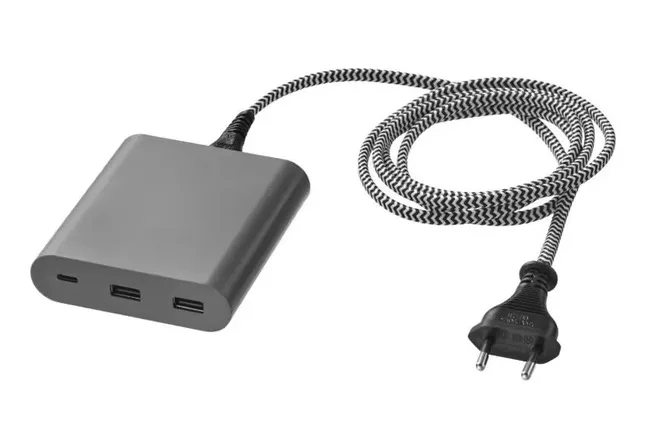

Het gaat specifiek om de donkergrijze versie van de oplader, met artikelnummer 50461193. De lader werd sinds april 2020 verkocht in de winkels van IKEA. De schokproblemen vinden plaats als je de lader langdurig gebruikt of de kabel oprolt, aldus IKEA.

> [!NOTE]
> Dit artikel verscheen eerder op [Bright](https://www.bright.nl/nieuws/1172893/pas-op-deze-ikea-oplader-kan-brandwonden-veroorzaken.html).

Je kunt de lader bij de klantenservice van de winkel inleveren. Een bon is niet nodig: iedereen krijgt bij het inleveren van de gadget zijn of haar geld terug. De terugroepactie blijft ook definitief van kracht: je hoeft hem dus niet binnen een bepaald aan tal dagen in te leveren.

## 

## Sorry

"We verontschuldigen ons voor het eventuele ongemak en bedanken alle klanten voor hun begrip", leest een verklaring op de website van IKEA.

Een terugroepactie wordt vaak in gang gezet als een product ook werkelijk gevaarlijk voor klanten is. In september vorig jaar moesten 300.00 elektrische eenwielers bijvoorbeeld terug naar de fabrikant na een reeks dodelijke ongelukken. Tesla riep in de Verenigde Staten twee miljoen auto’s terug toen bleek dat de Autopilot gebruikt kon worden zonder dat je achter het stuur hoefden op te letten.
