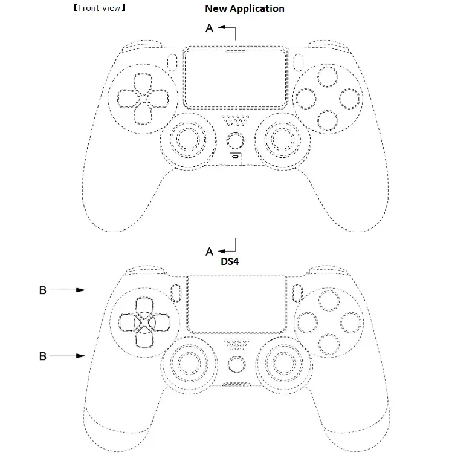

**De feiten over de PS5**

> [!NOTE]
> Dit artikel verscheen eerder op [Bright](https://www.bright.nl/nieuws/1124006/playstation-5-dit-weten-we-al.html).

[Bekijk ingesloten media](https://www.youtube.com/embed/YUgS64yLP7g?autoplay=1&modestbranding=1)

## Eind 2020 in de winkels

De PlayStation 5 zal [eind 2020](https://www.bright.nl/nieuws/artikel/4877191/playstation-5-verschijnt-eind-2020) in de winkels liggen. De console zou dan op tijd voor de feestdagen zijn.

Sony mikte lange tijd op een veel latere verkoop, op zijn vroegst in 2021. Het bedrijf heeft niet verteld waarom die datum naar voren is getrokken, maar concurrent Microsoft wil zijn [volgende Xbox-console](https://www.bright.nl/nieuws/artikel/4740901/microsoft-onthult-nieuwe-xbox-project-scarlett) ook eind 2020 verkopen. Wellicht wil Sony zo snel mogelijk de concurrentie aangaan.

## 8K-games

De PlayStation 3 en 4 draaiden games op hooguit een 1080p-resolutie, gevolgd door de [PlayStation 4 Pro](https://www.bright.nl/nieuws/artikel/4477511/playstation-4-pro-ps4-pro-stiller) met ondersteuning voor 4K-games. De nieuwe [PlayStation 5](https://www.bright.nl/nieuws/artikel/4680331/playstation-5-kan-games-8k-resolutie-afspelen) doet daar een schepje bovenop: games kunnen een maximale resolutie van 8K gebruiken.

Of spellen vanaf dag één die resolutie ook voluit gebruiken, is nog de vraag. Op het moment zijn er amper nog televisies met een [8K-scherm](https://www.bright.nl/tips/artikel/4394236/8k-4k-tv) op de markt. Maar de mogelijkheid wordt wel vanaf het eerste moment geboden.

## Specificaties van PlayStation 5

De specificaties van de nieuwe gameconsole zijn door Sony ook al bekend gemaakt. Je kunt het volgende verwachten:

-   Ryzen Zen 2 octacoreprocessor met een snelheid van maximaal 3,5GHz
-   AMD Radeon RDNA 2-videokaart met rekenkracht van 10,3 teraflops
-   16GB RAM-geheugen
-   825GB opslag
-   Ultra HD Blu-ray-speler

## Snellere laadtijden

Tijdens [een demonstratie](https://www.bright.nl/nieuws/artikel/4719551/playstation-5-laadt-game-976-keer-sneller-dan-voorganger) liet Sony zien hoeveel sneller de PlayStation 5 is vergeleken met de PlayStation 4. De [game Spider-Man](https://www.bright.nl/tests/artikel/4424026/spider-man-game-review-ps4) deed er op een PS4 in totaal 15 seconden over om te laden. Dezelfde game op de PS5 had slechts 0,8 seconde nodig om te starten.

Die snellere laadtijden worden mogelijk gemaakt door speciaal voor de PlayStation 5 gemaakte SSD-opslag, die nog sneller data verwerkt dan een gangbare SSD.

## Verbeterde gamepad

De PlayStation 5 wordt verkocht met de DualShock 5, een verbeterde versie van de gamepad die Sony al langer levert.

Op deze vernieuwde gamepad zitten onder andere schouderknoppen die wisselende drukniveaus kunnen bieden. Je moet harder de knop indrukken als je bijvoorbeeld een boog inspant, of drukt hem sneller in bij het intrappen van een gaspedaal.

Een geavanceerd trilsysteem zorgt er daarnaast voor dat de DualShock op verschillende manieren kan vibreren. Op die manier moet het gevoel van bijvoorbeeld een tackle op het voetbalveld beter worden overgebracht.

Officïele beelden van die gamecontroller zijn nog niet naar buiten gebracht, maar een gepubliceerd patent kan wel eens een voorproefje geven. Hierop is een iets dikkere DualShock-controller te zien, met aan de voorkant een microfoon voor audiochats.

> 

## Hyperrealistische reflecties

In de PlayStation 5 zit een speciale grafische chip voor [ray-tracing](https://www.bright.nl/nieuws/artikel/3913286/game-maker-epic-toont-hoe-realistisch-games-worden). Dit is een rendertechniek die tot op heden vooral in films werd gebruikt, maar door recente doorbraken ook in games mogelijk is.

Ray-tracing zorgt ervoor dat games bijvoorbeeld hyperrealistische reflecties en schaduwen kunnen laten zien, wat op zijn beurt zorgt voor geavanceerde lichteffecten. Het maakt games vele malen mooier. En omdat de technologie in een losse chip zit, wordt de gebruikelijke hardware niet extra belast.

## Schijfjes van 100GB groot

Games voor de PlayStation 5 worden waarschijnlijk gigantisch: op één schijfje is ruimte voor maar liefst 100GB aan opslagruimte. Hoewel die ruimte niet direct door iedereen benut zal worden, worden games op termijn vermoedelijk wel zo groot.

Dat betekent ook dat de PlayStation 5 nog een Blu-ray-lezer bevat, met ondersteuning voor [4K-films](https://www.bright.nl/tips/artikel/3917446/4k-films-series-nederland-kijken-zenders-kpn-ziggo-mediabox-next-netflix).

## Hele game installeren hoeft niet

Hoewel schijfjes plek hebben voor 100GB aan opslag, hoef je niet de volledige game op je spelcomputer te installeren. Het wordt volgens Sony mogelijk om alleen het gedeelte dat je wil spelen op de console te zetten. Zo kun je bijvoorbeeld alleen de verhaalcampagne installeren en de multiplayer overslaan.

## Ondersteuning voor PS4-games

Je PlayStation 4 kan vanaf eind 2020 de deur uit, want de games voor die console [werken ook gewoon](https://www.bright.nl/nieuws/artikel/4443601/playstation-5-ps5-oude-games-ps4-sony) op de PlayStation 5. Gelukkig maar, want Sony heeft een wisselende reputatie als het gaat om ondersteuning van oude games.

## Cloudfunctionaliteit

De PlayStation 5 werkt met cloudfuncties, al is het nog de vraag hoe dit precies in elkaar zal steken. De technische baas achter de console zei dat Sony nieuw grondgebied met zijn cloudtechnologie wil veroveren.

## Ook virtual reality voor PS5

Je kunt zelfs de [PlayStation VR](https://www.bright.nl/nieuws/artikel/3912656/sony-verlaagt-prijs-playstation-vr-startpakket)\-bril op de PlayStation 5 aansluiten om [virtual reality](https://www.bright.nl/tags/onderwerpen/tech/mixed-reality/virtual-reality)\-games te spelen. Volgens geruchten werkt Sony ook aan een opvolger van de headset speciaal voor de PlayStation 5.

Die nieuwe VR-bril zou draadloos met de console verbinden, waardoor je niet langer vastzit in een wirwar aan kabels. Daarnaast zou de kijkhoek maar liefst 220 graden zijn, met een 1440p-resolutie per oog.

[**Volg alle updates over de PlayStation 5**](https://www.rtlnieuws.nl/tags/onderwerpen/nieuw-toegevoegd/playstation-5)

**Geen gadgetreview missen, [abonneer op het Bright YouTube-kanaal](https://bit.ly/brighttv)**
