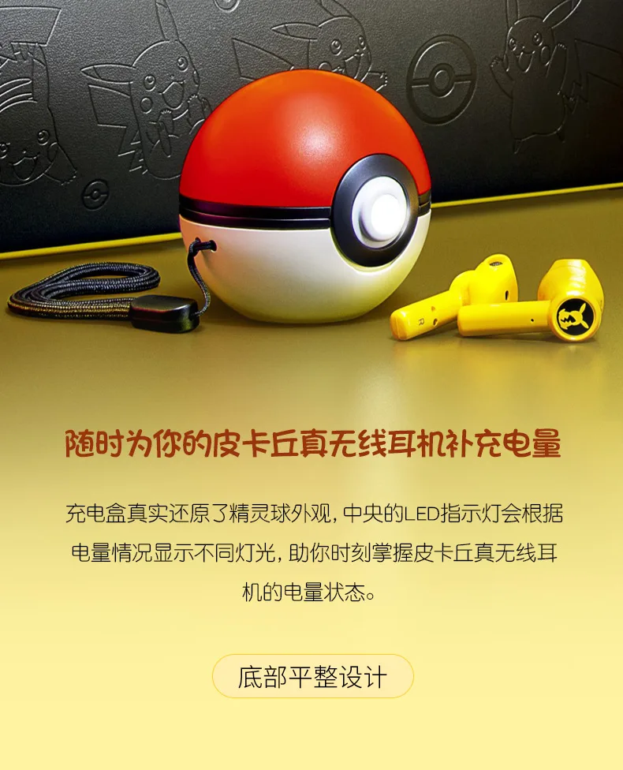

**In-ear Pikachu**

> [!NOTE]
> Dit artikel verscheen eerder op [Bright](https://www.bright.nl/nieuws/1126084/razer-maakt-airpods-concurrent-die-een-poke-ball-opladen.html).

De [oordoppen](https://zinggadget.com/2020/04/13/razer-pokemon-pikachu-tws-earphone/) lijken op de originele Apple-oordoppen [AirPods](https://www.bright.nl/tags/onderwerpen/tech/hardware/airpods), maar zijn geel en hebben aan de buitenkant Pikachu-icoontjes. Een ingebouwde microfoon laat je stemdiensten zoals Siri en de Google Assistent gebruiken. Volgens Razer bieden ze ook ruisonderdrukking, al is het onduidelijk hoe de pasvorm precies je gehele oren afsluit.

Op een volle accu kunnen de oordopjes onafgebroken drie uur muziek afspelen, waarna je ze in de Poké Ball moet stoppen om weer op te laden. Die bal heeft 15 uur aan stroom, wat betekent dat je ze vijf keer kunt laden voor je met een stroompunt moet verbinden.

## Alleen nog in China

Razer heeft in eerste instantie alleen nog maar plannen om de oordoppen in China uit te brengen, waar ze vanaf 16 april voor omgerekend ongeveer 110 euro over de toonbank gaan.

Over verkoop in Europa is nog niks gezegd, maar Razer verkoopt hier wel andere producten.

## Nieuwe AirPods

Steeds meer bedrijven maken hun eigen draadloze oordoppen. Geen wonder ook, gezien Apple met de AirPods en AirPods Pro een steeds grotere markt aanboort. De techreus komt volgens bronnen binnenkort met een draadloze koptelefoon en de [AirPods X](https://www.bright.nl/nieuws/artikel/5084541/apple-koptelefoon-komt-juni-airpods-x-september). Die laatste moet speciaal bedoeld zijn voor sporters.

## De beste draadloze oordoppen: beter dan AirPods?

[Bekijk ingesloten media](https://www.youtube.com/embed/IKCsfroEc7A?autoplay=1&modestbranding=1)

**[Volg Bright op YouTube](https://bit.ly/brighttv) voor meer tech-video's**
