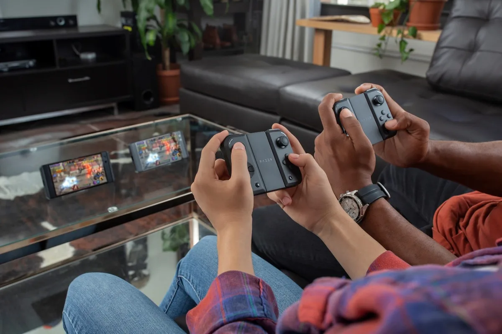

**Junglecat**

> [!NOTE]
> Dit artikel verscheen eerder op [Bright](https://www.bright.nl/nieuws/1124246/razer-maakt-van-smartphone-een-namaak-switch.html).

De nieuwe Razer-accessoire [Junglecat](https://press.razer.com/press-releases/keep-your-fingers-off-the-screen-and-focus-on-the-action-with-the-razer-junglecat/) werkt niet alleen met de [Razer Phone](https://www.bright.nl/nieuws/artikel/4444771/eerste-indruk-razer-phone-2), maar ook met de Galaxy Note 9, [Galaxy S10](https://www.bright.nl/bright-stuff/artikel/4675231/bright-stuff-samsung-galaxy-s10-plus-10) en [Huawei P30 Pro](https://www.bright.nl/bright-stuff/artikel/4675221/bright-stuff-huawei-p30-pro). Je bevestigt een speciale hoes aan je smartphone, waar je vervolgens de gamepad aan vastklikt. De Junglecat wordt voor 100 dollar verkocht in de webwinkel van Razer.

Nintendo heeft geen alleenrecht op twee controllerhelften met in het midden een scherm, maar de gelijkenissen zijn bij de Junglecat wel stuitend. Je klikt de gamepads op exact dezelfde manier vast en kunt ze zelfs in een mal voor een losse controller stoppen. Daarnaast is de knoppenplaatsing identiek als bij de [Nintendo Switch](https://www.youtube.com/watch?v=lg4ELY9dyGM).

## Fortnite

De fysieke knoppen moeten het makkelijker maken om intensieve games zoals [Fortnite](https://www.bright.nl/tags/onderwerpen/tech/games/fortnite) te spelen. Die games werken vaak al in combinatie met een gamepad, maar de Junglecat zorgt ervoor dat de knoppen stevig aan je smartphone zelf bevestigd zitten.

Hoewel de gadget aan je smartphone hangt, verbindt hij draadloos via Bluetooth met het toestel. De ingebouwde accu zorgt ervoor dat je honderd uur kunt gamen voordat je hem weer moet opladen.

## Speciale app

Werkt je game niet met een gamecontroller, dan kun je een bijbehorende app gebruiken. Hiermee koppel je delen van het scherm aan de knoppen, zodat deze op de juiste momenten worden ingedrukt.

Overigens werd Nintendo eerder door controllermaker Gamevice van [beschuldigd](https://www.bright.nl/nieuws/artikel/3927036/nintendo-aangeklaagd-om-switch-controllers) het ontwerp van de Switch te hebben gestolen. Dat bedrijf maakt een controller die je om het scherm van een iPhone of iPad heen bindt.

## Review: Nintendo Switch Lite

[Bekijk ingesloten media](https://www.youtube.com/embed/lg4ELY9dyGM?autoplay=1&modestbranding=1)

**[Volg Bright op YouTube](https://bit.ly/brighttv) voor meer gadgetreviews**
