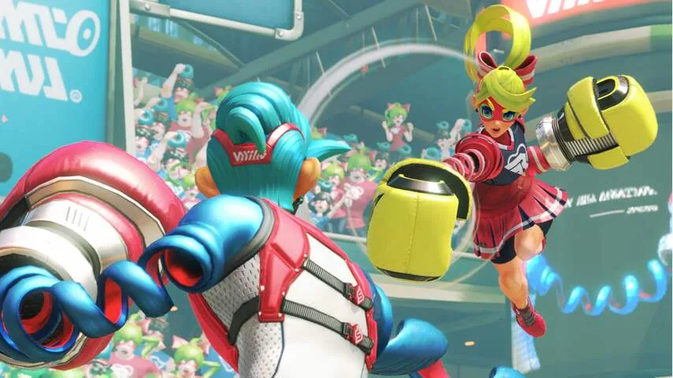
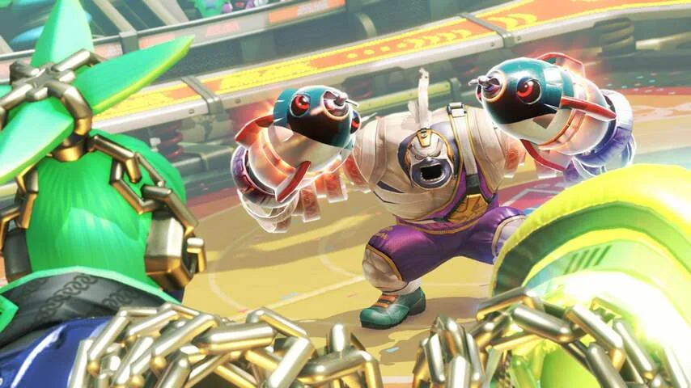

**De boksgame ARMS voor de Nintendo Switch laat zien hoe Nintendo steeds vaker probeert om competitieve multiplayergames te maken.**

> [!NOTE]
> Deze recensie verscheen eerder op [NU.nl](https://www.nu.nl/tech/4390140/eerste-indruk-boksgame-arms-toont-nieuwe-richting-voor-nintendo.html).

Het idee achter _ARMS_ doet een beetje denken aan de Nintendo Wii. Het spel gebruikt de Switch-gamepads als bewegingscontrollers, waardoor vuistslagen in de echte wereld ook in het spel worden geregistreerd.

Daarbij heeft de game één twist: alle boksers hebben springveren als armen, waardoor ze elkaar op grote afstand kunnen neerslaan. Door andere armen te kiezen, is het mogelijk om andersoortige klappen te geven.

De springveren zorgen ervoor dat een goed gerichte klap op tien meter afstand de tegenstander nog kan raken. Een vuist doet er echter lang over om een grote afstand af te leggen, waardoor de tegenstander hier weer op kan reageren.

_ARMS_ is misschien één van de leukste games die tijdens het Nintendo Switch-evenement speelbaar was. Tijdens een eerste aantal speelsessies leek de game wat simpel: probeer allebei zo hard mogelijk met de controllers te schudden en zie wie er wint.

[Bekijk ingesloten media](https://content.jwplatform.com/players/XePV2jWb-whqXCOFb.html)

## Tactiek

Na een paar potjes werden strategieën echter steeds duidelijker. Zo bleek al snel wanneer het slim was een stap opzij te doen (door de controllers te kantelen), of wanneer een klap juist geblokkeerd moest worden (door de controllers naar elkaar te duwen).

Speel nog wat langer en er komen nog meer interessante tactieken aan bod. Stapt een bepaald personage altijd naar rechts? Buig de vuist dan wat af naar die kant, zodat de klap alsnog goed terechtkomt. Tijdens het Nintendo-evenement speelde één journalist de hele middag enkel _ARMS_, waardoor hij op termijn precies wist hoe hij zijn tegenstander moest lezen. Net als een ‘echte’ bokser.

_ARMS — Beeld: Nintendo_

_ARMS — Beeld: Nintendo_

Een gevoel dat bij games doorgaans lastig over te brengen is, omdat een klap uit bepaalde richting razendsnel kan komen. Door de lengte komen klappen in _ARMS_ langzamer aan, waardoor de game makkelijker te doorgronden is. De game heeft daarmee de potentiële diepgang van een traditioneel vechtspel zoals _Street Fighter_, zonder dat de speler daarvoor complexe knoppencombinaties hoeft te leren.

Of de game op termijn ook zo interessant blijft moeten we nog zien. _ARMS_ gaat 60 euro kosten, dus de hoop is dat de game meer zal bieden dan simpele gevechtsarena’s om andere spelers of de computer in te bevechten. De eerste potjes beloven echter veel.

## Splatoon

_ARMS_ is een titel van Nintendo zelf, maar heeft duidelijk niet die uitstraling. De karakteristieke personages uit bijvoorbeeld Mario zijn omgeruild voor een wat algemener, Japans ontwerp, waarmee het bedrijf mogelijk een breder publiek hoopt aan te spreken.

De designrichting doet enigszins denken aan het Nintendo-schietspel _Splatoon_, dat qua stijl ook flink afwijkt van eerdere titels van het bedrijf. Een spel dat op de enigszins geflopte Wii U alsnog succesvol genoeg bleek om een vervolg op de Nintendo Switch te garanderen.

[Bekijk ingesloten media](https://content.jwplatform.com/players/5FpRevEE-whqXCOFb.html)

De gelijkenissen tussen _ARMS_ en _Splatoon_ houden daar niet op. Beide games zijn namelijk competitieve multiplayergames met verrassend diepgaande strategieën. Uniek voor Nintendo, dat met meerspelergames _Super Smash Bros_. en _Mario Kart_ juist altijd probeerde om lol belangrijker te maken dan niveau.

Nintendo lijkt met beide spellen een gooi te doen naar de eSports-markt, door zijn eigen unieke competitiegames op de markt te brengen. Of dat ook gaat lukken, is nog de vraag. Hoewel de inhoud van _ARMS_ veelbelovend is, staat Nintendo tot nu toe bekend om zijn wat magere online diensten. En het internet is bij multiplayer een belangrijk onderdeel. Als het echter lukt, kan het wel eens een nieuwe richting betekenen voor het bedrijf.
