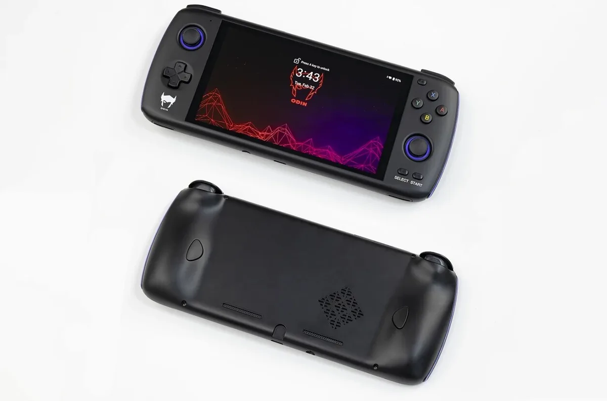

De Nintendo Switch heeft er een concurrent uit China bij. De nieuwe Odin Pro is even groot als een Switch Lite en draait naast Android-games ook klassieke spellen via speciale software. Maar is dat wel legaal?

> [!NOTE]
> Deze recensie verscheen eerder op [AD](https://www.ad.nl/games/deze-chinese-zakspelcomputer-speelt-alle-games-uit-je-jeugd-vlekkeloos-maar-is-dat-legaal~af57bae9/).

Eigenlijk is de Chinese Odin Pro een Android-telefoon met een gamecontroller er omheen gebouwd. Aan de binnenzijde zit een chip die in 2017 in de duurste smartphones zat. Die is inmiddels alweer vijf jaar oud, maar een bijbehorende ventilator houdt de spelcomputer koel, waardoor de chip harder kan werken dan in telefoons. Hierdoor worden ook zwaardere games vloeiend afgespeeld.

De Odin Pro voelt als een hoogwaardig product. De knoppen zijn stevig en fijn om in te drukken, met twee analoge trekkers die aanvoelen hoe diep je ze indrukt. Het scherm heeft een full hd-resolutie, die haarscherp oogt op het 5,98 inch-beeld. En omdat je een aanraakscherm hebt, kun je naast de knoppen ook je vinger gebruiken.

## Android-games spelen

Op de gameconsole staat Android 10 geïnstalleerd. Je kunt inloggen met een Google-account om vervolgens Android-spelletjes uit de Play Store te downloaden. Werkte een game al met controllers, dan is hij meteen te spelen met de fysieke toetsen van de Odin Pro. En anders kun je met speciale software delen van het scherm koppelen aan de toetsen, zodat spellen met virtuele besturing ook werken.

Het maakt de Odin Pro een uitstekend apparaat om Android-games op te spelen met fysieke knoppen, die je een extra voordeel geven in bijvoorbeeld Fortnite. Maar voor veel kopers van de handheld is het vermoedelijk een bijzaak: de Odin Pro heeft veel bekijks bij fans van retrogames, die speciale software gebruiken om oude klassiekers erop af te spelen.

De Odin Pro lijkt op een Nintendo Switch Lite, met achterop twee extra knoppen. © AYN

## Gemaakt voor oude games

Fabrikant AYN weet dat ook en heeft de Android-software speciaal ingericht zodat je makkelijk bij al je oude games kunt. Een bijbehorende dock verbindt de console met je tv, waar je met speciale poorten vervolgens je oude controllers voor de Nintendo 64 of GameCube op aansluit. Zo speel je precies zoals je twintig jaar geleden ook deed.

Oude games zijn doorgaans alleen te spelen op de gameconsoles waar ze ooit op zijn uitgebracht. Een zogeheten emulator kan dat oude systeem nabootsen, zodat een spel ook op nieuwe apparatuur werkt. Zo denkt je Odin Pro bijvoorbeeld dat hij een oude NES of een PlayStation 1 is.

Emulatie bestaat al langer, maar was jarenlang vooral bedoeld voor pc’s. Inmiddels wordt die software echter steeds beter voor smartphones en maken Chinese bedrijven gameconsoles die hier speciaal voor bedoeld zijn. Het spelen van klassieke titels wordt daardoor steeds toegankelijker.

De Odin Pro ondersteunt veel. Apparaten die tussen de jaren ’70 en het begin van de 21ste eeuw verschenen draaien vlekkeloos, waardoor games voor bijvoorbeeld de Atari 2600, SNES, PlayStation 1 en Dreamcast prima te spelen zijn. Maar ook veel titels voor de GameCube worden ondersteund. De PlayStation 2 doet het ook, al is het ietwat wisselend welke spellen daarvoor vloeiend werken.

## Nintendo vindt het niks

Maar mag dat wel? Nintendo is er in elk geval niet van gediend. ‘Nintendo is tegen degenen die profiteren van het creatief werk van gameontwikkelaars’, leest een kritische verklaring die het bedrijf ons toestuurde. Daarmee suggereert de studio dat emulatie ten koste gaat van de originele makers, die geen geld verdienen omdat je games illegaal downloadt.

Maar het gebruiken van een emulator is helemaal niet illegaal, weet gamejurist René Otto. ,,Een emulator is niets minder dan een softwareprogramma waarmee games van verschillende consoles kunnen worden gespeeld. Een dergelijk softwareprogramma is in principe niet in strijd met het auteursrecht als de code van dit programma zelf is gemaakt.”

## Illegaal downloaden

Dat zit anders met de games zelf, die in de vorm van een ROM-bestand worden verpakt. Die zijn auteursrechtelijk beschermd, wat het illegaal maakt om ze zomaar van een website te halen. Het downloaden van een ROM is dus piraterij, net als bijvoorbeeld het downloaden van een film die net op Blu-ray is verschenen.

,,Het maken van een kopie van een rechtmatig verkregen game zou voor eigen gebruik mogen”, weet Otto wel. Maar apparatuur om oude cartridges voor spelcomputers te kopiëren is zeldzaam en duur, waardoor de meeste mensen dat nooit zullen doen. De meeste emulatiespelers downloaden hun games.

Maar het afspelen van oude games via emulatie is ook belangrijk, denkt Wietse van Bruggen. Hij legt de geschiedenis van videogames vast op zijn website Gamegeschiedenis.nl.

,,Ik kwam zelf in aanraking met een emulator in de tweede helft van de jaren ’90. Over de game Chrono Trigger had ik gelezen in gametijdschriften. De game kwam uiteindelijk niet in Nederland uit. Via emulatie kon ik toch deze game spelen, en ik vond het een prachtig spel.”

,,Ik denk ook dat makers van games enorm geprofiteerd hebben van de ontwikkeling van emulatiesoftware, ook al zullen ze dat zelf misschien niet hardop durven te erkennen. Oude games zijn door emulatie niet compleet verdwenen, zijn speelbaar gebleven en hun culturele en maatschappelijke impact is daardoor naar mijn mening alleen maar groter geworden.”

## Hoge boete

Otto ziet in de praktijk niet dat mensen worden vervolgd voor het illegaal downloaden van zo’n oude game. ,,Een uitgever van een spel zal veel vaker achter de uploader aangaan, omdat dat het meest effectief is in het tegengaan van illegale downloads.” Ook van Bruggen heeft nog niet eerder een downloader vervolgd zien worden, maar zag wel meerdere downloadsites offline gaan.

De boete kan volgens Otto fors zijn: die kan oplopen tot maximaal 22.500 euro, of een celstraf van zes maanden.

Het is volgens Van Bruggen een dilemma: hij vindt emulatiesoftware te rechtvaardigen, maar denkt ook dat gamemakers een eerlijke boterham moeten verdienen. ,,Het emuleren van een game die bedoeld is om nu te verkopen met als doel om er maar geen geld aan uit te hoeven geven, daar ben ik ook zeker niet voor. Voor oude games die op geen enkele andere manier te spelen zijn, kan emulatie uitkomst bieden.”

_De Odin Pro is voor ongeveer 260 euro te koop op crowdfundsite_ [_Indiegogo_](https://www.indiegogo.com/projects/odin-the-ultimate-gaming-handheld#/)_. Ook is er een goedkoper model voor 180 euro. Leveringen zijn door coronamaatregelen in China wel vertraagd._
