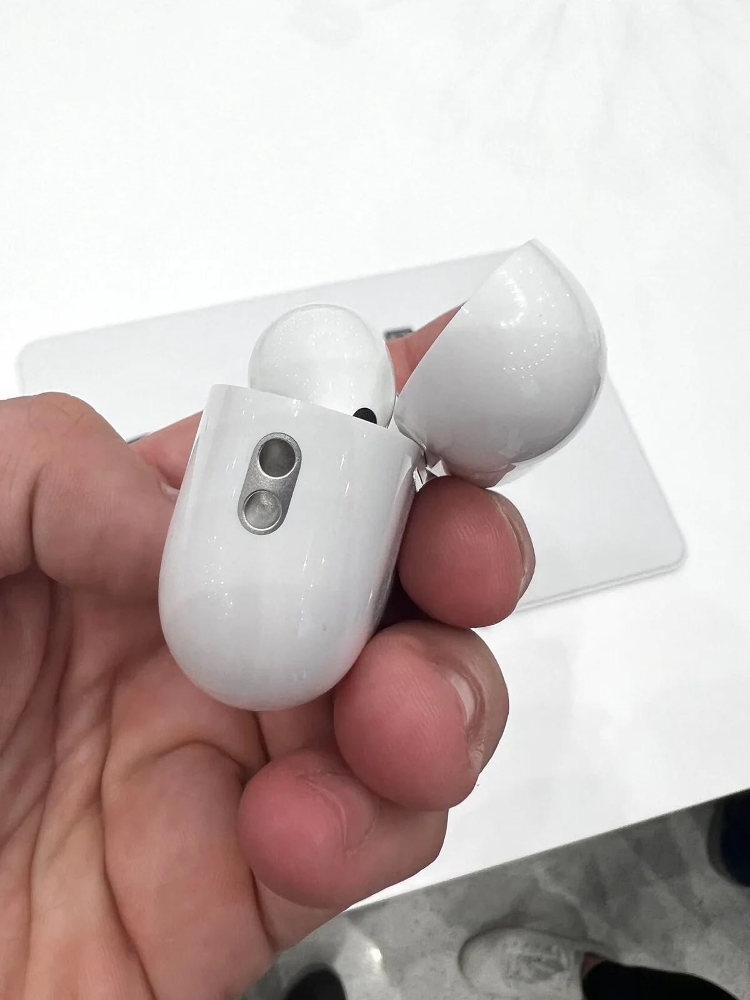

Ja, de nieuwe AirPods Pro laten geluid beter klinken dan die uit 2020. Maar misschien wel het bijzonderst is hoe de dopjes het doen als je helemaal niks afspeelt: de microfoons laten je de omgeving perfect horen, maar dan met minder kabaal.

> [!NOTE]
> Deze recensie verscheen eerder op [AD](https://www.ad.nl/tech/de-nieuwe-airpods-pro-klinken-alsof-er-niks-in-je-oren-zit~a2d308d88/).

Laten we eerst de meest vanzelfsprekende vraag beantwoorden: ja, de nieuwe AirPods Pro klinken beter dan de oude. Ze hebben duidelijk een goede bas, iets dat ontbrak bij de vorige versie, en een zuiver, breed bereik als je naar muziek luistert. Dit zijn de best klinkende oordopjes die Apple op het moment heeft, al denken we dat de AirPods Max-koptelefoon een iets groter bereik heeft.

Maar Apple heeft bij deze oordopjes niet alleen naar de geluidskwaliteit gekeken. De Pro-dopjes zijn net als hun voorgangers op de standen ‘Transparantie’ en ‘Ruisonderdrukking’ te zetten. Bij Transparantie wordt omgevingsgeluid doorgelaten, zodat je bijvoorbeeld kunt horen met wie je praat. En bij Ruisonderdrukking wordt herrie op de achtergrond onderdrukt, zodat je bijvoorbeeld muziek kunt luisteren in een luid vliegtuig.

## Alsof je geen oordopjes in hebt

De Transparantiemodus klonk bij onze tests veel natuurlijker dan bij de AirPods Pro uit 2020. Geluiden worden door de microfoons opgevangen en in je oren afgespeeld, maar dat is haast niet te merken. Stemmen klinken exact zoals je ze zonder dopjes hoort, waardoor het haast lijkt alsof je de AirPods Pro niet in hebt.

In deze modus worden geluiden van 85 decibel of hoger nu ook zachter gemaakt, zodat je minder last hebt van echt luide herrie. Je kunt je omgeving horen, inclusief die luide drilboor op straat, maar die klinkt dan ineens niet meer oorverdovend. Een functie die we nog niet uitgebreid konden testen, maar de eerste impressie was al indrukwekkend. Volgens Apple wordt geluid daarnaast zo aangepast, dat de textuur ervan niet wordt aangetast.

_De redactie van BestGetest zette de [beste draadloze oordopjes](https://bestgetest.nl/de-beste-draadloze-oortjes-van-2021?utm_source=ad&utm_medium=tekstlink&utm_term=byo&utm_campaign=redactioneel&utm_content=a2d308d88) op een rij._

Aan de zijkant zit een gaatje om een touwtje vast te maken. © Bastiaan Vroegop

## Met je AirPods naar een concert

Het betekent dat je bijvoorbeeld met AirPods Pro in naar een concert kunt gaan, om de muziek precies te horen zoals hij gespeeld wordt - maar dan een paar decibel zachter. De dopjes normaliseren geluid dat eigenlijk te hard voor je is, waardoor het zelfs fijn is ze te dragen als je geen muziek aan hebt staan.

De ruisonderdrukking is volgens Apple ook verbeterd, al was het bij onze tests lastig een verschil te horen met de vorige AirPods Pro. We merkten dat ze constante herrie goed wisten weg te filteren - maar dat deden de vorige AirPods Pro ook. Wel fijn zijn de nieuwe oortips, waarvan nu ook een maat voor kleinere oren is.

## Volume bedienen

Je bedient de AirPods Pro nog steeds door in de steeltjes te knijpen, maar nu zit er ook een aanraakpaneel aan beide zijden. Hier kun je overheen vegen om het volume aan te passen - iets dat we erg misten bij de vorige AirPods. Bij die moest je namelijk je iPhone erbij pakken om volume te veranderen, of Siri vragen dat voor je te doen.

Dat aanraakpaneeltje werkt prima, al moet je voor iedere volumestap weer een keertje vegen. Je bent dus even bezig als je helemaal omhoog of omlaag wil gaan - volgens Apple is dat om te voorkomen dat er ineens gigantisch harde muziek door je oren knalt.

## Voorlopige conclusie

Een hoop hebben we nog niet kunnen testen. Zo hebben de AirPods Pro een speciale scanfunctie die de muziek aan je oren aanpast en belooft Apple een langere accuduur, maar beide zijn pas te proberen zodra we ze langer kunnen reviewen.

Maar wat we hebben gezien, was indrukwekkender dan gedacht. Aan de oppervlakte lijken dit gewoon beter klinkende oordopjes, maar de manieren waarop Apple omgevingsgeluid wegfiltert is onwijs bijzonder. We kijken er zowaar naar uit om deze dopjes te dragen als we niet naar muziek luisteren - iets dat we ons in 2020 niet konden voorstellen.
