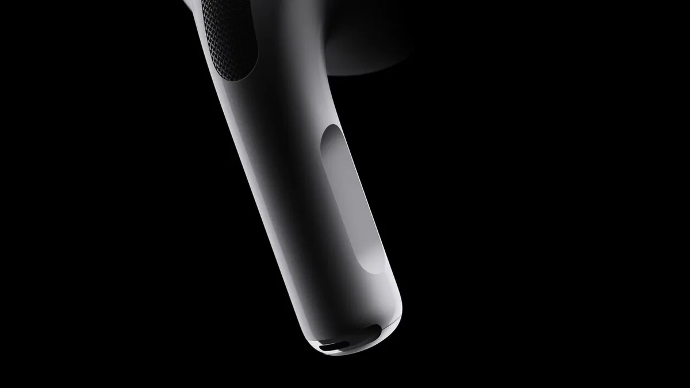

Apples nieuwe AirPods Pro lijken grotendeels op hun voorgangers, maar hebben door een paar upgrades een aantal nieuwe, handige toepassingen. We zetten er drie op een rij.

> [!NOTE]
> Deze recensie verscheen eerder op [AD](https://www.ad.nl/tech/de-nieuwe-airpods-pro-zijn-nu-ook-handiger-tijdens-concerten-en-op-de-fiets~a916207c/).

Inmiddels hebben we de nieuwe AirPods Pro ruim anderhalve week kunnen uitproberen. De nieuwe dopjes volgen Apples model uit 2019 op, met een algeheel betere audiokwaliteit. Dat was bij onze tests ook meteen merkbaar: de nieuwe dopjes hebben duidelijk een dieper basgeluid, wat de audio iets meer ‘punchy’ maakt.

Een speciaal aanraakpaneeltje op beide steeltjes maakt het ook mogelijk je volume aan te passen - iets waarvoor je bij eerdere modellen je telefoon erbij moest pakken. Een verademing, en het op en neer vegen hiervoor voelt precies en logisch.

Veeg je vinger over dit paneeltje en het volume gaat omhoog of omlaag. © Apple

Maar daarnaast zijn er nog een paar kleinere aanpassingen die zich minder makkelijk laten meten, maar die er wel voor zorgen dat je meer met je AirPods Pro kunt. We schetsen hieronder drie scenario’s waarin de dopjes nu soelaas bieden, wat eerder niet of in mindere mate het geval was.

## 1\. Bellen op de fiets

De nieuwe AirPods Pro hebben andere microfoons, die iets gerichter het geluid van je stem oppikken. Daarnaast wordt nog steeds ruisonderdrukking gebruikt om constante herrie zoals de wind te onderscheiden van je stem.

We merkten dat we hierdoor beter te verstaan waren tijdens telefoontjes op de fiets dan bij de eerdere AirPods Pro. De ruisonderdrukking in je oren sluit je daarnaast iets beter af van de buitenwereld, waardoor je zelf ook minder last hebt van de wind. Het zorgt ervoor dat je goed op de fiets kunt bellen met de nieuwe AirPods Pro.

## 2\. Slimmere oordopjes voor tijdens concerten

Wie gehoorschade wil voorkomen, draagt al snel oordopjes tijdens een concert. Dat is echter niet zonder nadelen: omdat je gehoorgang wordt geblokkeerd hoor je niet alle tonen van de muziek. Het is veiliger, maar ook iets minder mooi.

Een nieuwe toevoeging bij de AirPods Pro kan daarbij helpen. De Apple-dopjes hebben al langere een zogeheten transparantiemodus, waarbij de microfoons geluid van de buitenwereld binnenlaten. Maar bij de AirPods Pro 2 verlaagt deze modus harde geluiden, zodat ze op laag, gebalanceerd volume in je oren komen.

Het resultaat: keiharde muziek van een concert wordt door de microfoons opgepikt, in volume verlaagd en goed gebalanceerd in je oren afgespeeld. Bij onze tests bleef dat mooi klinken, zonder dat je een dof geluid kreeg.

De redactie van BestGetest zette de [beste koptelefoons met ruisonderdrukking](https://bestgetest.nl/de-beste-koptelefoons-met-noise-cancelling-van-2022?utm_source=ad&utm_medium=tekstlink&utm_term=byo&utm_campaign=redactioneel&utm_content=artikelcode) op een rij.

## 3\. Je raakt ze minder snel kwijt

Dat kleine AirPods-doosje ben je zo kwijt tussen de bankkussens of onderin een rugzak. Daar heeft Apple bij de nieuwe variant iets op gevonden: je kunt nu via de Zoek Mijn-app op je iPhone een geluidje afspelen. Dat wordt dan afgespeeld via een klein, nieuw speakertje onderop het doosje van de doppen.

Heb je een recente iPhone, dan wordt in de app zelfs een pijl getoond richting je dopjes, zodat je weet waar je moet zoeken. Bovendien kun je nu een koordje aan de doos bevestigen, zodat je de AirPods bijvoorbeeld stevig kunt vastmaken aan de binnenzijde van een tas.
