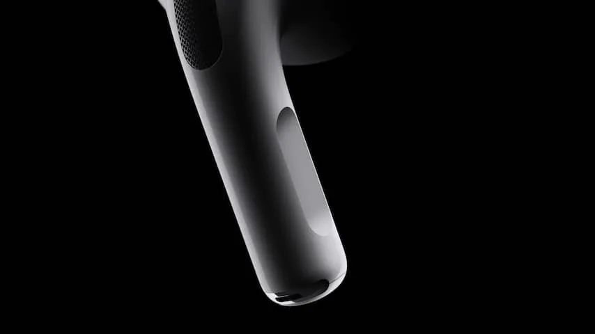
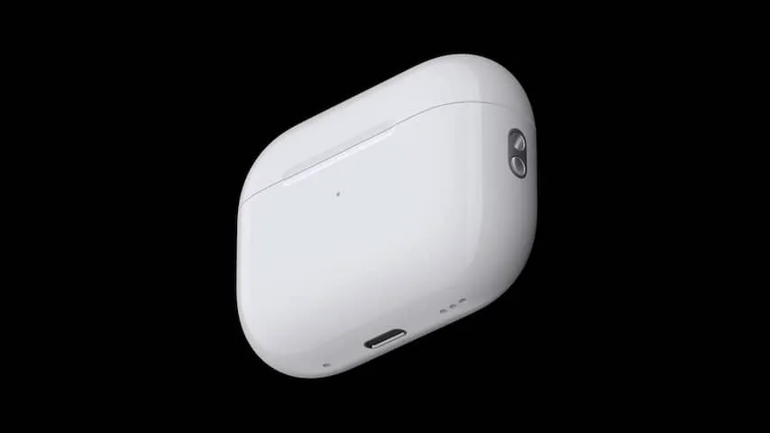

**Apples nieuwe AirPods Pro klinken beter, maar onderscheiden zich vooral op momenten dat je niet naar muziek luistert.**

> [!NOTE]
> Deze recensie verscheen eerder op [NU.nl](https://www.nu.nl/reviews/6225323/review-airpods-pro-2-zijn-ook-fijn-als-je-niet-naar-muziek-luistert.html).

De draadloze Pro-oordopjes hebben na drie jaar een upgrade gekregen. Daarin worden een paar voor de hand liggende zaken aangepakt. Nieuwe hardware zorgt er bijvoorbeeld voor dat het geluid beter klinkt. Tijdens onze tests merkten we een verschil, vooral bij de lagere bastonen. Audio heeft bij de nieuwe AirPods Pro iets meer impact.

Tijdens het bellen in sterke wind met de AirPods Pro blijft de ander ook bijzonder goed verstaanbaar. Tijdens testtelefoontjes op de fiets bleven we goed verstaanbaar, terwijl de AirPods de wind goed wegfilterden.

De algehele ruisonderdrukking is naar ons idee ook iets beter, al hadden we bij de originele AirPods Pro al weinig te klagen. Apple levert nu bovendien kleinere oortipjes naast de drie standaardmaten, waardoor de dopjes beter afsluiten als je kleine oorgaten hebt.

## Eindelijk een volumeregelaar

Daarnaast hebben de nieuwe dopjes een veel gevraagde volumeregelaar. Die ontbrak op eerdere AirPods, waardoor je via Siri of je iPhone het volume moest veranderen. Veeg met je vinger omhoog of omlaag op de steeltjes en je past het geluid aan.

Iedere veeg is één sprongetje omhoog. Wie in één keer van zacht naar hard wil moet daarom best veel met de vinger bewegen, maar dit voorkomt dat je het geluid per ongeluk in één keer gigantisch hard zet. In de praktijk deden we ook vooral kleine geluidsaanpassingen, waardoor dit geen groot probleem is.

_Review: AirPods Pro 2 zijn ook fijn als je niet naar muziek luistert — Beeld: Apple_

## Makkelijker terug te vinden

Aan de onderzijde van de AirPods Pro zitten nu vier kleine gaatjes: drie aan de rechterzijde en één aan de linkerkant. Achter de gaten rechts zit een kleine speaker die wordt gebruikt voor de Zoek Mijn-app. Het gat links is volgens Apple een "akoestisch gat", dat bedoeld is om druk van de speaker weg te nemen.

Ben je de AirPods kwijt, dan kun je een geluid afspelen om ze terug te vinden. Daarnaast werken de AirPods Pro als recente AirTags, waardoor op recente iPhones een kompaspijl wijst in de richting waar je kwijtgeraakte dopjes liggen.

_Review: AirPods Pro 2 zijn ook fijn als je niet naar muziek luistert — Beeld: Apple_

## Een volumeregelaar voor je dagelijks leven

De grootste verbeteringen zitten naar ons idee bij de Transparantie-modus van de AirPods Pro. Houd het steeltje van je dopjes ingedrukt en de ruisonderdrukking wordt net als bij oude modellen uitgeschakeld, waarna microfoons ervoor zorgen dat je de omgeving beter kunt horen.

Bij de AirPods Pro uit 2019 klonk dat omgevingsgeluid soms wat blikkerig. Bij de nieuwe versie is dat niet het geval: stemmen van anderen komen natuurlijk over, waardoor het klinkt alsof je helemaal geen dopjes in je oren hebt. Dat is op zichzelf een bijzondere prestatie.

Daarnaast heeft Apple een nieuwe functie met de naam 'Adaptive Transparency' toegevoegd. Deze zorgt ervoor dat zeer harde geluiden (van boven de 85 decibel) in volume worden verlaagd, maar nog wel goed te horen zijn. Het zorgt ervoor dat een drilboor, snelweg of een luid concert een minder grote aanslag op je gehoor is, maar nog wel te horen is.

Het voelt in de praktijk als een soort persoonlijke geluidsmixer voor je dagelijks leven. Vooral bij concerten is dat van grote meerwaarde: je AirPods maken de muziek goed hoorbaar en zorgen voor een verdraagbaar volume, zonder dat je de tonen mist die bijvoorbeeld ontbreken bij ouderwetse oordopjes voor gehoorbescherming.

## Conclusie

De nieuwe AirPods Pro klinken beter, maar we zijn vooral onder de indruk van de verbeteringen in de transparantiemodus. Dit kan weleens een gadget zijn die je ook graag draagt als je niet naar muziek luistert, simpelweg om je omgeving dragelijker te maken. Al is het de vraag hoe je omgeving daarop reageert: die zal immers denken dat je altijd naar muziek zit te luisteren.

_De redactie van BestGetest zette eerder de [beste betaalbare koptelefoons met ruisonderdrukking](https://bestgetest.nl/de-beste-betaalbare-noisecancelling-hoofdtelefoons-van-2022?utm_source=nu&utm_medium=tekstlink&utm_term=byo&utm_campaign=redactioneel&utm_content=airpods2review) op een rij._
