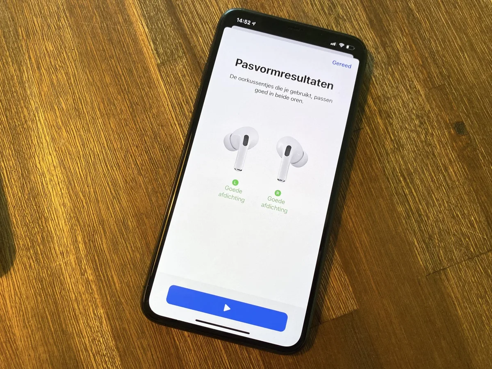
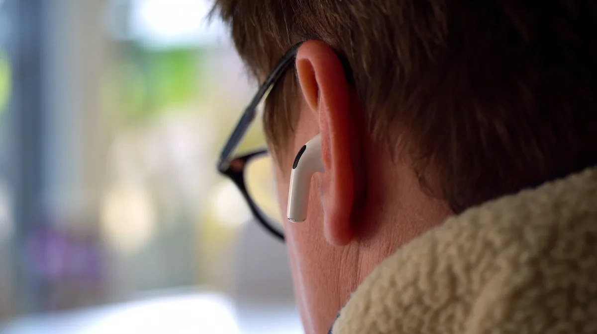
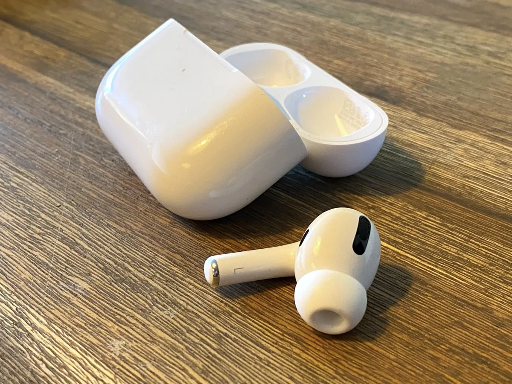
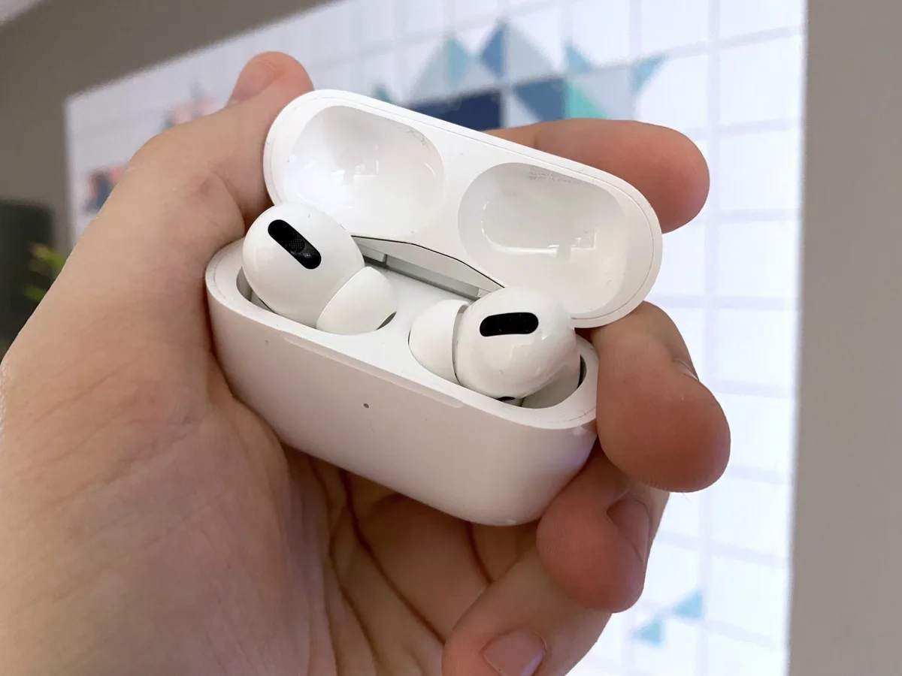

**Oordopjes**

> [!NOTE]
> Deze recensie verscheen eerder op [Bright](https://www.bright.nl/nieuws/1124249/eerste-indruk-airpods-pro-doen-precies-wat-je-wil.html).

[Bekijk ingesloten media](https://www.youtube.com/embed/VNViBTFl8tg?autoplay=1&modestbranding=1)

## Kijk de eerste indruk en reageer:

**Maak kans op de AirPods Pro:** volg Bright op [Instagram](https://www.instagram.com/bright_nl) of [Facebook](https://www.facebook.com/brightnl), en download de Bright-app, voor [iOS](https://bit.ly/brightios) of [Android](https://bit.ly/brightandroid).

Met de [AirPods Pro](https://www.bright.nl/nieuws/artikel/4900586/apple-kondigt-airpods-pro-aan-oordoppen-met-noise-cancelling) bevindt Apple zich ineens op een heel andere markt. Met een prijskaart van 280 euro moeten deze draadloze oordoppen zich niet alleen meten met veel high-end-merken, maar ook met ruisonderdrukkende koptelefoons van bijvoorbeeld [Sony](https://www.bright.nl/bright-stuff/artikel/4439121/sony-1000xm3-bright-stuff-buyers-guide-koopgids-review-de-beste) en [Bose](https://www.bright.nl/bright-stuff/artikel/4829121/bright-stuff-bose-700-nc-koptelefoon).

De nieuwe AirPods hebben siliconen dopjes om je oren volledig mee af te sluiten. Dit in-ear-systeem zorgt ervoor dat geluid van buitenaf minder makkelijk je oren binnenkomt. Andere in-ear-doppen kunnen je een gevoel van druk op je oren geven, maar bij de [AirPods Pro](https://www.bright.nl/nieuws/artikel/4900586/apple-kondigt-airpods-pro-aan-oordoppen-met-noise-cancelling) is dat amper het geval. Dat komt door kleine roosters in de dopjes, die het lucht in je oren naar buiten laten.

De dopjes van Apple hebben ook niet het geprop dat je van andere in-ear-oortjes kent: ze zitten niet zo zeer _in_ het gehoorkanaal maar sluiten de boel vooral hermetisch af. Dat maakt ze een stuk comfortabeler, zeker voor de in-ear-hater.

Een leuk handigheidje: je kunt vanuit de instellingen zien of de door jou gebruikte siliconen dopjes de buitenwereld goed afsluiten. De AirPods spelen een muziekje af, waar de microfoons in het oor naar proberen te luisteren. Als ze dezelfde muziek horen, betekent het dat er geluid naar buiten lekt - en ook je oren binnen kan komen. En dan adviseert Apple je om één van de andere meegeleverde maten op te bevestigen.

## Noise cancellation

Combineer die in-ears met de actieve ruisonderdrukking van de oordoppen, en je hoort veel minder luide geluiden. Helemaal van de wereld word je daarbij niet afgesloten, maar bij onze tests werd een luide trein bijvoorbeeld een licht gebrom, terwijl langsrijdende auto’s klonken alsof ze zich ver in de achtergrond bevonden.

Het harde maar constante gebrom blijkt dan weer geen enkel probleem voor de AirPods Pro: het vliegtuig was zo slecht te horen dat we de oortjes moesten uitdoen om te controleren of de motoren nog wel draaiden. Diezelfde mate van prima geluidsdemping is het geval bij vergelijkbare constante bronnen van herrie: gepraat op kantoor, herrie in een café, de drukte op straat.

Je hoort bij het gebruik van de nieuwe AirPods overigens nog wel meer dan bij de Bose QuietComfort 35 II, een koptelefoon waar we ze snel mee konden vergelijken. Als de AirPods een stil geluidje lieten doorsijpelen, was dat geluid vaak zachter of zelfs onhoorbaar bij de Bose-concurrent. Zoals ook bij concurrerende noise cancelling-oordoppen geldt ook bij de AirPods Pro dat de truc alleen goed werkt met geluid aan. Speel je niks af, hoor je de omgeving nog wel, maar flink gedempt. Speel je wel wat af dan is de ervaring overtuigend.

## Betere geluidskwaliteit

De algehele geluidskwaliteit lijkt ook te zijn verbeterd. De bas is beter voelbaar, terwijl je muziek zelfs op hoge volume-opties helder blijft. Dit zijn overigens geen oordoppen die je hard mee laten trillen, maar lijken zich vooral te richten op een prima, gebalanceerd geluid.

Je voelt bij het dragen van de AirPods Pro wel iedere voetstap die je zet. Omdat geluid buiten wordt gehouden, vallen zware trillingen binnen je lichaam des te meer op. Daarnaast voelden de in-ear-rubbertjes na een tijdje oncomfortabel. Beide problemen zijn niet exclusief aan de AirPods Pro, maar kwesties die bij veel in-ear doppen spelen. Maar het zijn pijnpunten waar je bij een koptelefoon geen last van hebt.

## Ze blijven stevig zitten

Daar staat tegenover dat het vrij lastig is om de AirPods Pro te laten vallen. Hoe hard je ook met je hoofd schudt, ze blijven door de in-ear-rubbers bijna altijd goed zitten. Een verademing ten opzichte van de gewone AirPods, waarbij de vorm van je oor bepaalt hoe makkelijk ze blijven zitten. _One size fits most:_ als je de normale AirPods niet past, heb je pech. De kans dat je deze AirPods Pro past, is een stuk groter.

Je kunt de AirPods Pro niet bedienen door er op te tikken, zoals bij het reguliere model. Je zou de dopjes dan scheef tikken, en daarmee de isolatie van de dopjes doorbreken. Apple heeft wat anders bedacht: druksensoren.

Door het steeltje van de AirPods in te knijpen, kun je de ruisonderdrukking aan- of uitzetten. Daarmee kun je een speciale luistermodus activeren, waarbij de microfoons van de AirPods je omgevingsgeluid in je oren afspelen. Handig als je wil horen wat iemand tegen je zegt, maar ook deze optie schakelde niet altijd even makkelijk in. Gelukkig kun je de optie ook activeren vanaf de iPhone of Apple Watch.

## Voorlopige conclusie

De nieuwe AirPods Pro zijn eigenlijk precies wat je er van verwacht: een in-ear-variant met ruisonderdrukking van de eerste AirPods. Die ruisonderdrukking werkt ook prima, hoewel hij in onze korte test niet de 'grote' koptelefoons van concurrenten lijkt te evenaren.

Daar staan echter een hoop handigheidjes tegenover: de AirPods Pro koppelen dodelijk simpel met je iPhone en kunnen met een knijp je omgevingsgeluid laten horen. Dit lijkt een prima optie voor iedereen die een luxere variant van de AirPods wil proberen, al moeten we nog zien hoe ze het in bijvoorbeeld een vliegtuig doen.

**Abonneer je op het [Bright YouTube-kanaal](https://bit.ly/brighttv) voor meer gadgetreviews.**

**Mis niks, download de Bright-app, voor [iOS](https://bit.ly/brightios) of [Android](https://bit.ly/brightandroid)**

[Bekijk ingesloten media](https://www.youtube.com/embed/DBFCTHE-qbc?autoplay=1&modestbranding=1)

## Kijk ook: eerste indruk Apple TV+
