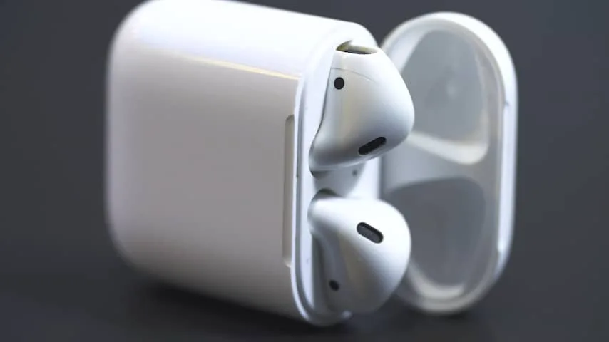
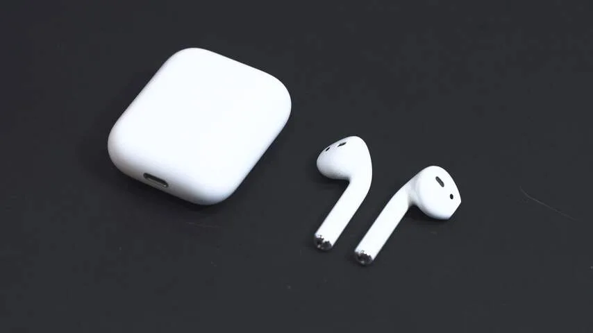
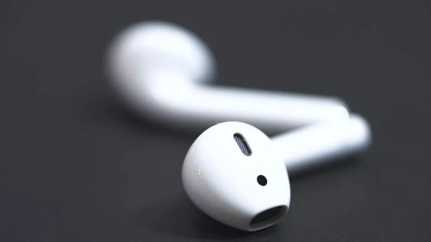
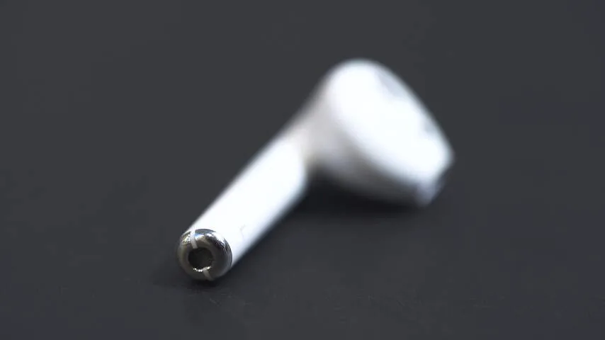
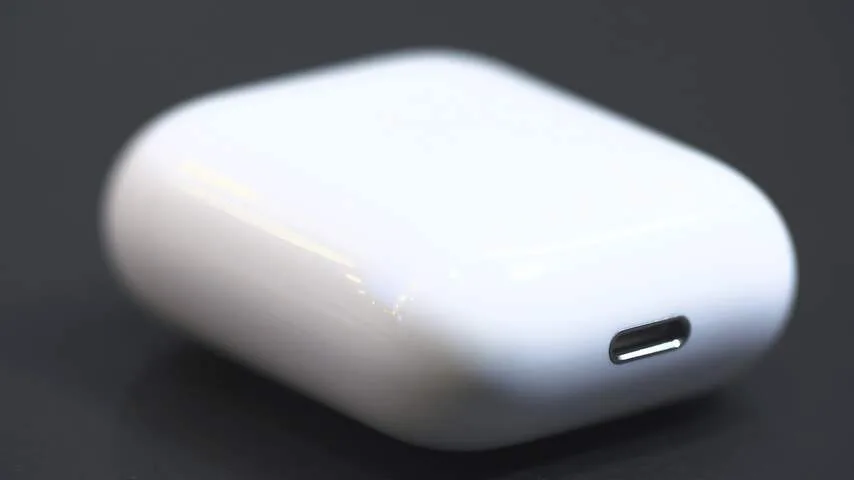

**Na enige vertraging bracht Apple in december de AirPods uit. Weten deze draadloze doppen hun hoge prijskaartje goed te maken?**

> [!NOTE]
> Deze recensie verscheen eerder op [NU.nl](https://www.nu.nl/reviews/4370023/review-de-airpods-zijn-het-beste-apple-product-van-dit-jaar.html).

Draadloze oordoppen bestaan strikt gezien al langer. In het afgelopen jaar zagen we meerdere crowdfundinginitiatieven vergelijkbaar met de AirPods, nog voordat Apple ze had aangekondigd. Zelfs concurrent Samsung heeft draadloze alternatieven die verdacht veel aan de AirPods doen denken. Apple belooft echter groter gebruiksgemak dan we van concurrenten gewend zijn.

De AirPods bestaan in feite uit twee onderdelen: de oordoppen en de bijbehorende doos. Beide doppen verbinden draadloos onafhankelijk van elkaar met een iPhone, waardoor het mogelijk is om één tegelijkertijd te gebruiken. Iedere dop houdt het vijf uur met een opgeladen accu vol.

De bijbehorende doos bevat een ingebouwde batterij, die de totaalduur van de accu verlengt naar 24 uur. Stop de doppen in de doos en ze worden meteen opgeladen. Bij tests werkten de AirPods hierdoor een volle werkweek, door ze gemiddeld twee uur per dag in het openbaar vervoer te gebruiken.

Zowel de oordoppen als de verpakking zijn voorzien van sensoren, waardoor ze zien wat er precies mee gebeurt. Zo weten de AirPods wanneer ze in het doosje zijn gestopt om op te laden, of wanneer ze in oren zitten.

De sensoren zorgen ervoor dat de gebruiker nooit onnodige stappen hoeft te zetten. De oordoppen hoeven alleen maar in oren worden gestoken, waarna ze meteen zijn gekoppeld en het geluid afspelen.

Door ze op te bergen, worden ze zowel uitgeschakeld als opgeladen. Haal één dopje uit een oor en muziek zal automatisch worden gepauzeerd.

[Bekijk ingesloten media](https://content.jwplatform.com/players/mKLrW1j5-whqXCOFb.html)

## Twee keer tappen

De oordoppen weten wanneer iemand er op tikt. Twee taps op een dop activeert automatisch Siri, waarna met de ingebouwde microfoon stemcommando’s ingesproken kunnen worden.

Siri werkt ongeveer net zo accuraat als op de iPhone, maar helaas is de virtuele assistent daarop vaak nog wat onhandig. Zo kunnen telefoontjes soms niet worden gestart zonder het toestel te ontgrendelen.

Vanuit de iPhone-instelling kan het commando gekoppeld aan de twee taps veranderd worden, om bijvoorbeeld muziek af te spelen of te pauzeren. Ook kan de dubbele tap de oordoppen volledig uitschakelen.

Die extra commando’s zijn echter niet heel nuttig. Muziek kan al worden gepauzeerd door één van de doppen uit te doen, en ze gaan al uit zodra ze in de doos worden gestopt. Het zou veel handiger zijn om met twee taps naar een volgend nummer te springen, maar dat is helaas niet in te stellen.

## Aardig geluid

Wie alleen het allerzuiverste geluid wil, zal waarschijnlijk niet voor de AirPods kiezen. De oordoppen bieden een geluid dat zich het beste laat beschrijven als 'wel aardig'.

Klanken zijn prima en we kunnen meerdere instrumenten in complexe nummers van elkaar onderscheiden. Daarmee is het geluid iets beter dan de EarPods - Apples bedrade doppen die standaard bij iPhones worden geleverd. Het basgeluid is echter amper te voelen bij het gebruik van de draadloze gadget.

## W1-chip

De AirPods gebruiken Bluetooth om met een iPhone te verbinden, waarbij een speciale draadloze W1-chip van Apple de connectie regelt.

Door het doosje voor het eerst open te klappen verschijnt op de iPhone een speciaal koppelscherm. Dit scherm toont na de koppeling de batterijpercentages van de doppen en verpakking.

De connectie gelegd met de W1-chip lijkt over het algemeen stabieler dan een gewone Bluetooth-connectie. Op een iPhone die soms moeite heeft meteen te verbinden met een Bluetooth-koptelefoon, werken de AirPods nagenoeg altijd zodra ze uit de doos zijn gehaald.

## Andere apparaten

Zijn de AirPods eenmaal met een iPhone gekoppeld, dan zijn deze gekoppeld aan de Apple-account van een gebruiker. Hierdoor werken de oordoppen ook met alle andere apparaten die hiermee verbonden zijn.

Dat werkt tijdens tests verrassend goed. AirPods verbinden met twee tikken met een MacBook of een Apple Watch, waarna ze werken zoals verwacht. Dat is een stuk gemakkelijker dan bij Bluetooth-koptelefoons, die vaak via hele processen gekoppeld of ontkoppeld moeten worden.

Wel waren er af en toe wat problemen met het maken van een koppeling met een MacBook, maar waar dat aan lag werd niet helemaal duidelijk.

## Kleine bugs

Hoewel de AirPods bij tests beter werkten dan gebruikelijke Bluetooth-apparatuur, zijn er wel een aantal kleine bugs waar de draadloze doppen last van kunnen hebben.

In één situatie werkte bijvoorbeeld slechts de rechterdop, waardoor aan de linkerkant niks te horen was. Een paar dagen later liep één van de doppen ongeveer een honderdste van een seconde achter, waardoor er een soort 'echo' ontstond in het geluid.

Beide bugs konden worden opgelost door de doppen terug in het doosje te stoppen en er weer uit te halen. Het zijn echter mankementen, waardoor de AirPods nog nèt niet helemaal vlekkeloos in elkaar steken. Vaak kwamen de problemen echter niet voor.

## Pasvorm

De angst om draadloze oordoppen kwijt te raken is groot: vallen ze eenmaal uit, dan liggen ze zomaar in bijvoorbeeld hoog gras. Bij een test van ongeveer een week zijn de AirPods echter nooit uitgevallen. Zelfs bij een korte sprint naar een bus of flink hoofdschudden blijven ze gewoon zitten.

De pasvorm van de AirPods is voor iedereen echter anders. Er zijn mensen die ze sneller kwijtraken bij te harde hoofdbewegingen. Het is daarom verstandig de oordopjes vooraf snel eens uit te proberen.

_AirPods — Beeld: NU.nl_

_AirPods — Beeld: NU.nl_

_AirPods — Beeld: NU.nl_

_AirPods — Beeld: NU.nl_

_AirPods — Beeld: NU.nl_

## Conclusie

De AirPods zijn misschien wel het beste product dat Apple in 2016 heeft uitgebracht. Dat is deels te danken aan voorgaande apparaten. De iPhone 7 was eerder controversieel dan revolutionair door de geschrapte koptelefoonpoort. Iets later introduceerde de MacBook een aanraakbalk boven het toetsenbord, maar de implementatie daarvan in software was vooral wat rommelig.

De draadloze oordoppen van Apple doen echter wat we van het bedrijf verwachten: dit is een simpel product, waar een gebruiker weinig bij stil hoeft te staan. Er is geen complex koppelproces, de doppen gaan aan en uit op de logische momenten zonder dat er een knop aan te pas komt. Hoewel er wat kinderziektes zijn, is het indrukwekkend hoe Apple het normaal frustrerende draadloze koppelproces wist terug te brengen naar zoiets simpels.
