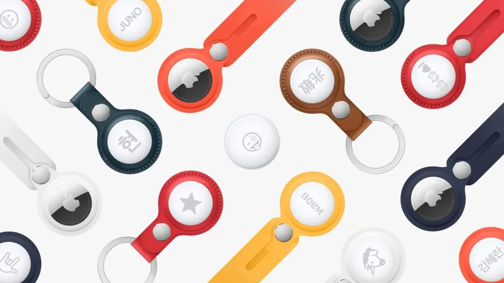

Apple probeert met zijn nieuwe AirTags het probleem van de kwijtgeraakte portemonnee of sleutelbos voor eens en altijd op te lossen. Maar hoe goed werkt dat nou echt?

> [!NOTE]
> Deze recensie verscheen eerder op [AD](https://www.ad.nl/tech/review-is-een-apple-airtag-de-35-euro-waard~aeb93672/).

Ze zijn naar Apple-standaarden bijna goedkoop te noemen: een AirTag kost je slechts 35 euro, of 120 euro voor een pakje met vier. De apparaatjes lijken op grote knopen, die met los verkochte holsters aan bijvoorbeeld een sleutelbos, tas of andere gadget bevestigd kunnen worden.

Daar hebben ze vervolgens maar één doel: ervoor zorgen dat je het verbonden object niet meer kwijtraakt. Vanuit de Zoek Mijn-app op je iPhone zie je op de kaart waar het betreffende voorwerp voor het laatst verbinding heeft gemaakt. Ben je in de buurt, dan maakt de AirTag met een druk op de knop een simpel geluidje om je zoektocht te verspoedigen.

Voor zo’n klein apparaatje kan de AirTag verrassend veel geluid maken. Hierdoor konden we hem zelfs horen onder een kussen achter gesloten deuren. Volgens de techreus komt dat door een speciale fabricagetechniek, waardoor de gehele achterzijde van de AirTag in feite als luidspreker dient.

## Tile

Apple is zeker niet het eerste bedrijf dat zo’n tracker maakt. Het Amerikaanse Tile probeert al sinds 2012 met vergelijkbare apparatuur de wereld te veroveren, met trackers die zelfs in de vorm van flinterdunne pasjes worden verkocht. Handig voor in een beurs. Dat bedrijf zegt nu te vrezen voor Apples AirTags, omdat het bedrijf wellicht oneerlijk zou concurreren.

Want waar Tile alleen werkt in combinatie met een losse iPhone-app, is de functionaliteit van je AirTag diep ingebakken binnen je iPhone. Het apparaatje kan bijvoorbeeld gebruikmaken van een speciale chip in de iPhone 11 en 12, waarmee de exacte locatie van een voorwerp gevonden kan worden. Een pijl op de telefoon laat dan zien welke kant je precies op moet lopen.

## Kwijt

De nauwe samenwerking tussen een iPhone en AirTags wordt pas echt duidelijk als je iets ver van huis bent kwijtgeraakt. De gadget maakt dan contact met iedere passerende iPhone, om versleuteld en anoniem de locatie naar jou toe te sturen. Bij onze tests konden we op die manier een AirTag een dorp verderop nog terugvinden, ondanks dat het apparaat zelf niet met het internet of gps verbindt.

Zo’n kwijtraakfunctie heeft Tile ook, maar daarbij is hij afhankelijk van langslopende telefoonbezitters die toevallig ook de Tile-app hebben geïnstalleerd. Omdat AirTags van Apple zijn, helpt werkelijk iedere nabije iPhone om je sleutelbos of portemonnee weer te lokaliseren. En omdat er wereldwijd vele miljoenen iPhone-gebruikers actief zijn duurt dat nooit lang.

© Apple

## Binnen twee minuten

Dat merken wij in de praktijk ook. We hebben de AirTags een paar keer op een gemiddeld bezochte locatie neergelegd, om te zien wat er zou gebeuren. Op drukke plekken was hij binnen twee minuten in de app teruggevonden - rustigere locaties deden er ongeveer een uurtje over.

Uiteraard zal de snelheid waarop iets wordt teruggevonden voor iedereen verschillen. Maar het haalt niet weg dat de basis hier buitengewoon solide is: het is met AirTags lastig om iets voor altijd kwijt te raken, tenzij het wordt gestolen.

Overigens ben je niet alléén afhankelijk van iPhone-bezitters. Staat een AirTag in de speciale kwijtmodus, dan kan een Android-toestel ook de ingebouwde NFC-chip scannen. Dan verschijnt een simpele boodschap, inclusief jouw telefoonnummer om contact op te nemen.

## Batterij

Ondanks onze tests is er een hoop dat we nog niet weten. Apple belooft een dik jaar batterijduur, wat in een testperiode van een week onmogelijk is om te verifiëren. De knoopcelbatterij kan makkelijk worden vervangen, maar het is nog onduidelijk hoe water- en stofwerend hij blijft nadat je dit hebt gedaan.

Wel hebben we de AirTags een paar keer op regenachtige boswandelingen meegenomen, zonder dat de apparaatjes daar onder leken te lijden. Ze zijn vermoedelijk bestand tegen de meeste ruige weersomstandigheden, al zal mogelijke langetermijnschade pas in de komende maanden duidelijk worden.

## Conclusie

Slimme trackers voor je sleutels, portemonnee of rugzak bestaan al tijden, maar Apple weet de achterliggende technologie met zijn AirTags te verfijnen. Dat komt niet eens door de gebruikte hardware, maar is te danken aan het grote aantal iPhones in het wild. Een kwijtgeraakte AirTag is doorgaans snel weer gevonden.

Dat alleen al maakt het wat ons betreft een aanrader. Voor 35 euro is de kans ineens piepklein dat je ooit nog je voordeursleutel kwijtraakt. Een relatief klein bedrag dat in het niet valt vergeleken met de kosten van een slotenmaker om 3:00 uur ’s nachts die de voordeur moet openbreken.
