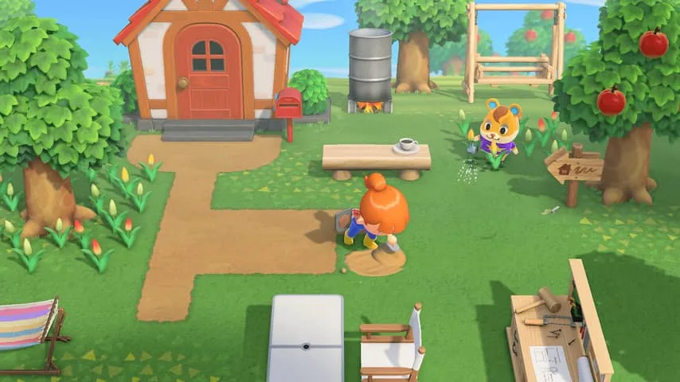
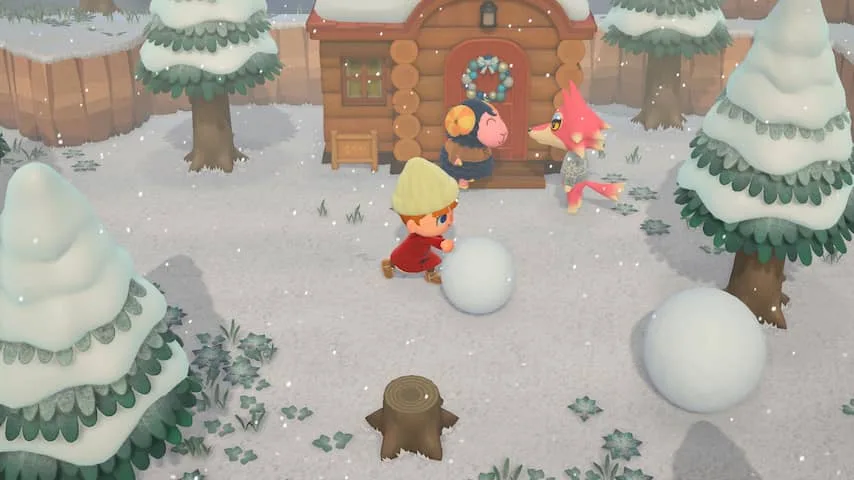
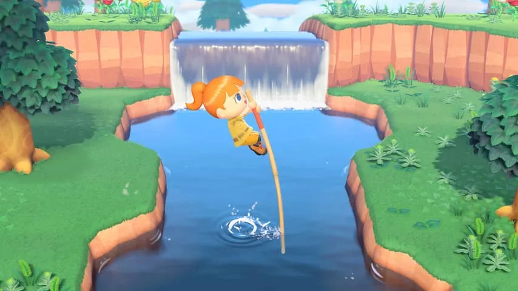

**Nintendo's nieuwste game is er een om voor thuis te blijven. In Animal Crossing: New Horizons kun je namelijk nog wel naar de winkels en gezellig keuvelen met de buren.**

> [!NOTE]
> Deze recensie verscheen eerder op [NU.nl](https://www.nu.nl/tech/6037896/review-animal-crossing-is-de-perfecte-game-om-te-ontstressen.html).

De eerste _Animal Crossing_ was een soort experiment: Nintendo maakte een spel dat gebruikmaakt van de interne klok van je spelcomputer, zodat de virtuele wereld meebeweegt met de echte.

Winkels openen en sluiten op vaste tijden en feestdagen worden ook in _Animal Crossing_ gevierd, wat reden biedt om het spel elke dag op te starten. Een einddoel was er eigenlijk niet. _Animal Crossing_ draaide om het alledaagse, waarbij je vooral bezig bent met vissen, schatgraven en je huisje inrichten.

Het nieuwe _Animal Crossing: New Horizons_ op de Nintendo Switch is op dat vlak weinig veranderd. Ditmaal verhuis je naar een onbewoond eiland, waar je samen met een paar medereizigers tenten neerzet. Op termijn kun je op de plek van die tent een klein huisje bouwen waar je vervolgens een hypotheek op afbetaalt.

Dat doe je door bijvoorbeeld fruit, vissen, insecten en stenen te verkopen aan een lokaal winkeltje, dat naarmate je meer handelt transformeert van een tent in een volwaardig pand. Hetzelfde gebeurt met tenten van je medebewoners, waardoor het kampeerterrein langzaamaan een dorpje wordt.

_Animal Crossing: New Horizons — Beeld: Nintendo_

## Geen urgentie

Hoewel je een hypotheek hebt om af te betalen, presenteert de game je die zonder urgentie. Pandjesbaas Tom Nook benadrukt dat je alle tijd mag nemen om het bedrag af te betalen, van rente is in de wereld van _Animal Crossing_ geen sprake.

Maar wie geen waarde hecht aan de grootte van het huis, kan gerust het eiland afstruinen op zoek naar zeldzame vissen, die na een donatie te zien zijn in het aquarium van een lokaal museum. Of je kunt bijpraten met de mede-eilandbewoners, die bijna altijd wel iets nieuws zeggen en soms zelfs verzoekjes of cadeaus voor je hebben.

_Animal Crossing: New Horizons — Beeld: Nintendo_

## Nederlandstalig

Voor het eerst is een _Animal Crossing_\-game gelokaliseerd naar het Nederlands. Deze vertaling zit vol kleine woordgrapjes en zinspelingen: de lokale uil begroet je gapend met "Goe-hoe-demorgen", waarna hij zich excuseert voor zijn vermoeide staat. Want "overdag knapt hij doorgaans een uiltje".

Bij het vangen van vissen en insecten krijg je steeds een klein woordgrapje voorgeschoteld. Bij karpers word je erop gewezen dat die "soms samen reizen in een karppoel" en bij een forelbaars vraagt je personage af of het niet gewoon een "verbaarsde forel is".

Er is buitengewoon veel aandacht gestoken in de Nederlandse versie van de game. Bovendien maakt deze de game toegankelijk voor jongere spelers.

_Animal Crossing: New Horizons — Beeld: Nintendo_

## Doe-het-zelven

In vroegere _Animal Crossing_\-games kon je nieuwe meubels en andere voorwerpen alleen in winkeltjes kopen. In dit nieuwe deel heb je ook de mogelijkheid om te doe-het-zelven, zodat je met gevonden blokken hout en stukken steen bijvoorbeeld een bank, bed of hekje kunt maken.

Dat doe je dan ook veel: de gereedschappen waarmee je graaft, bomen hakt en vist gaan op termijn kapot, waardoor je soms meermaals per dag iets nieuws maakt. Aan het begin van de game frustreert dat een beetje, omdat je alleen de simpelste varianten kunt maken. Pas later leer je hoe je steviger gereedschap in elkaar zet, maar zelfs dat gaat op termijn kapot.

Bijna alles in de wereld van _Animal Crossing_ is te koop met klingels, maar ditmaal kun je ook miles verzamelen door activiteiten af te ronden. Vang een bepaald aantal vissen, verkoop genoeg voorwerpen en maak een paar objecten en je krijgt weer nieuwe miles, die je aan specifieke voorwerpen kan uitgeven. Iedere dag komen er nieuwe missies bij waarmee je extra veel miles verdient.

Dat miles-systeem geeft het soms wat doelloze _Animal Crossing_ iets meer houvast. Je kunt simpelweg de vijf dagelijkse missies afronden om wat te sparen, waarbij je gaandeweg leert wat je allemaal nog meer in de game kunt doen. In het begin stimuleert _New Horizons_ je om dit te doen, omdat je eerste huis-upgrade met miles gekocht kan worden. Maar hoe verder je komt, hoe vrijer de game wordt.

[Bekijk ingesloten media](https://www.youtube.com/embed/_3YNL0OWio0)

## Conclusie

In _Animal Crossing: New Horizons_ kun je zorgeloos met andere dorpsbewoners praten. Alle winkels zijn nog open en iedereen is bezig met totaal andere zaken. Het doelloze karakter van de game maakt dit bovendien één van de meest stressloze ervaringen die je nu kunt vinden. Er zijn ergere dingen om te spelen tijdens een quarantaine.

_Review score 4,5 ster — Beeld: NU.nl_
