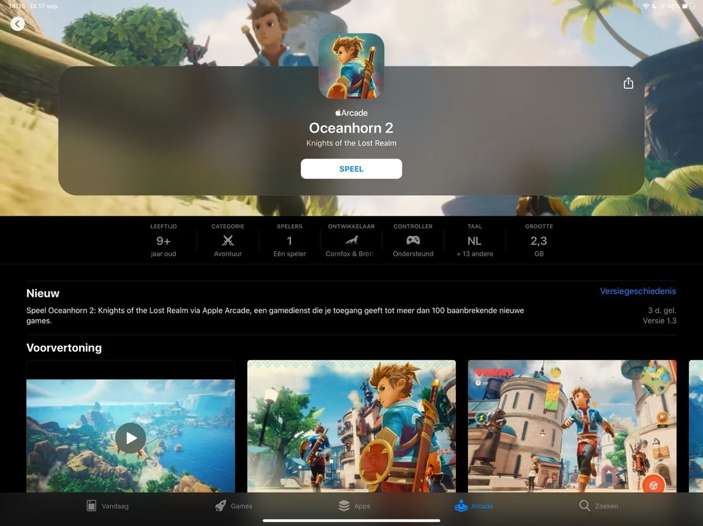

**Wat een games**

Met [Apple Arcade](https://www.bright.nl/trends/artikel/4656351/apple-arcade-gamedienst-games-prijs-prijzen-spelen-ios-android) hoopt Apple mobiele games weer een beetje interessant te maken. Ontwikkelaars krijgen een keuze: als games geen in-app aankopen of advertenties bevatten en niet voor Android verschijnen, dan mogen ze worden uitgegeven via het nieuwe Apple-platform.

> [!NOTE]
> Deze recensie verscheen eerder op [Bright](https://www.bright.nl/nieuws/1123758/eerste-indruk-apple-arcade-kan-de-app-store-voor-altijd-veranderen.html).

Een deel van het abonnementsgeld van alle Arcade-gebruikers die de game spelen, wordt vervolgens uitgekeerd aan de maker. Hiermee is het platform vergelijkbaar met bijvoorbeeld Spotify en Netflix, maar dan voor mobiele spellen. Het is overigens nog de vraag hoe Apple die punten van de taart precies zal verdelen.

## Nu al grote games

Het idee achter Apple Arcade lijkt nu al goed uit te pakken. Op het moment van schrijven staan er meer dan vijftig games in Apple Arcade, waarvan een hoop zijn gemaakt door geroemde ontwikkelaars en grote studio’s.

Monument Valley-maker Ustwo heeft bijvoorbeeld met Assemble with Care een klein, lief spel uitgebracht, waarin je oude apparaten moet repareren om meer te leren over de bezitters hiervan. De ontwikkelaars van het zen-puzzelspel Mini Metro heeft ook een vervolg uitgebracht genaamd Mini Motorways.

Ook grote internationale bedrijven zijn er vroeg bij. Rayman, de mascotte van het Franse Ubisoft, heeft een nieuwe game die exclusief voor Arcade verschijnt. Daarnaast brengt de Japanse Final Fantasy-maker Square Enix een uniek rollenspel uit voor het platform.

Misschien wel de meest indrukwekkende game op het platform is Oceanhorn 2. Dit driedimensionale rollenspel heeft een verbluffend mooie spelwereld, die er uitziet als de wereld van een miljoenengame op spelcomputers. Het spel moet je 15 uur bezig houden en zit vol met grootse baasgevechten en puzzels.

## Trailer: Oceanhorn 2

[Bekijk ingesloten media](https://www.youtube.com/embed/DoRchbMDnqU?autoplay=1&modestbranding=1)

## Lijstjes zoals bij Netflix

Bovendien zijn de spellen via Family Sharing te delen met familieleden. Een verademing voor ouders, die kinderen ineens zonder gedoe games zonder in-app aankopen en andere streken kunnen laten spelen.

De games van Apple Arcade zijn te vinden op een speciaal tabblad in de App Store. Zodra je een abonnement hebt afgesloten kun je ze allemaal met één tik op het scherm downloaden. Het bevestigingsscherm dat je bij gewone gratis apps ziet, komt niet eens in beeld. Het voelt hierdoor dodelijk simpel om snel een game te downloaden.

De titels staan gesorteerd in met de hand gemaakte categorieën, zoals muziekgames en avonturenspellen. Daarmee lijkt Apple streamingdiensten voor andere media een beetje na te doen, door een vooraf samengestelde lijst met aanraders te tonen.

Je kunt een game ook aantikken om er meer over te lezen - en op die pagina’s krijg je net wat meer informatie dan op een gewone App Store-detailpagina. Er staat vermeld vanaf welke leeftijd een game geschikt is, hoeveel mensen hem tegelijk kunnen spelen en onder welk genre ze vallen.

## Ondersteuning voor gamepads

Ook kun je zien welke games je met een gamepad kunt spelen. Dat kan vanaf iOS 13 voor het eerst met een controller voor Xbox One of PlayStation 4, waardoor je niet langer een dure iOS-variant hoeft te kopen.

Hoewel lang niet alle games met zo’n gamepad werken, zijn het er toch nog aardig wat. Vooral de wat traditioneel ogende spellen worden ondersteund, zoals Oceanhorn 2, Hot Lava en Mutazione. Deze games kunnen over een tijdje ook op die manier gespeeld worden op een Apple TV, zodra Apple Arcade hiervoor beschikbaar komt. Een gaaf pluspunt, want je kunt een game op je iPhone thuis dan verder spelen op het grote scherm.

## Geen eigen zoekfunctie

Wel jammer: je kunt niet zoeken in Apple Arcade. Er staat wel een zoekbalk onderin beeld, maar die is bedoeld voor heel de App Store en laat slechts soms de Arcade-games zien. Een plek om alleen naar Arcade-games te zoeken, is nergens te vinden.

Hoewel Apple allerlei extra informatie over de games laat zien, kun je daar ook niet op filteren. Je kunt dus niet bijvoorbeeld alle éénspeler-avonturenspellen met controller-ondersteuning bekijken.

Je kunt wel een pagina met alle Arcade-games openen, maar op termijn is deze lijst waarschijnlijk te groot om snel een specifieke titel te vinden. Het is te hopen dat Apple tegen die tijd een zoekoptie heeft toegevoegd.

## Voorlopige conclusie

Vijf euro per maand voelt eigenlijk als een prikkie voor wat er nu al in Apple Arcade staat: sommige games in de lijst zouden we los al vijf euro voor betalen - en Apple belooft maandelijks nieuwe titels toe te voegen. Hopelijk weten ze het huidige niveau een beetje vol te houden.

Daarmee kan de techgigant de appindustrie wel eens een tweede keer volledig veranderen: wordt dit een succes, dan is het voor gamestudio’s ineens vooral lucratief om mobiele games voor Apple Arcade te maken. Want zou jij nog een losse game kopen, als je ook al een Apple Arcade-abonnement hebt?

## Deze games zijn op dag één beschikbaar:

Assemble With Care (usTwo)

Shantae and the Seven Sirens (WayForward Technologies)

Grindstone (Capybara Games)

WHAT THE GOLF? (The Label)

Card of Darkness (Zach Gage)

LEGO Brawls (LEGO)

Patterned (Borderleap)

Stellar Commanders (Blindflug Studios)

Where Cards Fall (Snowman)

Overland (Finji)

Exit the Gungeon (Devolver Digital)

Rayman Mini (Ubisoft)

Spaceland (Tortuga Team)

Agent Intercept (PikPok)

Punch Planet (Block Zero Games)

Sneaky Sasquatch (Rac7 Games)

Operator 41 (Shifty Eye Games)

Frogger in Toy Town (Konami)

Red Reign (Ninja Kiwi)

Various Daylife (Square Enix)

Mini Motorways (Dinosaur Polo Club)

Don’t Bug Me! (Frosty Pop)

Oceanhorn 2 (Cornfox & Bros)

King’s League II (Kurechii)

Explottens (Werplay Priv.)

Spelldrifter (Free Range Games)

The Get Out Kids (Frosty Pop)

Spek. (Rac7 Games)

Way of the Turtle (Illusion Labs)

Lifeslide (Block Zero Games)

Neo Cab (Surprise Attack Games)

Skate City (Snowman)

Tint. (Lykke Studios)

The Enchanted World (Noodlecake Studios)

Over the Alps (Stave Studios)

Hot Lava (Klei Entertainment)

The Pinball Wizard (Frosty Pop)

Shinsekai Into the Depths (Capcom)

Word Laces (Minimega)

Dear Reader (Local No. 12)

Projection: First Light (Blowfish Studios)

ATONE: Heart of the Elder Tree (Wildboy Studios)

Big Time Sports (Frosty Pop)

Tangle Tower (SFB Games)

Dread Nautical (Zen Studios)

Mutazione (Die Gute Fabrik)

Bleak Sword (Devolver Digital)

Sayonara Wild Hearts (Annapurna)

Dead End Job (Headup)

Cat Quest II (The Gentlebros)

Dodo Peak (Moving Pieces)

Cricket Through the Ages (Devolver Digital)

Speed Demons (Radiangames)

## Review: iPhone 11 en 11 Pro

[Bekijk ingesloten media](https://www.youtube.com/embed/8QiQmdG1rdM?autoplay=1&modestbranding=1)
