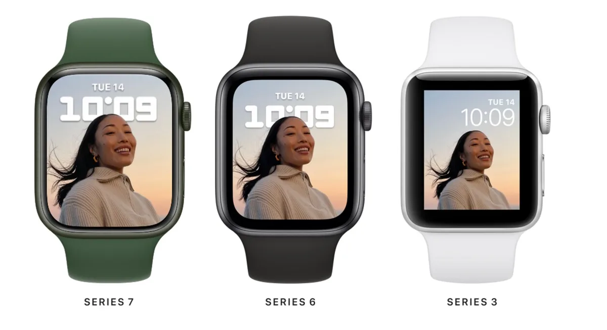

Apples nieuwste smartwatch heeft het grootste scherm tot nu toe, maar is tegelijk de kleinste upgrade die we ooit zagen.

> [!NOTE]
> Deze recensie verscheen eerder op [AD](https://www.ad.nl/tech/dit-is-de-kleinste-upgrade-die-de-apple-watch-ooit-kreeg~aad0e0fb/).

De populariteit van de Apple Watch moet niet onderschat worden. Het is inmiddels niet alleen de populairste smartwatch, maar zelfs het meest gedragen horloge ter wereld. In 2017 won de techreus al de populariteitsprijs van Rolex. Dat zegt veel over Apples dominante positie, vooral als je bedenkt dat het horloge alleen in combinatie met een iPhone werkt.

De eerste Apple Watch verscheen in 2015, waarna het ontwerp van het horloge eigenlijk gelijk is gebleven. Ieder jaar werd alleen de binnenkant van de gadget verbeterd, met bijvoorbeeld een snellere processor en extra sensoren om bijvoorbeeld zuurstof in het bloed te meten en een hartfilmpje te maken.

## Groter scherm in de Series 7

Ook het scherm groeide met de jaren, en bij de nieuwe Apple Watch Series 7 is het de meest significante upgrade tot nu toe. De randen rond het horloge zijn bijna verdwenen, waardoor nagenoeg het hele oppervlak van het horloge wijzerplaten en berichten kan laten zien.

Die dikke randen probeerde Apple al sinds 2015 te verbergen door een oledscherm te gebruiken en daarop vooral wijzerplaten met zwarte achtergronden te tonen. Het zwart van het scherm en de behuizing van het horloge gingen in elkaar op. Door de randen nu een slag dunner te maken, zien klokjes met op de achtergrond bijvoorbeeld je eigen foto’s er mooier uit.

De Series 7 (links) heeft een groter scherm en dus dunnere randen. © Apple

## Nieuwe wijzerplaten

Over wijzerplaten met foto’s gesproken: Apple heeft in zijn nieuwste Apple Watch-upgrade daar een nieuwe van toegevoegd. Hierbij kan een portretfoto geschoten met een iPhone worden ingeladen, waarbij de Apple Watch onderscheid maakt tussen het onderwerp en de achtergrond. De klok wordt net achter de gefotografeerde persoon getoond, wat zorgt voor een gaaf diepte-effect. Deze wijzerplaat werkt ook op andere Apple Watch-modellen, maar bij die modellen is de foto nog omheind met dikkere, lelijke randen.

Er zijn ook twee nieuwe klokjes exclusief voor de Series 7. Bij de een is extra veel plek voor de zogeheten complicaties, waarmee je allerlei app-informatie groot in beeld kunt tonen. Bij de ander lopen de cijfers van een analoge klok nauw langs de randen van het scherm. Beide zijn duidelijk gemaakt om gebruik te maken van het ruimere display.

## Typen op een horloge

Nu het scherm groter is, heeft Apple ook een toetsenbord toegevoegd om bijvoorbeeld reacties in een chatapp mee te typen. Die knoppen zijn nog steeds wat priegelig, maar bij onze tests maakten we verrassend weinig tikfouten. Dat komt volgens Apple door speciale software die probeert te voorspellen wat je wil typen, zodat bij twijfelachtige drukken op de toetsen de juiste letter wordt gekozen. Een soort preventieve spellingscontrole.

Verder is het scherm volgens Apple 70 procent helderder en kan het horloge beter tegen stof. De bijgeleverde oplader heeft nu een USB-c-poort voor de oplader, waardoor hij 33 procent sneller van stroom is voorzien. Daarmee kun je hem makkelijker tussendoor opladen, maar de batterij is vergelijkbaar met vorige modellen gebleven. Met één lading houd je het ruim een dag vol.

## Groot scherm, kleine upgrade

En daar blijft het eigenlijk bij. Voor het eerst in jaren heeft Apple niet een nieuwe, snellere processor aan de Apple Watch toegevoegd, en is er ook geen sprake van sensoren om andere gezondheidsinformatie af te lezen. Het maakt de Series 7 eigenlijk gewoon een Series 6 met een iets groter beeldscherm. Nu vermoeden we dat weinig mensen hun horloge ieder jaar upgraden en daar écht van balen, maar het is opmerkelijk dat Apple zijn upgrade dit jaar zo klein heeft gehouden.

Wie upgradet vanaf een oudere Apple Watch kan uiteraard rekenen op veel functies die in eerdere edities zijn toegevoegd, waarvan wij het _always on_\-scherm van de Series 6 nog steeds de meest significante vinden. Hierdoor wordt de tijd altijd op het horloge getoond, terwijl oudere modellen alleen iets tonen als je het scherm naar je toedraait. Ondanks die toevoeging houdt het horloge het nog prima een dag vol op een volle accu.

Het voelt een beetje alsof Apple de Series 7 op het laatste moment als een soort tussenmodel heeft ontwikkeld. Geruchten wijzen al maandenlang op de komst van een écht nieuwe Apple Watch, met een plat scherm en een ontwerp dat vergelijkbaar is met de nieuwste iPhones. Het zou voor het eerst sinds 2015 zijn dat de Watch een compleet ander ogende behuizing krijgt. Over dat horloge werd echter met geen woord gerept tijdens de iPhone-aankondiging afgelopen maand, waarna we de wat conservatieve Series 7 te zien kregen. Zou Apples productieketen vertraging hebben opgelopen bij dit nieuwe model? We zullen het waarschijnlijk nooit zeker weten.

## Conclusie

De Apple Watch Series 7 is, simpel gezegd, een Apple Watch Series 6 met groter scherm. Natuurlijk zijn er nog een paar kleine andere upgrades, zoals betere weerstand tegen stof en snellere laadtijden, maar het zijn wijzigingen waar je bijna niks van merkt. Terwijl we voor het eerst in jaren géén snelle processor krijgen.

Daar kunnen we zuur over zijn, maar tegelijkertijd is de nieuwste Apple Watch een aanrader. Zelfs bij zo’n kleine stap voorwaarts blijft Apples _wearable_ mijlenver voorlopen op de concurrentie. Natuurlijk, upgraden van een Series 6 naar een Series 7 heeft weinig nut. Maar wie voor het eerst een Watch koopt of een veel ouder model heeft, koopt met de nieuwste een prima horloge.
