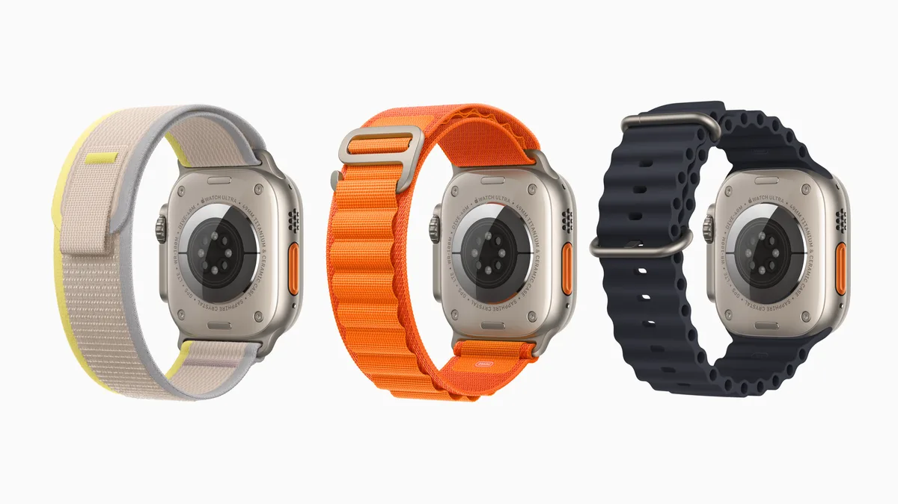
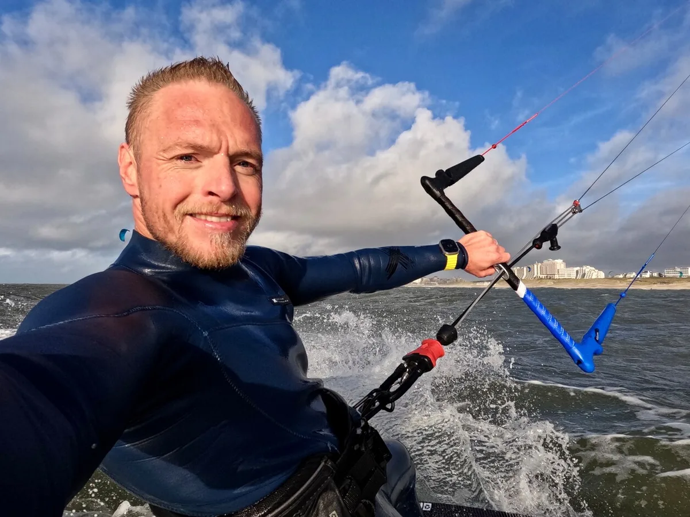

De Apple Watch Ultra is een smartwatch die alleen bedoeld is voor de meest extreme sporters. Kitesurfer Ruben Lenten is er in elk geval blij mee: ,,Ik kan precies zien hoe hoog ik heb gesprongen.”

> [!NOTE]
> Deze recensie verscheen eerder op [AD](https://www.ad.nl/tech/de-apple-watch-ultra-is-een-uitstekende-smartwatch-maar-alleen-zijn-geld-waard-voor-extreme-sporters~a2048da8/).

Naast de goedkopere Apple Watch SE en de gewone Apple Watch is er nu ook de Apple Watch Ultra: een horloge met een robuuster ontwerp, steviger en helderder scherm, langere accuduur en betere waterbestendigheid. Volgens de techreus is hij bedoeld voor extreme sporters, zoals duikers die diep het water in moeten of hardlopers die met hun urenlange routes niet genoeg hebben aan de gebruikelijke accuduur.

Al die extra’s maken hem ook een stuk duurder: voor een Ultra betaal je tegen de duizend euro. Dat terwijl veel van de extraatjes vergeleken met een ‘gewone’ Watch voor lang niet iedereen zijn weggelegd.

## Twee tests: door een reviewer en een kitesurfer

Omdat de Watch Ultra voor een specifieke doelgroep bedoeld is, hebben we hem anders getest dan bij andere reviews. We hebben hem zelf uitgeprobeerd zoals we bij iedere gadget zouden doen, maar daarnaast hebben we kitesurfer Ruben Lenten gevraagd hem ook uit te proberen. Hij onderwierp de gadget aan wat extremere testomstandigheden, om te zien of hij dan alle gemaakte beloftes inlost.

Om te beginnen met onze eigen tests: de Watch Ultra is simpel gezegd een betere Apple Watch. Er zitten allerlei extraatjes in die de gewone gebruiker ook leuk zal vinden - de grotere accu zorgt er in de praktijk voor dat je nog maar om de dag hoeft op te laden, in plaats van iedere dag. Het scherm is helderder en daardoor beter af te lezen bij fel zonlicht. Daarnaast is het door de luidere speaker makkelijker om een telefoongesprek te voeren dan bij goedkopere Watches.

De Ultra wordt verkocht met drie bandjes voor specifieke sportsituaties, waaronder eentje voor watersport (rechts). © Apple

## Handige actieknop

Misschien wel onze favoriete toevoeging is de extra knop aan de linkerzijde. Die is standaard gekoppeld aan de fitness-app, zodat je snel een workout kunt starten. Daarnaast kun je er bijvoorbeeld de stopwatch, zaklamp of een automatisering via de Opdrachten-app aan koppelen, zodat je snel iets kunt opstarten zonder te hoeven navigeren naar een specifieke app.

Maar zijn die extra’s het geld waard voor een gewone gebruiker, die niet bovengemiddeld sport? Waarschijnlijk niet. Want ja, het scherm is helderder en de speaker luider, maar over beide functies hadden we bij alledaags gebruik weinig klachten bij zelfs de goedkoopste Apple Watch. De extra actieknop is leuk en de dubbele batterijduur fijn, maar beide kun je bij goedkopere concurrenten ook terugvinden.

## ‘Airtime zien is interessant en motiverend’

Het is duidelijk een horloge bedoeld voor een zeer specifieke doelgroep, zoals kitesurfer Ruben Lenten. Hij gebruikte tijdens zijn tests een app bedoeld voor surfers, die laat zien hoe hoog hij kwam bij iedere sprong. ,,Het liet mijn airtime zien en dat soort dingen. Dat is superinteressant en werkt heel erg motiverend, want ik wil dan iedere keer hoger komen.”

Kitesurfer Ruben Lenten hielp ons met het testen van de Apple Watch Ultra. © Ruben Lenten

,,We hadden kleine apparaatjes om hetzelfde mee te doen, maar die zaten op je board en zijn dan pas achteraf uit te lezen. Of je maakt je telefoon vast aan je board om hem zo uit te lezen. De Watch Ultra heeft dan voordelen bij het aflezen van die informatie.”

## Anderhalve dag accu bij intensieve workouts

Bij zijn intensievere workouts haalt Lenten een minder lange batterijduur dan wij bij gemiddeld gebruik: na anderhalve dag is zijn Watch Ultra weer leeg. Hij gebruikte de nieuwe Ocean-polsband, die gemaakt is voor watersporters. ,,Die blijft goed zitten en zit lekker onder de wetsuit.”

Zelf zou hij de Watch Ultra in elk geval kopen. ,,Ik ben wel een gadgetman en vind het voor deze functies wel zijn duizend euro waard. Het is wel mijn eerste smartwatch: ik was hiervoor nooit echt een horlogemens.”

Eén puntje van kritiek heeft hij wel: de nieuwe actieknop aan de linkerzijde van de kast mag van hem wel een stukje naar boven worden geschoven. ,,Steeds als ik de draaiknop rechts probeer in te drukken, klik ik ook automatisch op die actiebutton.” De toets zit namelijk precies op de plek waar je duim op leunt wanneer je het horloge aan beide zijden vasthoudt.

## Conclusie

Ga je een paar keer per week voetballen of naar de sportschool? Dan is de nieuwe Watch Ultra overkill voor jou. Het horloge maakt zijn beloftes pas waar als je urenlang gaat sporten of bijvoorbeeld diep onderwater duikt. De extra’s zijn alsnog voor iedereen leuk, maar niet leuk genoeg om dubbel zoveel voor te betalen.

Maar als je een specifieke reden hebt om dit horloge te gebruiken, dan is dit een uitstekende smartwatch. Al vermoeden we dat die groep mensen best klein is en het gros gewoon de goedkopere smartwatches van Apple blijft kopen.
