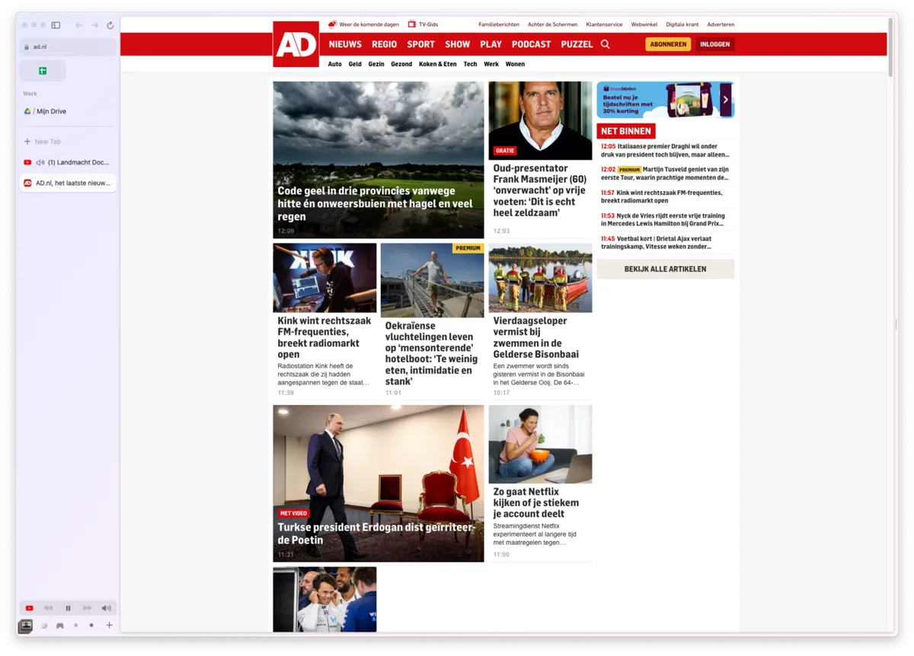
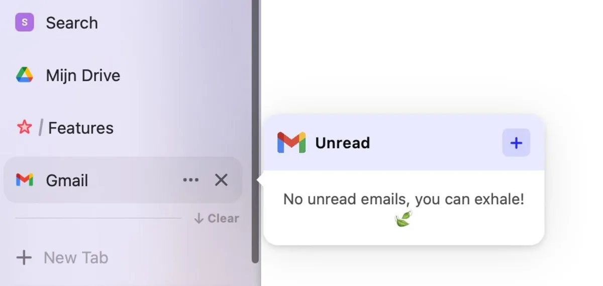
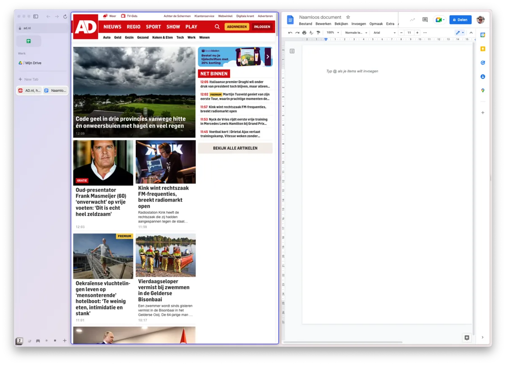

Een groep Facebook-alumni wil veranderen hoe we het internet bezoeken. Hun nieuwe webbrowser Arc belooft een einde te maken aan de eindeloze hoeveelheid miniscule tabbladen die boven in het scherm van je computer leven.

> [!NOTE]
> Deze recensie verscheen eerder op [AD](https://www.ad.nl/tech/deze-experimentele-webbrowser-wil-veranderen-hoe-je-het-internet-gebruikt~ab1bdebe/).

Het New Yorkse The Browser Company bestaat al drie jaar, maar staat nu pas op het punt om hun eerste app uit te brengen. Het bedrijf is opgericht door techveteraan Josh Miller, die in 2011 de linkdeelwebsite Branch oprichtte, die vervolgens in 2014 door Facebook werd overgenomen.

Het bedrijf heeft een webbrowser ontworpen die er totaal anders uitziet dan je gewend bent van bijvoorbeeld Chrome en Edge. ‘We zijn dol op het internet, maar het is soms overweldigend’, leest de website van de browserbouwers. ‘Wij willen daarom een betere manier bouwen om het internet te gebruiken.’

## Tabbladen aan de linkerkant

Bij het nieuwe Arc vind je boven in het scherm niet langer een grote URL-balk met daarboven al je geopende tabbladen. In plaats daarvan staan al je tabs verzameld in een menubalk aan de linkerzijde, waar je ze kunt sorteren in allerlei mapjes.

Dat is om een aantal redenen veel slimmer dan bij oude webbrowsers. Ten eerste past het nieuwe ontwerp beter bij moderne computerschermen. Oude webbrowsers waren ontworpen voor monitors met een verhouding van 4 bij 3, waar aan weerszijden amper ruimte is. Maar inmiddels werken we allemaal op breedbeeldschermen (16 bij 9), waarop genoeg ruimte is aan de linkerzijde van de website. En omdat de URL-balk en tabbladen niet meer bovenaan staan, is er meer ruimte om de website goed te tonen.

Tabbladen in Arc staan aan de linkerkant. Zet je ze boven de streep, dan blijven ze altijd gepind in de browser. © The Browser Company

## Minder snel verdwaald in je eigen tabs

Het zorgt er daarnaast voor dat je meer overzicht houdt. Tabbladen boven in je webbrowser worden naarmate je er meer opent een warrig overzicht, met knopjes die te klein zijn om nog de titel te tonen. De linker menubalk laat altijd duidelijk zien wat er openstaat.

Ook handig: Arc Browser sluit ongebruikte tabbladen automatisch na zes uur - al kun je die tijdslimiet verhogen. Wil je een pagina altijd open houden, dan kun je hem slepen naar de lijst met gepinde websites. Daarnaast kun je zogeheten ‘_spaces_’ maken, collecties met tabbladen die je eerder hebt gepind. Zo schakel je snel tussen de websites die je voor werk nodig hebt en de pagina’s die je liever buiten kantooruren bezoekt.

Bij sommige tabbladen kun je de muis er overheen bewegen om een kleine preview te zien. Zo weet je of er e-mail is zonder meteen te wisselen naar je mailtabblad. © The Browser Company

## Arc werkt met alles

Arc Browser is bovenop Chromium gebouwd, de motor achter Googles eigen webbrowser Chrome en ook Microsoft Edge. Dat is goed nieuws, want omdat Chrome marktleider is zijn de meeste websites hiervoor geoptimaliseerd. Sites die goed werken in Chrome, worden dus ook in Arc goed getoond.

Daarnaast ondersteunt Arc hierdoor ook nog eens plug-ins die voor Chrome zijn gemaakt.

## Arc zit vol met extraatjes

Je kunt ook notities in de browser-app maken. Die staan dan in je webbrowser als los tabblad. Ook ondersteunt de app zogeheten ‘_Easels_’, een soort collageborden die je met internetvondsten kunt vullen. Je kunt twee tabbladen naast elkaar openen en de standaardkleuren van een website aanpassen. Daarnaast heeft de app een ingebakken adblocker, al moedigen de makers je aan die uit te schakelen bij websites die je graag steunt.

Onze favoriet is de videospeler. Zet een video aan op websites zoals YouTube, en het beeld zal naar de hoek verdwijnen zodra je naar een ander tabblad gaat. Zo kun je blijven kijken terwijl je tegelijkertijd een heel andere site leest.

Lang niet alles dat Arc doet is uniek. In Microsoft Edge kun je tabbladen ook naar de linkerzijde verplaatsen, en Apple werkt aan een vergelijkbare update voor later dit jaar in Safari. Arc weet er echter een makkelijk bij te houden, coherent overzicht van te maken. Na een week Arc te hebben gebruikt hadden we nooit onnodige tabbladen openstaan en konden we alles makkelijker vinden.

Je kunt twee tabbladen naast elkaar openen. Ze staan dan ook samen in je tabbladenbalk. © The Browser Company

## Nog niet voor iedereen

Dat maakt Arc Browser een absolute aanrader - al kan nog lang niet iedereen met de webbrowser aan de slag. Op het moment is Arc alleen te downloaden voor macOS, en pas nadat je je hebt aangemeld voor een wachtlijst. Zodra er daarna plek voor je is, sturen ze je een linkje naar de benodigde download toe.

**_Praat mee_**
