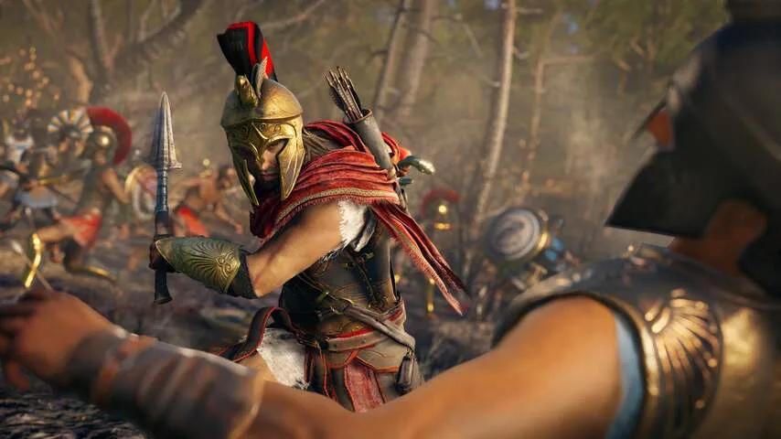
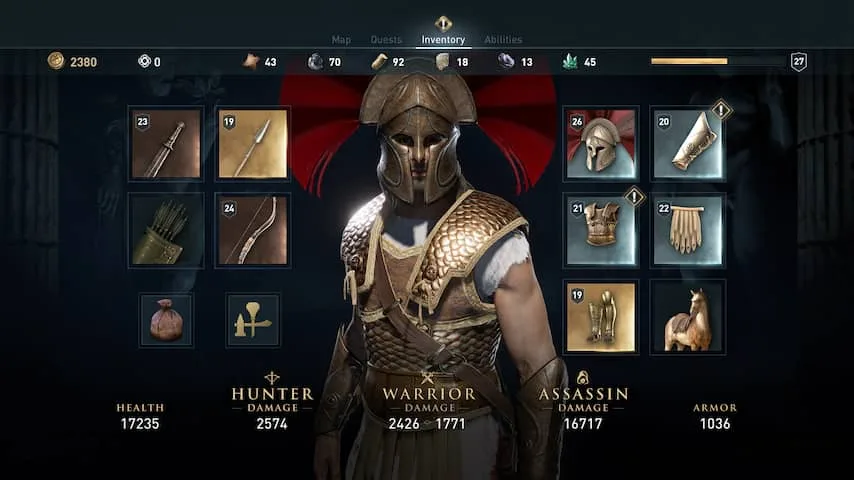
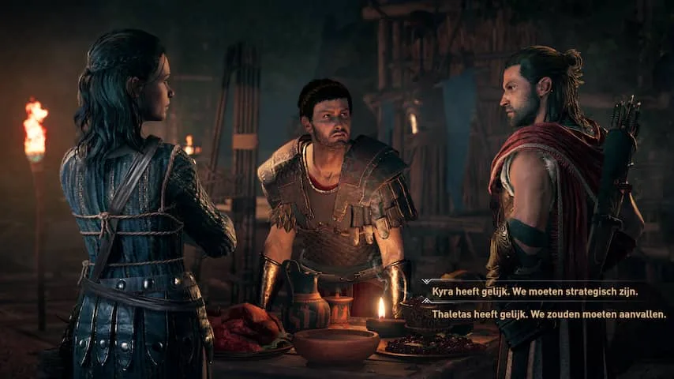
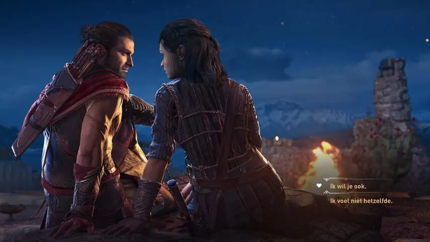
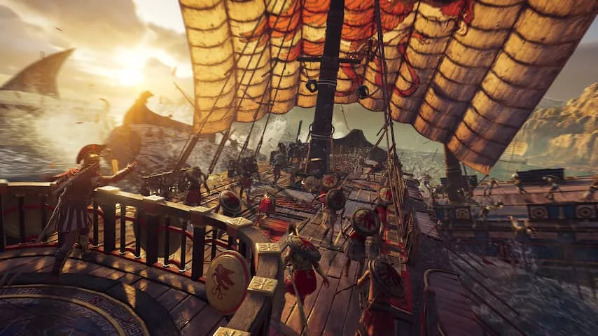

**De nieuwe openwereldgame Assassin's Creed Odyssey lijkt in grote lijnen op zijn voorganger. Er is wel één belangrijke uitzondering: het spel doet zijn best om spelers nog meer keuzevrijheid te geven.**

> [!NOTE]
> Deze recensie verscheen eerder op [NU.nl](https://www.nu.nl/reviews/5312936/eerste-indruk-assassins-creed-odyssey-belooft-meer-keuzevrijheid.html).

_Assassin's Creed Odyssey_ speelt zich af in het oude Griekenland op het moment dat er een oorlog uitbreekt tussen Sparta en Athene. De hoofdrolspeler is een nazaat van de Spartaanse koning Leonidas.

Tijdens een demo van een uur kon NU.nl een deel van de game alvast spelen. We arriveren op een eiland dat door een tiran wordt geteisterd. Daar worden we al snel warm onthaald door het ondergrondse verzet.

[Bekijk ingesloten media](https://content.jwplatform.com/players/tYSb8bb7-whqXCOFb.html)

Veel onderdelen uit klassieke _Assassin's Creed_\-games zijn ook in dit spel aanwezig. De kaart van _Odyssey_ is bezaaid met extra opdrachten, waarmee je extra geld of uitrusting vrij kunt spelen. Ieder gebouw is volledig te beklimmen, wat ook nodig is om veel plekken te bereiken.

In het spelsegment dat wij hebben gespeeld, moesten we de huidige eilandleider onttronen. Door speciale zijmissies te spelen, nam de zogeheten _nation power_ van de heerser van het gebied af. Daardoor daalde zijn level langzaam en werd hij steeds slechter bewaakt. Dat maakt het makkelijker om hem op een later moment te vermoorden en het eiland te bevrijden.

## Veldslag

Toen de invloed van de tiran zijn dieptepunt had bereikt, mondde het conflict tussen de heerser en de rebellen uit in een grootschalige veldslag. We waren hierin slechts één van vele soldaten. Het was onze missie om de leiders van het leger uit te schakelen.

De gevechten in de game voelen methodisch. Op de actieknop rammen tot een vijand dood is, heeft hier geen nut: het is afwachten tot de tegenstander een opening biedt of tot je een aanval moet ontwijken.

Doe je dat niet, dan zijn er slechts een paar klappen nodig om uitgeschakeld te raken. De veldslag voelde hierdoor spannend aan. Je weet immers maar nooit of er een speer uit onverwachte hoek in je zij wordt gestoken.

Hoewel de veldslagen een welkome toevoeging zijn, lijkt er niet veel aan het gevechtssysteem te zijn veranderd sinds _Assassin's Creed Origins_. Ergens is dat logisch, aangezien die game slechts een jaar oud is. Het lijkt erop dat de serie vanaf nu weer kleine stappen zal gaan maken, terwijl _Origins_ nog zo'n grote stap was ten opzichte van voorganger _Syndicate_.

_Assassin's Creed Odyssey — Beeld: Ubisoft_

_Assassin's Creed Odyssey — Beeld: Ubisoft_

_Assassin's Creed Odyssey — Beeld: Ubisoft_

_Assassin's Creed Odyssey — Beeld: Ubisoft_

_Assassin's Creed Odyssey — Beeld: Ubisoft_

## Rollenspel

In _Assassin's Creed Odyssey_ kun je kiezen uit twee hoofdrolspelers: Alexios of Kassandra. Het is voor de tweede keer dat spelers bij een hoofdgame in de reeks tussen een man of vrouw kunnen kiezen. Het is voor het eerst dat de personages in vaardigheden identiek zijn.

De speler kan voor het eerst ook bepalen wat hij of zij zegt in een gesprek. Bij een eerste ontmoeting met een Spartaanse officier is het mogelijk je afkomst te delen, maar is er ook de optie om te liegen. Dergelijke keuzes veranderen de manier waarop de game zijn verhaal vertelt, waardoor iedere speelsessie uniek aanvoelt.

Zulke verhaalkeuzes zijn een belangrijk onderdeel van rollenspellen zoals _Mass Effect_, waarin de speler vaak moreel lastige keuzes moest maken. _Assassin's Creed_ lijkt de ambitie te hebben om steeds meer zo'n rollenspel te worden.

Daarmee bouwt Ubisoft voort op de RPG-achtige opties die ook in het eerdere _Assassin's Creed Origins_ zaten. In die game stijgt de hoofdpersoon in level naarmate hij meer missies afrondt, een systeem dat ook aanwezig is in _Odyssey_.

## Voorlopige conclusie

Combineer dat met de keuze tussen een man en een vrouw en de speler heeft de mogelijkheid om zijn of haar eigen verhaal te bepalen. De ene _Assassin's Creed_\-speler zal als Alexios wellicht een pacifistische route proberen af te leggen, terwijl een Kassandra-speler misschien liever snel op oorlogspad gaat.

Het is alleen nog de vraag of keuzes in de game ook echt gewicht zullen hebben. Dat zal pas duidelijk worden als de game later dit jaar in de winkels ligt.

_Assassin's Creed Odyssey verschijnt 5 oktober voor pc, PlayStation 4 en Xbox One._
