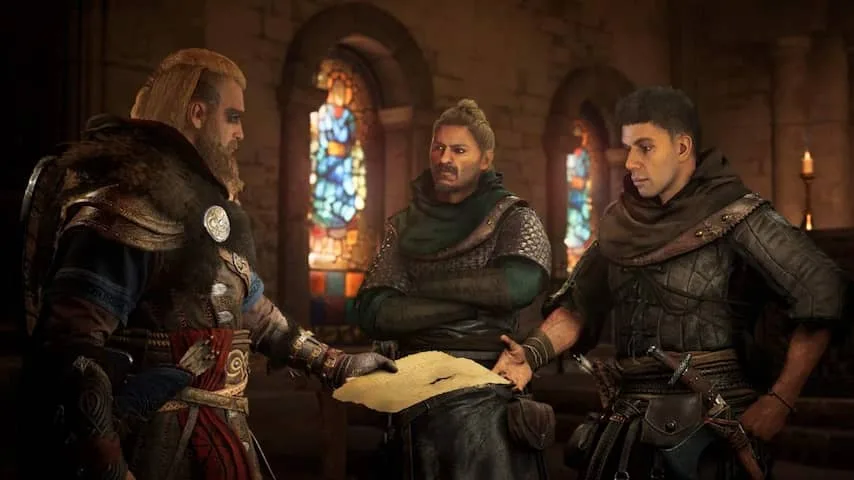
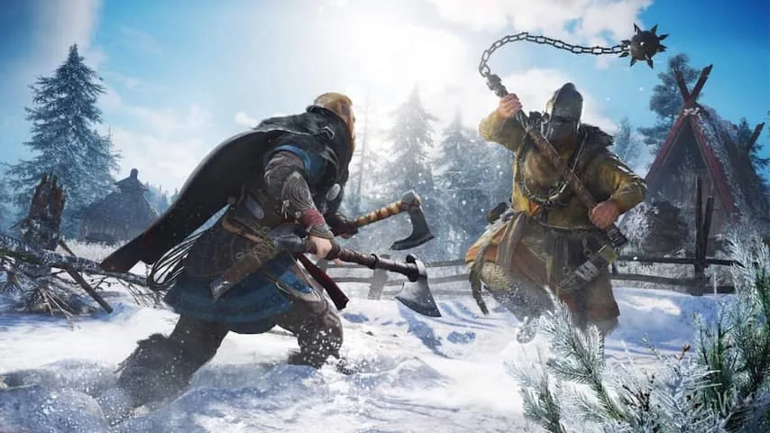
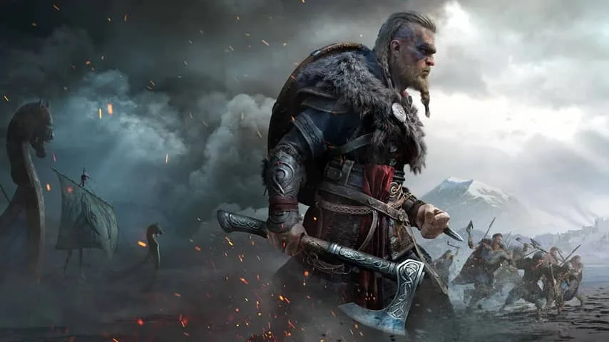

**In de nieuwste Assassin's Creed kruip je als speler in de huid van een Viking. Het spel voelt rauwer en gewelddadiger, maar biedt tegelijk meer van hetzelfde.**

> [!NOTE]
> Deze recensie verscheen eerder op [NU.nl](https://www.nu.nl/reviews/6063732/eerste-indruk-assassins-creed-valhalla-is-harder-maar-weinig-vernieuwend.html).

Het Franse Ubisoft pakt elke twee jaar groots uit met zijn _Assassin's Creed_\-reeks. Ieder vervolg speelt zich af op een andere plek in de geschiedenis, waar de hoofdrolspeler via een soort virtualrealitymachine naar afreist.

In _Assassin's Creed Valhalla_ kruipen spelers in de huid van de Viking Eivor, in de tijd dat de Denen probeerden het Verenigd Koninkrijk te veroveren. Je probeert de Britten te helpen tegen je agressieve landgenoten en zo relatief vreedzame allianties te smeden.

Eivor kan zowel een man als een vrouw zijn: spelers kiezen aan het begin van de game een geslacht. Beide Eivors zijn qua persoonlijkheid nagenoeg identiek. Van verschillende personages, zoals in _Assassin's Creed Odyssey_, is niet langer sprake. Het is daarom ook mogelijk om midden in een spelsessie alsnog je geslacht te veranderen.

[Bekijk ingesloten media](https://content.jwplatform.com/players/RuVo5zBw-whqXCOFb.html)

## Interessant, maar oppervlakkig

We speelden een drie uur durende demo van de game, waarin een hoek in het oosten van het Verenigd Koninkrijk verkend kon worden. Daar stond een kort oorlogsverhaal centraal: de Britse prins Oswald was ontvoerd door een gewelddadige Viking en moest zo snel mogelijk gered worden.

Het korte verhaal legt de nadruk op de verschillen tussen de Denen en Britten, met name de religies van beide landen. De Vikingen geloven in een bloeddorstige levensstijl tijdens hun plundertochten, terwijl Oswald zijn tegenstanders spaart in naam van zijn god. Het schetst een interessant geschiedenisbeeld, al bleef de invulling tijdens onze korte sessie wat oppervlakkig.

_Assassin's Creed Valhalla — Beeld: Ubisoft_

_In Valhalla probeer je conflicten relatief vreedzaam op te lossen. (Beeld: Ubisoft)_

## Gameplay is meer van hetzelfde

In grote lijnen speelt de game gelijk aan eerdere _Assassin's Creed_\-titels. Er is wederom een grootse, open spelwereld die je vrij kunt verkennen. Wie de A-knop ingedrukt houdt, kan met gemak op grote gebouwen klauteren.

Het gevechtssysteem is op een paar kleine fronten gewijzigd. Zo is het mogelijk om wapens in beide handen te dragen, waarbij je elke hand met een andere schouderknop bedient. Eivor had in onze demo standaard een schild aan zijn linkerzijde om klappen mee op te vangen, maar het was ook mogelijk er een tweede bijl te pakken en agressiever te spelen.

Gezien Eivor een Viking is, zien gevechten er een stuk bloederiger uit. Met één druk op een knop was een vijand al onthoofd of van ledematen ontdaan.

_Assassin's Creed Valhalla — Beeld: Ubisoft_

_De hoofdpersoon kan wapens in beide handen gebruiken. (Beeld: Ubisoft)_

## Met een stormram door kasteeldeuren

De verkenbare onderdelen van de wereld doen sterk aan de voorgangers in de reeks denken: er zijn weer torens om te beklimmen, schatkisten te vinden en obstakelkoersen te beklauteren, om extra vaardigheden vrij te spelen en pantsers te vinden.

Nieuw is de mogelijkheid om op plundertocht te gaan. Met een groep Vikingen kun je dorpen en nederzettingen aan de rivieren binnenvallen. De eerste plundertochten voelden wat simpel en draaiden vooral om het verslaan van veel soldaten, samen met computergestuurde teamgenoten.

In het verhaal kregen we een iets complexere variant voor de kiezen, waarbij we met stormrammen door kasteeldeuren moesten slaan om verder te komen. Daarbij was het essentieel om bijvoorbeeld boogschutters op de kasteelmuren uit te schakelen, zodat de stormram zijn werk goed kon doen.

## Niet echt een sluipmoordenaar

Het Vikingkarakter van de game lijkt soms wel wat te schuren met de oude visie van _Assassin's Creed_. Lange tijd richtten de games zich op subtiele sluipmoordenaars, een mal waar Eivor niet echt in lijkt te passen.

Hoewel sluipen nog wel mogelijk is, spoorde de game ons nagenoeg nooit aan om iets subtiel aan te pakken. De reisgenoten van Eivor willen ook liever dat hij lomp op oorlogspad gaat.

_Assassin's Creed Valhalla — Beeld: Ubisoft_

_De mal van subtiele sluipmoordenaar lijkt Eivor niet te passen. (Beeld: Ubisoft)_

## Voorlopige conclusie

_Valhalla_ voelt op veel fronten als meer van hetzelfde. De nadruk op sluipen is verminderd en het gevechtssysteem is verder uitgediept, maar grotendeels doe je precies wat je ook in de eerdere delen _Odyssey_ en _Origin_ gedaan wilde krijgen.

Dat is niet per se erg: de game richt zich op een compleet andere setting en tijdsperiode, waardoor het geheel fris genoeg aanvoelt. Wat we zagen, zat solide in elkaar. Maar verwacht van _Valhalla_ niet een game die het spel naar een nieuw niveau tilt.
