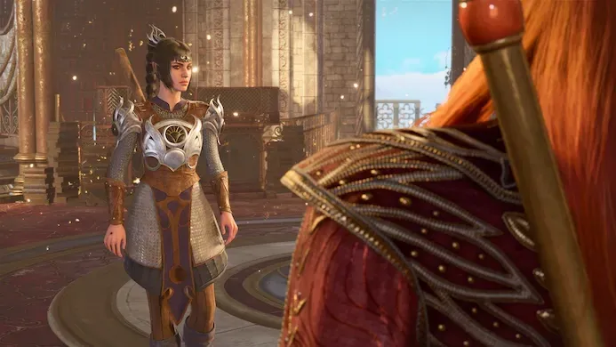
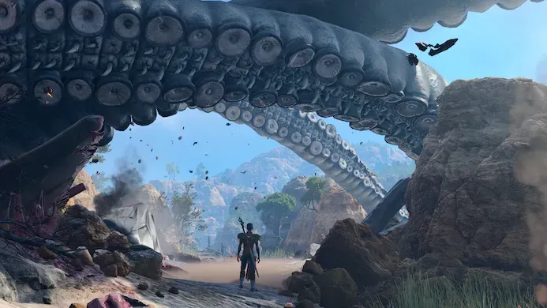
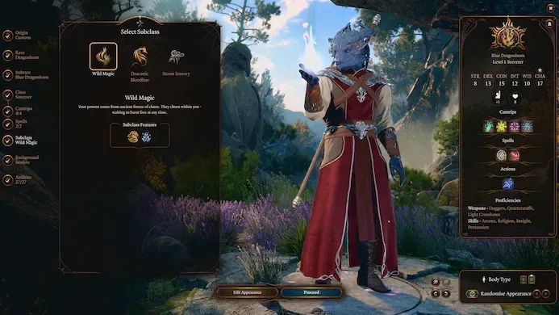
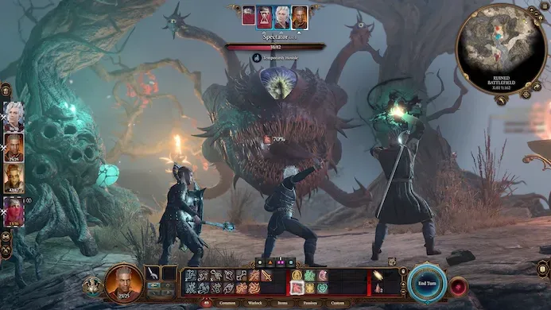
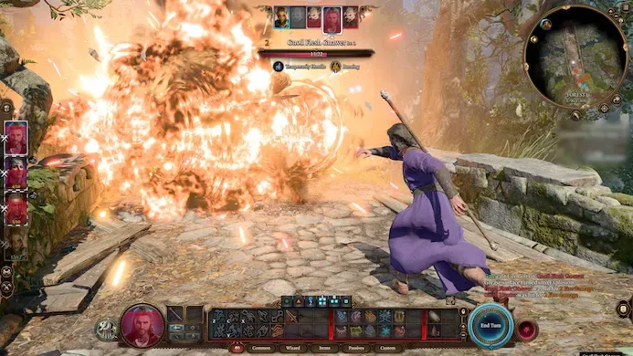
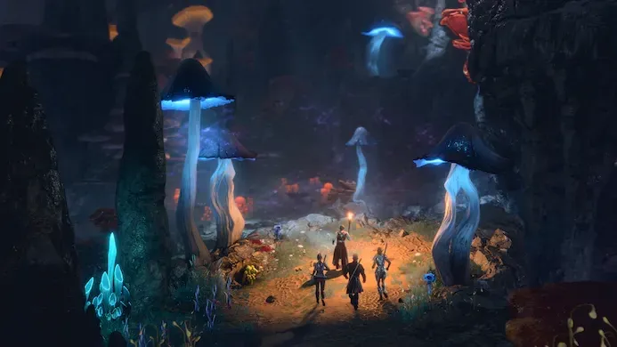

Baldur's Gate 3 is één van de beste games die dit jaar is verschenen - misschien wel de beste rpg van het afgelopen decennium. We zeggen het maar vast vooraf in de recensie, zodat je genoemde kritiekpunten goed kunt relativeren. Het is een game die heel het genre naar een nieuw niveau tilt en de vrijheid biedt waar we twintig jaar geleden over fantaseerden.

> [!NOTE]
>
> Deze recensie verscheen eerder op [Gamer.nl](https://gamer.nl/reviews/games/pc-games/baldur-s-gate-3-is-de-beste-rpg-in-jaren/).

Rpg's schotelen ons al jaren keuzevrijheid voor. Een tof idee dat in de praktijk vaak neerkomt op keuze uit een paar smaken. Shepard kan in Mass Effect zich nobel opstellen of als cowboy iedere boef neerschieten, maar uiteindelijk bereikt hij altijd hetzelfde doel: de missie wordt gehaald. Soms is een ver afgelegen buitenaards ras door je besluit uitgestorven, maar dat is hooguit verhaalontwikkeling op de achtergrond. De gamewereld waar je zelf in rondloopt blijft ruwweg hetzelfde en je primaire pad blijft onveranderd.

Zo niet in Baldur's Gate 3. Nadat je personage is ontsnapt uit een vreemd ruimteschip van dimensie-afreizende, gedachten lezende monsters, ga je op pad om een door hun ingebrachte parasiet uit je hersenen te verwijderen. Al vrij snel achterhaal je meerdere manieren om dat te doen. Je kunt op zoek gaan naar een vermiste druïde die je wellicht kan genezen en zijn kamp redden, of juist samenwerken met een groep kobolden om de druïdes uit het bos te verjagen. Of je smeedt een alliantie met een gevangen drakenrijder die nog wel een andere genezer kent en slaat een uur of tien over van het hoofdverhaal.

## Kleine aftakkingen

Door de game heen zijn allerlei kleine aftakkingen in het verhaal mogelijk. Soms zijn die gekoppeld aan je personage. Speel je een drow? Dan denken de kobolden dat je één van hun leiders bent - dat is immers van nature zo - en kun je heel gemakkelijk hun kampen infiltreren.

Op andere momenten zitten afwijkingen verstopt achter dobbelsteenworpen. Probeer je een baas te overtuigen zich over te geven? Je gooit een twintigzijdige dobbelsteen, telt daar je overtuigingsscore bovenop en duimt dat het hoger is dan je nodig hebt om het gesprek te 'winnen'. Lukt het, dan hoef je vaak niet te vechten. Is je passieve perceptie hoog en spot je een geheime deur? Dan kun je naar de laatste kamer van een kerker sluipen om ongezien schatten te stelen.

De game is zeer expliciet in hoe hoog je rolt. Als je zelf actief een dobbelsteen gooit staat deze groots in het midden van je scherm. Loop je rond en mis je iets dat je personage passief had kunnen opmerken, dan verschijnt er een boodschap boven diens hoofd. Die nadruk op de statistieken zorgt dat de game wat mechanisch oogt, maar hierdoor merk je ook continu wáár de keuzes zoal verstopt zitten. Tijdens het spelen met je eerste personage zul je mentaal aantekeningen maken van wat je nog meer had kunnen proberen, om daar later mee te experimenteren in een tweede campagne.

## Met de lokale huiskat praten

De game doet ontzettend veel om ook buiten die gemaakte momenten variatie te bieden. Een paladin kan bijvoorbeeld zijn eed breken en veranderen in een 'Oathbreaker', met een hele reeks nieuwe vaardigheden en zijmissies. Of je kunt bij het maken van een personage kiezen hem of haar de 'Dark Urge' te geven, wat ze feitelijk een psychopaat maakt met extra dialoogopties. Je kunt leren met dieren praten om nieuwe paden te ontdekken door met de lokale huiskat te praten, of met een spreuk de doden tot leven wekken om hun te ondervragen.

Tegelijkertijd is er het Inspiration-systeem, dat je beloont met speciale punten als je iets doet dat past bij een personage. Speel je een rogue en beroof je iemand? De kans bestaat dat je daar een punt voor krijgt. Met dat punt kun je een mislukte dobbelsteenrol opnieuw proberen. Het motiveert je om in je rol te blijven. Baldur's Gate 3 zit vol met zulke nuances die iedere speelsessie uniek maken. En waar ze in veel andere rpg's aan de oppervlak blijven, ging onze campagne compleet andere kanten op dan die van vrienden.

Alles in de wereld van Baldur's Gate 3 is met een duidelijke reden ergens neergezet. Het voelt nooit alsof je door kerkers van het ene inwisselbare gevecht naar de ander loopt - je vindt in een keuken de kok en zijn hulpjes, in een balzaal een groep nobelen. En omdat vechten niet je enige optie is, heeft iedereen een achterliggend verhaal en dialoog. Het brengt de wereld tot leven op een manier die zeldzaam is in games, waar orcs en cultisten vaak louter als slachtwerk dienen.

## Vechten zoals in Dungeons & Dragons

Gevechten vinden beurtelings plaats en zijn nagenoeg identiek aan die in het papieren Dungeons & Dragons. Je rolt aan het begin een dobbelsteen om te zien wie als eerste mag aanvallen, waarna iedereen om de beurt iets mag doen. In een beurt mag elk personage bewegen, een hoofdactie en een bonusactie uitvoeren.

In de kern is dit vrij simpel - je loopt bijvoorbeeld naar een vijand, gebruikt de hoofdactie om je zwaard in 'm te rammen en hebt nog een genezingsspreuk die je als bonusactie mag doen. Maar door spreuken van meerdere levels, reacties en andere onderliggende systemen is er een hoop nuance om rekening mee te houden. Voor D&D-veteranen geen probleem, maar spelers die nu pas instappen stuiten op een steile leercurve.

## Onduidelijke controller-interface

Die leercurve is nog iets steiler als je met een controller speelt. Dan bestaat de interface uit radiaalmenu's bovenop radiaalmenu's, waarin argeloos iedere nieuwe vaardigheid en spreuk wordt gekwakt zonder dat ergens prioriteit aan wordt gegeven. Je kunt alles proberen te sorteren, maar dat is veel gedoe. En omdat je in het begin nog niet de klappen van de zweep kent, is het lastig om in één oogopslag te zien welke knoppen precies het belangrijkst zijn om eerst naar te kijken. Je stuit op grote cirkels vol knoppen die je niet kent, die je stuk voor stuk moet lezen om ze te doorgronden. En daarna nog een paar keer, want pas als je de gameregels snapt zal alles in die menu's duidelijk worden.

Veel functies zitten verstopt op onverwachte plekken. Vierpuntdruktoetsen zijn snelkoppelingen naar extra functies, maar doen weer iets anders als je ze lang uitlegt - iets dat de game je niet duidelijk uitlegt. Wie de gamepadcontrols wil doorgronden kan het beste even googelen, maar dat is uiteraard niet een heel goede oplossing.

## Wat kleine bugs

Nog een kritiekpuntje: op moment van schrijven vind je in Baldur's Gate 3 nog best wat bugs. We zijn nog niet op spelverpestende problemen gestuit, maar af en toe herhaalde een gesprek met een npc zich of bleef de camera hangen. Het heeft geheid te maken met de vroege verschijning, want ontwikkelaar Larian Studios bracht de pc-versie een maand eerder uit om concurrent Starfield voor te zijn.

En eerlijk: in een game van deze schaal en met zo onwijs veel variabelen die je speelsessie beïnvloeden, is het bijzonder dat we niet meer problemen tegen het lijf zijn gelopen. Hoe dan ook heeft Larian intussen al meerdere patches uitgebracht en hebben we geen reden om te vermoeden dat ze daar binnenkort mee stoppen.

## Niet voor iedereen, wel fenomenaal

Baldur's Gate 3 heeft veel oude rpg's voor ons verpest, simpelweg omdat we na deze game meer échte gevolgen voor gemaakte keuzes verwachten. Het is een game die de norm verhoogt, wat haast oneerlijk is voor andere ontwikkelaars - er is een klein wonder nodig om een spel als dit in alle rust te kunnen produceren.

Dat maakt het één van de beste rpg's van afgelopen jaren, maar tegelijkertijd is het er één die we niet zomaar iedereen kunnen aanraden. Want nogmaals: heb je eerder geen Dungeons & Dragons gespeeld, dan zul je wat uurtjes nodig hebben om alle systemen in Baldur's Gate 3 goed te begrijpen. Het kan moeilijk zijn om in de game te komen, zoals je ook over een soulslike kunt zeggen. Maar dat is tegelijkertijd de charme: Baldur's Gate 3 Verontschuldigt zich niet en doet geen concessies. Het is gemaakt voor een groep gamers die al jaren hunkert naar een rpg van AAA-productiekwaliteit, maar een ongeëvenaarde diepgang biedt die op sommige vlakken alleen de meest hardcore D&D-nerds kunnen waarderen. Een game niet voor iedereen, maar wel de beste in zijn klasse.

## Conclusie

Baldur's Gate 3 is de beste rpg in jaren. Het spel is niet voor iedereen gemaakt en bevat vooral voor niet-D&D'ers een steile leercurve. Maar wie bereid is er in te duiken, vindt een game die je meer keuzevrijheid biedt dan we ooit in genregenoten zagen.

> [!INFO] Details
>
> **Baldur's Gate 3**
>
> Beoordeling: ★★★★★
>
> **Pluspunten:** Veel keuzevrijheid met ook echte gevolgen, strategisch vechtsysteem, hondstrouw aan Dungeons & Dragons.
>
> **Minpunten:** Wat lastig inkomen voor niet-D&D'ers, controllerinterface is niet heel goed, nog wat bugs.
