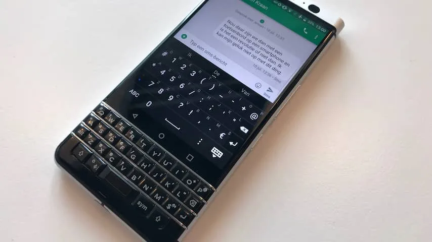
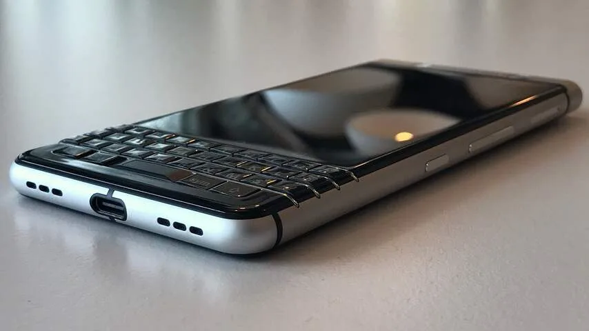
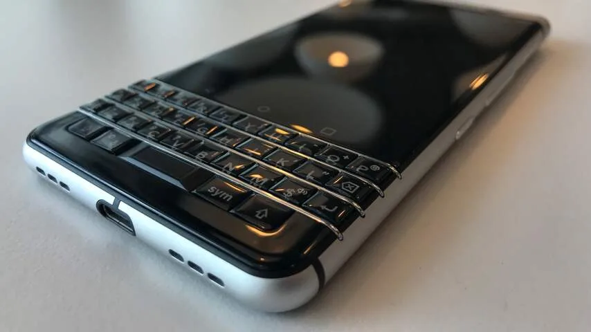
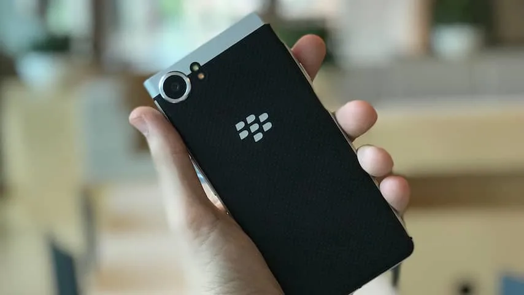
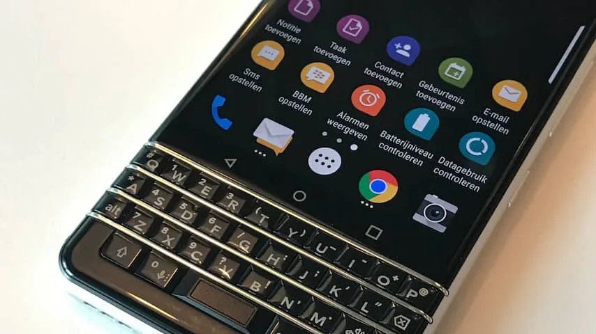
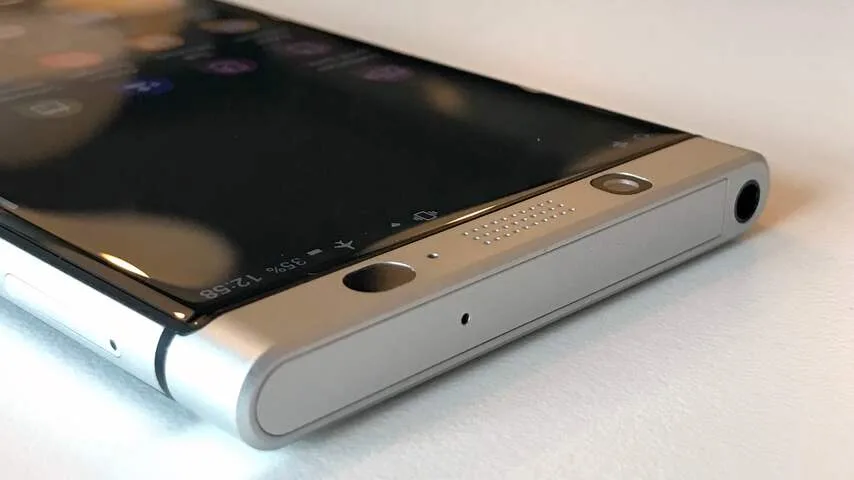

**De nieuwe BlackBerry KeyOne heeft een fysiek toetsenbord, maar draait ook op Android. Is dat genoeg om het smartphonemerk uit het slop te trekken?**

> [!NOTE]
> Deze recensie verscheen eerder op [NU.nl](https://www.nu.nl/reviews/4860261/review-blackberry-keyone-met-toetsenbord-schiet-tekort.html).

Dit is niet de eerste keer dat we een BlackBerry met Android zien. De eerdere Priv had een uitschuifbaar toetsenbord. Dat toestel werd opgevolgd door de DTEK50 en DTEK60, die het zonder fysieke knoppen probeerden.

De nieuwe KeyOne voelt iets meer als een traditioneel BlackBerry-toestel. Het toetsenbord zit recht onder het scherm, net als bij de klassieke Bold-telefoon. Het scherm is wel iets groter: het touchscreen is 4,5 inch groot en heeft een resolutie van 1620 bij 1080 pixels.

De behuizing voelt vrij hoogwaardig aan. De achterkant gebruikt een leerachtig materiaal met een subtiel motief, waardoor hij eerder aanvoelt als een luxe portemonnee dan een smartphone.

De combinatie van toetsenbord en beeldscherm is wel even wennen voor wie gewone smartphones gewend is. De gehele telefoon is vrij groot - qua formaat zit hij tussen de Galaxy S8 en iPhone 7 Plus in. Maar voor dat formaat krijg je wel een veel vierkanter scherm dan op veel andere telefoons in deze categorie.

[Bekijk ingesloten media](https://content.jwplatform.com/players/FulMxIli-whqXCOFb.html)

Door het vreemde formaat voelt het scherm vaak krap aan. Het toestel toont bijvoorbeeld minder berichten tegelijkertijd in een chatapp. Bij het afspelen van een video worden vrijwel altijd zwarte balken getoond, waardoor een film nog kleiner wordt op het al kleine beeld.

## Toetsenbord

Daar krijg je wel een fysiek toetsenbord voor terug. Deze kan in iedere app worden gebruikt om te typen, waarbij geen virtueel toetsenbord op het scherm verschijnt. De fysieke knoppen voelen deels identiek aan die van eerdere BlackBerry-toestellen. Met de sym-toets kunnen veelgebruikte symbolen worden gebruikt, die met wat oefening makkelijk te bereiken zijn.

Bij minder gebruikte tekens verschijnt er alsnog een virtueel toetsenbord op het scherm. Dan verdwijnen apps bijna helemaal uit beeld, wat het lastig maakt om te zien waar je ook alweer op reageert.

_BlackBerry KeyOne Toetsenbord — Beeld: NU.nl/Bastiaan Vroegop_

Fervente BlackBerry-gebruikers zullen met rap tempo over de toetsen bewegen, maar voor bezitters van gewone smartphones zal het even duren totdat zij zo ver zijn. Na twee weken gebruik waren wij nog altijd sneller op een virtueel toetsenbord dan op de fysieke knoppen van de KeyOne.

## Niet krachtig

De BlackBerry KeyOne is niet een bijzonder krachtige smartphone. Bij benchmarktests haalt het toestel een significant lagere score dan huidige vlaggenschepen zoals de Galaxy S8, iPhone 7 en LG G6. Ter illustratie: bij tests met benchmark-app AnTuTu scoorde de KeyOne rond de 60.000 punten, terwijl de iPhone 7 bijna 170.000 aantikt. Een hogere score wijst op betere prestaties.

De telefoon is goedkoper dan zijn sterkere concurrenten, maar het prijsverschil is met 100 euro vrij klein. De KeyOne kost namelijk 600 euro. Dat maakt het lastig om het grote verschil in prestaties te rechtvaardigen.

Dat betekent overigens niet dat de processor buitensporig traag is. Bij dagelijks gebruik van bijvoorbeeld Facebook, WhatsApp en Twitter doet de KeyOne het prima. Er zijn zelden momenten waarop de telefoon lang blijft laden en vastlopers zijn we niet tegengekomen. Eigenlijk merkten we het verschil pas bij het starten van een zware 3D-game, of het opnieuw opstarten van het toestel. Daarbij kan de KeyOne soms erg lang blijven hangen.

De accu met een capaciteit van 3.505 mAh zou een lange batterijduur moeten bieden, maar in onze praktijktests viel dit tegen. De telefoon was rond het einde van de middag bijna altijd helemaal leeg bij gewoon gebruik, waardoor hij alsnog opgeladen moest worden. Wellicht dat een softwarebug voor batterijproblemen zorgt, al zagen we op ons toestel geen apps die excessief veel stroom verbruikten.

_BlackBerry KeyOne — Beeld: NU.nl/Bastiaan Vroegop_

_BlackBerry KeyOne — Beeld: NU.nl/Bastiaan Vroegop_

_BlackBerry KeyOne — Beeld: NU.nl/Bastiaan Vroegop_

_BlackBerry KeyOne — Beeld: NU.nl/Bastiaan Vroegop_

_BlackBerry KeyOne — Beeld: NU.nl/Bastiaan Vroegop_

## Conclusie

Voor een gewone smartphonebezitter is er eigenlijk weinig om enthousiast over te worden bij de KeyOne. Het toetsenbord biedt niet echt een gigantisch voordeel ten opzichte van een touchscreen, terwijl een flink deel van je telefoon hier wel door wordt ingenomen. De processor en batterij zijn ook nog eens ondermaats. Waarschijnlijk zal alleen de meest fanatieke BlackBerry Bold-gebruiker waarde in deze telefoon zien.
