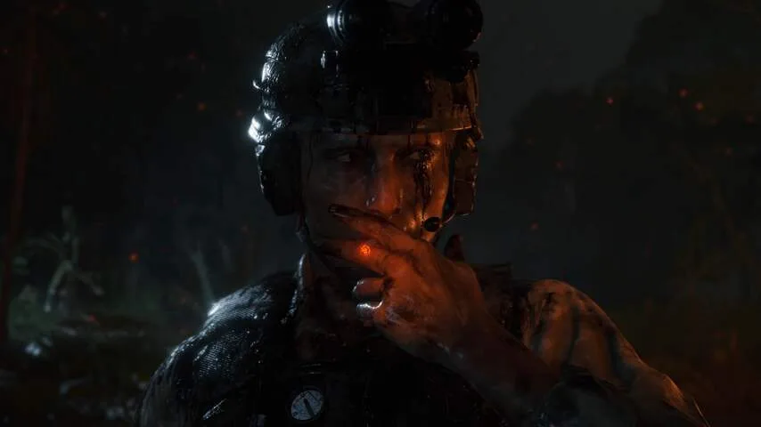
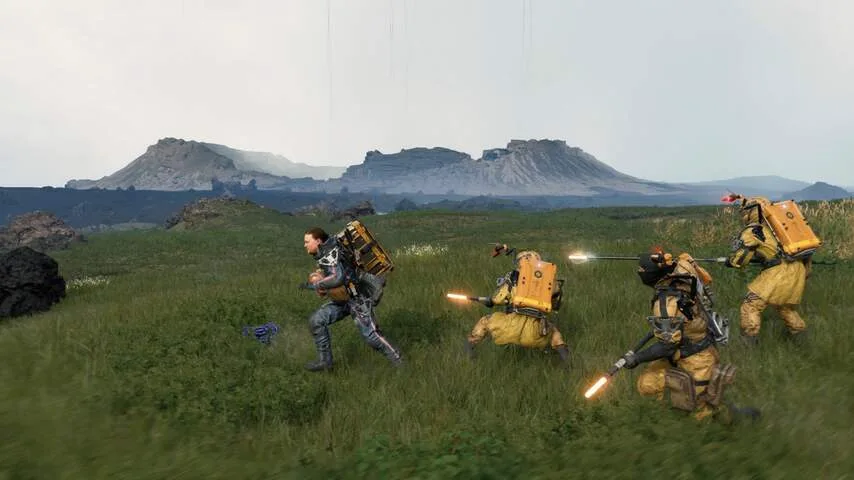
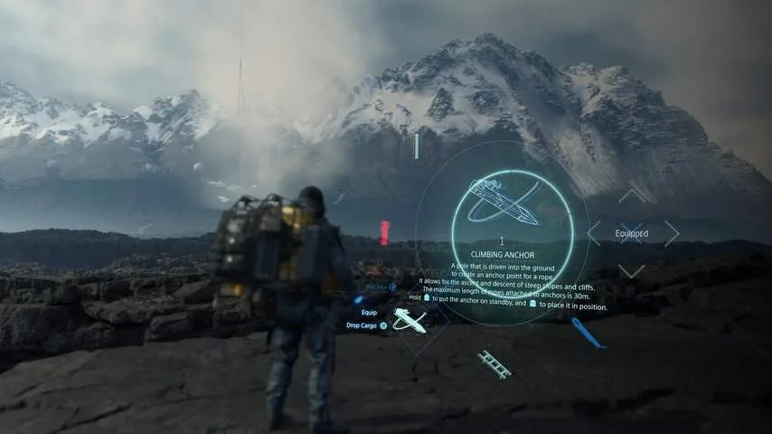

**Death Stranding is één van de uniekste games die deze spelcomputergeneratie is verschenen, maar vergt wel veel geduld.**

> [!NOTE]
> Deze recensie verscheen eerder op [NU.nl](https://www.nu.nl/reviews/6008122/review-een-game-als-death-stranding-bestond-nog-niet.html).

De eerste beelden van _Death Stranding_ waren verwarrend. Toen de game in 2016 werd getoond, gebeurde dat met een trailer waarin een naakte Norman Reedus (bekend van onder meer de tv-serie _The Walking Dead_) een aan hem bevestigde foetus koestert. Zijn lijf zat onder de handafdrukken. In latere beelden was de acteur eveneens te zien, maar dan omringd door poppenhoofden.

Het is de eerste game van ontwikkelaar Hideo Kojima's onafhankelijke studio. De gamemaker pionierde met cinematische spellen zoals _Metal Gear Solid_, maar ging na een geschil met zijn werkgever Konami voor zichzelf aan de slag. Sindsdien werkte hij aan zijn droom van een filmische game, geheel in zijn eigen stijl en vol met bekende acteurs.

## Balans tussen leven en dood is verstoord

_Death Stranding_ zet een grimmige wereld neer. De balans tussen leven en dood lijkt te zijn verstoord, waardoor onzichtbare geesten proberen de levenden te grijpen. Als dat ze lukt, volgt er een gigantische explosie die volledige steden kan wegvagen.

Tegelijkertijd is de regen op aarde dodelijk geworden: alles dat wordt aangeraakt, is in korte tijd vele malen ouder. Wie met ontbloot lijf door de regen loopt, wordt in luttele seconden een oude man of vrouw.

Die twee nieuwe gevaren hebben de Verenigde Staten, waar de game zich afspeelt, compleet veranderd. Er zijn veel minder mensen en het landschap is door de 'tijdregen' compleet verwilderd. Daarnaast wordt er buitengewoon voorzichtig met nieuwe doden omgegaan, uit angst dat spoken nieuwe explosies veroorzaken.

_Death Stranding — Beeld: Kojima Productions_

## Mensen koppelen zichzelf aan foetussen

Mensen koppelen zichzelf aan de foetussen van baby's van hersendode moeders, omdat die hen in staat stellen de geesten te zien. Deze baby's bevinden zich namelijk op de grens tussen leven en dood. Dat vertaalt zich ook naar een gamesysteem waarbij je soms je baby moet wiegen om te troosten.

De wereld van _Death Stranding_ is uniek. We hebben nog niet eerder een gamewereld gezien met zulke opmerkelijke regels, die de maatschappij op unieke manier compleet ontwrichten. De eerste paar uur van het spel zijn daardoor ook wat verwarrend, omdat het even duurt tot het verhaal alle basisregels aan je heeft uitgelegd.

## Je moet een berg pakketjes bezorgen

Je speelt in _Death Stranding_ een postbode. Je bezorgt pakketjes in verschillende steden, terwijl je langzaam van de oostkust naar de westkust van de Verenigde Staten beweegt. Intussen verbind je iedere bezochte stad met een futuristische variant van het internet. Zo probeer je alle inmiddels afgezonderde Amerikanen weer met elkaar in verbinding te brengen.

Je laadt de boodschap op je rug, opent de kaart en legt een te bewandelen route af. Je kunt ladders en touwen plaatsen om steile landschappen te beklimmen en probeert je balans te behouden door de L2- en R2-knoppen in te drukken.

Ieder pakket is fysiek terug te zien op je personage. Probeer je tientallen pakketten in één wandeltocht te bezorgen, dan heb je een gigantische toren op je rug en val je gemakkelijker om. Je kunt proberen pakketjes goed over je lijf te verspreiden, zodat je beter blijft staan en stabieler kunt Lopen.

_Death Stranding — Beeld: Kojima Productions_

## Het begint een beetje saai

De eerste paar uur van je bezorgavontuur kunnen wat simpel en zelfs saai zijn. Je hebt naast je ladder en klimtouw nagenoeg niks om je tocht divers te maken, waardoor je vooral op langzaam tempo van punt A naar punt B loopt. Pakweg de eerste vijftien uur van de game voelden tergend langzaam aan: de in de game vormgegeven wereld was fascinerend, maar het daadwerkelijke spelelement was niet veel aan.

Gelukkig komt daar later verandering in. Gaandeweg introduceert _Death Stranding_ nieuwe spelelementen, zoals spoken waar je langs moet sluipen en rovers die achter je pakketjes aan komen en bevochten kunnen worden. Op spaarzame momenten verandert _Death Stranding_ ineens in een actiegame, waarin je met geweren en granaten gigantische bazen moet verslaan.

De kern van de game blijft gedurende de vijftig uur die je speelt echter hetzelfde: je bent vooral een postbezorger. Gelukkig ontgrendel je ook steeds meer uitrusting om dat gevarieerder en spannender te maken. Je kunt na een tijd bijvoorbeeld motoren en vrachtwagens maken om grote afstanden met een flinke voorraad af te leggen. Je kunt in het wild steeds grootsere gebouwen neerzetten, zoals kijktorens om vijanden te spotten en bruggen om makkelijk het water over te steken.

_Death Stranding — Beeld: Kojima Productions_

## De game heeft een sociaal element

Daarnaast introduceert de game een sociaal element. De bouwsels die je neerzet, zijn ook zichtbaar voor andere spelers. Daardoor help je elkaar door de game heen te komen. Extreem grote voorwerpen zoals snelwegen vereisen buitengewoon veel grondstoffen om te bouwen, maar je bouwt deze samen met spelers die op hetzelfde punt in de game zitten.

Je moet steeds beter nadenken over hoe je een pakket bezorgt. Je tekent op de kaart een route langs rustplaatsen en handige bouwsels van je medespelers, terwijl je jouw uitrusting op het juiste gebied afstemt. Loop je door een roverskamp? Dan is het slim om wellicht een wapen mee te nemen. Terwijl bij een trip door de bergen een speciaal robotharnas van pas komt.

Het bovenstaande klinkt als een leuk idee voor een kleine, onafhankelijke game. Dat is _Death Stranding_ niet: dit is een miljoenenproject van gigantisch veel ontwikkelaars. De game kon waarschijnlijk alleen in deze vorm gemaakt worden, omdat Kojima een goede reputatie heeft. Dat alleen al maakt _Death Stranding_ een uniek soort game.

Daar staat tegenover dat het script niet heel sterk is. Hoewel Kojima een interessante wereld neerzet, zijn dialogen tussen personages afstandelijk en onwennig. Zonde, vooral als je bedenkt dat _Death Stranding_ acteurs zoals Mads Mikkelsen en de eerder genoemde Norman Reedus en regisseur Guillermo del Toro inzet.

[Bekijk ingesloten media](https://content.jwplatform.com/players/b0Fb3rfd-whqXCOFb.html)

## Kojima heeft een eindredacteur nodig

Het is vrij duidelijk dat Kojima een eindredacteur nodig heeft. Dialogen springen van de hak op de tak, waarbij soms tien onderwerpen worden behandeld die nooit meer van toepassing zijn in de game. Een gesprek dat in tien regels klaar kan zijn, neemt in _Death Stranding_ vaak vijftig regels in beslag. Kojima wil ieder verhaalpunt meermaals aan je uitleggen, zodat je het sowieso begrijpt.

Soms is dat fijn, maar het begin en einde van de game zijn hierdoor langdradig. Het duurt echt uren tot het verhaal op gang is, terwijl de eerste uren van het spelsysteem ook wat saai zijn. Spelers moeten echt doorbijten om het leuke gedeelte te bereiken.

Maar dan zoomt de camera soms uit en begint in een prachtig landschap een indiepopmuziekje te spelen. Op die momenten is de game fenomenaal geregisseerd.

## Conclusie

Weet je voorbij die eerste tergend langzame uurtjes te komen, dan is _Death Stranding_ buitengewoon bijzonder. Deze game laat zich niet echt vatten door een traditioneel gamegenre en zet een uniek scifiverhaal neer. Af en toe sluip en schiet je, maar je bent vooral bezig met het effectief afleveren van je pakketten. En dat is best leuk naarmate je genoeg extra nieuwe systemen hebt ontgrendeld.

_4 sterren — Beeld: NU.nl_
