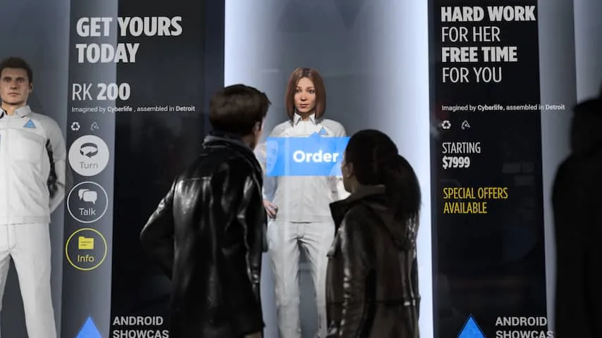

**De nieuwe PlayStation 4-game Detroit: Become Human geeft een glimp van een toekomst waarin robots net zo populair zijn als smartphones. Maar schuilt daar ook een leuke game in?**

> [!NOTE]
> Deze recensie verscheen eerder op [NU.nl](https://www.nu.nl/reviews/5281139/review-detroit-become-human-is-een-game-die-liever-een-film-is.html).

_Detroit: Become Human_ speelt zich af in het jaar 2038. Families van over de hele wereld hebben robots in huis gehaald voor simpele klusjes, zoals de boodschappen of het oppikken van kinderen bij school. Ook in fabrieken is het meeste menselijke personeel inmiddels vervangen door machines, die efficiënter en goedkoper dezelfde klussen uitvoeren.

Een klein aantal robots begint echter vreemde symptomen te vertonen. Ze wijken in moeilijke situaties af van hun programmering, om zichzelf te verdedigen of een afwijkende keuze te maken. Een androïde die door zijn eigenaar wordt mishandeld besluit bijvoorbeeld zijn aanvaller te vermoorden, terwijl dat helemaal niet mogelijk hoort te zijn.

Je speelt in deze setting als drie robots: de huishoudrobots Kara en Markus en de politieagent Connor. Je loopt met alle drie rond door interactieve filmscènes, waarin je simpele acties moet verrichten om het verhaal voort te zetten. Zo praat je met andere robots en mensen, zoek je objecten en vecht je door op de knoppen te drukken. De drie beginnen al snel symptomen van vreemde emoties te vertonen, waar ze allemaal op hun eigen manier mee om proberen te gaan.

[Bekijk ingesloten media](https://content.jwplatform.com/players/7w5yRkfe-whqXCOFb.html)

## Keuzes maken

_Detroit_ is duidelijk geen actiegame. Je krijgt bij een handeling te zien welke knoppencombinatie je moet indrukken, waarbij het alleen van belang is dat je de opgelegde opdracht correct uitvoert. Dit is niet een game die reflexen of bepaalde vaardigheden vereist, maar een veredelde film met interactieve onderdelen.

De keuzes die je maakt hebben wel impact op het verhaal van de game. Als Kara begin je bijvoorbeeld als huishoudster van een werkloze vader die op een zeker moment zijn dochter begint te mishandelen. Je kunt er dan voor kiezen een wapen te pakken en het gevecht aan te gaan, of om de kamer in te springen om een dialoog te beginnen. Beide keuzes kunnen compleet andere gevolgen hebben, waardoor het verhaal zich bij de ene speler anders ontwikkelt dan bij de ander.

Aan het einde van een hoofdstuk krijg je alle mogelijke paden in het verhaal te zien, waarna het ook mogelijk is om opnieuw te spelen en de andere mogelijkheden uit te pluizen. Dat is leuk, al is het aan te raden het spel eerst één keer van begin tot eind te spelen zonder opnieuw te starten.

## Niet subtiel

_Detroit_ schetst een toekomst met robots, waarbij ook veel maatschappelijke problemen worden aangekaart. Fabrieksmedewerkers protesteren op straat omdat ze hun werk verliezen door de robotisering, terwijl predikanten roepen dat de mens steeds meer God probeert te spelen.

Op veel punten is de game niet bepaald subtiel met zijn boodschap. De robots worden als slaven ingezet, maar zien er ondanks hun arbeidersrol uit als gewone mensen. Markus reist op een bepaald punt bijvoorbeeld met de bus, maar moet dan achter in het voertuig in een speciaal robothok gaan staan - net zoals zwarte Amerikanen aan het begin van de twintigste eeuw vaak achter in de bus plaats moesten nemen.

_Detroit: Become Human — Beeld: Quantic Dream_

Naarmate de robots door softwarefouten emoties beginnen te vertonen, veranderen ze steeds meer in een nieuwe levensvorm waar mensen rekening mee moeten houden. Een interessant sciencefictionhaakje, maar het verhaal is net niet goed genoeg geschreven om de ruim tien uur van de game te vullen. Waar een film zijn kijkers zou prikkelen om de morele implicaties te onderzoeken, verandert Detroit in een 'goed-versus-slechtsituatie'.

De game doet ook wel heel hard zijn best om op een film te lijken, maar heeft alsnog de speelduur van een avonturengame. Hierdoor voelt het geheel al snel langdradig aan. Het basisverhaal lijkt net genoeg om één film te vullen, maar is uitgespreid over vier keer de lengte ervan. Hierdoor loop je vaak in een laag tempo door steden, of moet je op zoek naar simpele objecten zonder dat er echt iets belangrijks gebeurt.

## Shawshank Redemption

Daarnaast zijn de interessante onderdelen niet heel goed geschreven. De game steelt regelmatig volledige scènes uit populaire films, zoals bijvoorbeeld de ontsnapping uit _Shawshank Redemption_. Hierdoor voelt Detroit op sommige dieptepunten als een onhandige imitatie van een ander medium.

Omdat Detroit graag op een film wil lijken, is de game ook gevuld met generieke momenten met oersaaie handelingen. Het hoogtepunt daarvan zit in het begin van de game, waarin je een klein half uur alleen maar bezig bent met het opruimen van een huis. Dat soort luchtige momenten werken in een film, maar in een game voelen ze als werk.

## Conclusie

Het idee achter _Detroit_ is ontzettend leuk. De game is een soort interactieve film, waar je meerdere malen naar kunt terugkeren om andere uitkomsten te bekijken. Daarnaast schetst de game een interessante toekomst waarin robots en kunstmatige intelligentie steeds belangrijker worden. Het is alleen jammer dat het verhaal zelf wat saai en uitgespreid is.

_3sterren — Beeld: NU.nl_

_Detroit: Become Human_ is vanaf 25 mei verkrijgbaar voor PlayStation 4.
