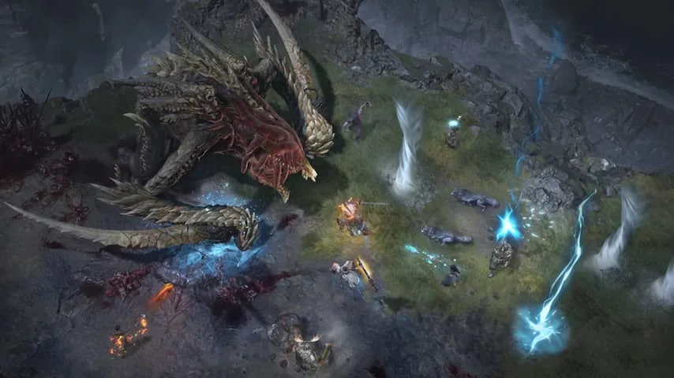
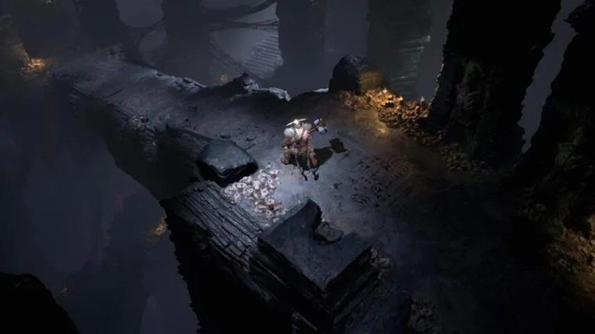
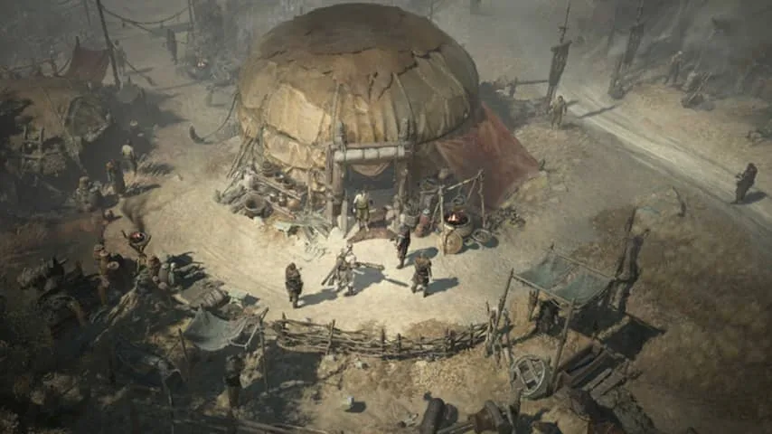

**De nieuwste Diablo-game is een duistere, bloederige game, die zijn inspiratie put uit de middeleeuwse idee van de hel.**

> [!NOTE]
> Deze recensie verscheen eerder op [NU.nl](https://www.nu.nl/reviews/6008491/eerste-indruk-diablo-iv-is-duisterder-enger-en-intiemer.html).

De eerste _Diablo_\-games hielpen om de Amerikaanse gamestudio Blizzard op de kaart te zetten. Het bedrijf dacht de eerste game misschien 100.000 keer te verkopen, maar zag de teller al snel oplopen naar meer dan twee miljoen - in die tijd een gigantisch aantal.

De vervolgen werden nog grotere kaskrakers. Het recentste _Diablo III_ is meer dan 30 miljoen keer verkocht, aldus cijfers uit 2015. Nu hoopt de ontwikkelaar dit succes te herhalen met _Diablo IV_, dat probeert terug te grijpen naar de duistere toon van de eerste twee delen.

_Diablo IV_ is een rollenspel waarin je de actie van bovenaf bekijkt. Je kiest aan het begin een personage dat je wil spelen - op het moment zijn een barbaar, magiër en druïde onthuld - en vecht je een weg door hordes vijanden om opdrachten te doen en nieuwe uitrustingen te vinden.

_Diablo IV — Beeld: Blizzard_

## Tientallen moordenaars

De actie in _Diablo IV_ is razendsnel. Tijdens onze demo was een enkele klap voldoende om soms meerdere vijanden uit te schakelen. Dat is ook nodig, gezien het scherm al snel gevuld is met tientallen monsters die je willen vermoorden. Je kunt nu opzij rollen om klappen te vermijden, een optie die eerst alleen in de spelcomputerversie van _Diablo III_ beschikbaar was.

Aanvallen hebben een gevoel van impact. Een druïde kan bijvoorbeeld in een beer transformeren om een vijand te doden, waarbij het slagveld overstroomt met bloed naarmate je langer rondslaat. Door een spreuk in te zetten, vult het scherm zich met bliksemschichten en cyclonen, terwijl diepe dondergeluiden uit de speakers komen.

De gamewereld bestaat uit meerdere grote gebieden. Die verken je door missies te voltooien, maar je kunt ook rondzwerven om nieuwe plekken te vinden. Op die manier kwamen wij bijvoorbeeld een verdwaalde avonturier tegen, die hulp nodig had om monsters te verslaan. De game probeert verkenning te stimuleren, zodat je niet alleen maar blind de hoofdopdrachten voltooit.

_Diablo IV — Beeld: Blizzard_

## Vrij aanpassen

Hoe meer je speelt, des te meer uitrustingen je vindt. Daarnaast groei je ook langzaam in level, waardoor je nieuwe vaardigheden ontgrendelt. Je kunt punten in een speciaal talentsysteem investeren, waardoor je bepaalt welke aanvallen sterker worden. Dat systeem steekt wat vrijer in elkaar dan in _Diablo III_, waarin je upgrades gekoppeld waren aan specifieke aanvallen. In _Diablo IV_ kun je vrij upgrades kopen, wat je de ruimte geeft om bijvoorbeeld al je punten te investeren in één supersterke spreuk.

Naast nieuwe wapens en pantsers vind je ook zogeheten runes, die je in je uitrusting kan stoppen. Een zwak zwaard kan gaandeweg worden getransformeerd in een krachtig wapen, dat met door jou gekozen runes is afgestemd op exact jouw speelstijl. Het is nog een manier waarop Blizzard wil verzekeren dat je personage uniek voor jou is.

_Diablo IV — Beeld: Blizzard_

## Grauw

De wereld van _Diablo IV_ is buitengewoon duister. De eerste trailer was zodanig bloederig, dat de gamestudio adviseerde om de onthulling niet samen met kinderen te kijken. Daarmee lijkt Blizzard te reageren op kritiek over _Diablo III_, dat volgens fans van de eerste twee games te kleurrijk was.

Bloed spuit vrijelijk rond door de gamewereld, waardoor je held tijdens een trektocht door een kerker langzamerhand steeds roder is beschilderd. Verspreid door kamers liggen lijken met losgerukte ledematen. Dat alles wordt onderstreept door een grauw kleurenpalet en een beklemmende stilte. De game weet uitstekend wanneer je omgeving stil moet zijn om de grimmige ondertoon te benadrukken.

## Duistere verhalen

De verhalen die _Diablo IV_ vertelt zijn net zo duister. In de onthullingstrailer was al te zien hoe het bloed uit de lijven van drie avonturiers werd gezogen, zodat een oude demon opgeroepen kon worden. In de demo werd een verhaal verteld over een vader die zijn zoon verdrinkt, als offer om de oogst van het dorp te redden.

_Diablo IV_ put zijn inspiratie uit de middeleeuwen. Dit is een gamewereld waarin de mensheid op de rand van de afgrond probeert te overleven, omsingeld door bloeddorstige wezens verstopt in gotische kerkers en omringd door pentagrammen.

De missies die we speelden voelden klein en persoonlijk. Ze gingen niet over het lot van het universum en de strijd tussen goed en kwaad, zoals in _Diablo III_ vaak het geval was. De game gebruikt verhalen van simpele mensen om zijn punt te maken, waardoor het geheel intiemer en persoonlijker voelt.

## Conclusie

_Diablo IV_ is duister, bloederig en geeft je buitengewoon veel keuzes bij het aanpassen van je personage. Dat laatste is al genoeg om de game in potentie honderden uren te blijven spelen.

We moeten nog wel even wachten tot we dat zeker weten: een verschijningsdatum voor _Diablo IV_ is nog niet bekendgemaakt. Het kan nog jaren duren tot de game uitkomt.

_Diablo IV staat gepland voor pc, PlayStation 4 en Xbox One._
