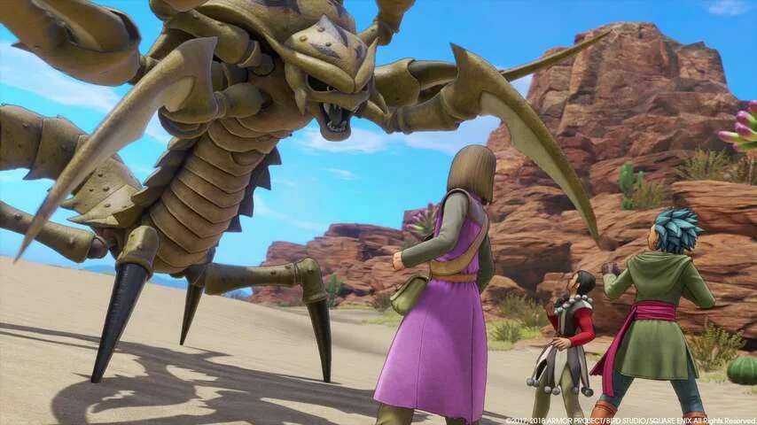
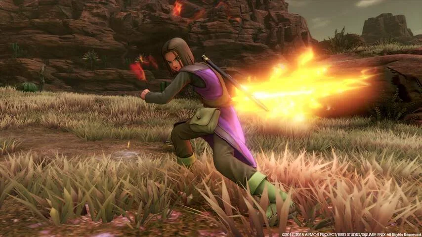
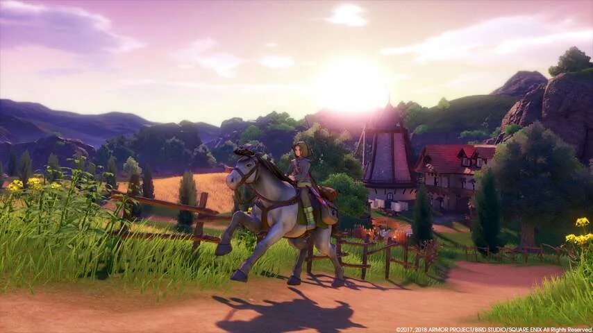
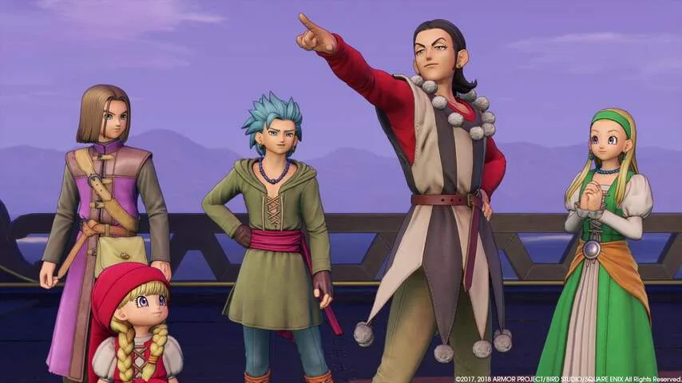

**Dragon Quest is in thuisland Japan de populairste gamereeks aller tijden. Nu doet de serie een nieuwe poging in het Westen met zijn elfde deel.**

> [!NOTE]
> Deze recensie verscheen eerder op [NU.nl](https://www.nu.nl/reviews/5451962/review-dragon-quest-xi-is-ouderwets-en-liefdevol.html).

In Japan weet ieder deel in de _Dragon Quest_\-reeks miljoenen op te brengen. De introductie van een spel gaat gepaard met grote billboards in steden, en wordt zelfs besproken in de belangrijkste talkshows.

Het succes van de games is deels te danken aan de tekenstijl. Personages worden ontworpen door striptekenaar Akira Toriyama, bekend van de tevens in Japan succesvolle serie _Dragon Ball_. In het Westen heeft de game dit succes echter nooit weten te herhalen. De spellen verkochten bescheiden aantallen.

Het is de vraag of _Dragon Quest XI_, dat deze maand verschijnt voor de PlayStation 4 en pc, daar verandering in gaat brengen. De game volgt de formule van zijn voorgangers namelijk tot op de letter. Dit is een rollenspel waarin je een jonge held speelt die de wereld moet redden, en zo langzaamaan de wereld over reist.

[Bekijk ingesloten media](https://content.jwplatform.com/players/rURlBOrx-whqXCOFb.html)

## Gevechten zijn langzaam

Tijdens je reis vecht je tegen het ene na het andere monster. Dat gebeurt via een menusysteem, waarbij jouw team hoofdpersonen beurtelings klappen uitwisselt met de tegengekomen monsters. Net als in oude rollenspellen uit de jaren negentig, en eigenlijk is de formule ook amper veranderd sinds die tijd. Het vechten voelt methodisch, maar is op veel punten ook langzaam. Hierdoor zit je soms urenlang op de X-knop te drukken om verder te gaan.

_Dragon Quest XI_ heeft geen gekke gimmicks die het spel onderscheiden van moderne Japanse rollenspellen zoals _Final Fantasy XV_. Het simpele verhaal biedt als leidraad om je langzaam van stad naar stad te sturen. Schurken hebben verdacht gekrulde snorren en stiekeme blikken, waardoor je nooit verrast zal zijn tijdens een plotwending.

Visueel is het spel wel prachtig. Personages zien eruit als driedimensionale tekenfilmfiguren, maar stralen wel allemaal persoonlijkheid uit. De spelwereld gebruikt daarnaast slimme licht- en kleureffecten en reikt tot aan de horizon, waardoor je echt het gevoel krijgt een fantasiewereld te verkennen.

Daar staat een wat conservatief voelende muziektrack tegenover. Het spel zit bomvol klassieke nummers. Die zijn misschien wel opgenomen door een gerenommeerd Japans orkest, maar in een game voelen ze vreemd en misplaatst aan.

_Dragon Quest XI — Beeld: Square Enix_

_Dragon Quest XI — Beeld: Square Enix_

_Dragon Quest XI — Beeld: Square Enix_

_Dragon Quest XI — Beeld: Square Enix_

_Dragon Quest XI — Beeld: Square Enix_

## Charme in de kleine dingen

De charme van _Dragon Quest XI_ lijkt eigenlijk vooral in de kleine dingen te zitten. De spelwereld is simpel en voorspelbaar, maar zit bomvol goed geschreven personages en dialogen. Zo zul je soms met digitale dorpelingen spreken die iets zeggen wat willekeurig lijkt, maar wat op een heel later punt in de game van toepassing blijkt te zijn. Het zorgt ervoor dat de spelwereld echt tot leven komt, op een manier die je zelden in games ziet.

Daar moet je alleen wel heel erg veel voor overhebben. Je bereikt het einde van de game namelijk pas als je zo'n honderd uur op de teller hebt staan. Aan de ene kant is dat geweldig nieuws: je krijgt voor je aanschaf immers ontzettend veel inhoud terug. Maar door de trage gevechten en het vaak wat simpel voelende verhaal, verlopen die honderd uur heel erg traag.

## Conclusie

_Dragon_ _Quest XI_ is traag, traditioneel en prachtig. Het is een game die lang niet iedereen zal waarderen. Je hebt geduld nodig om je door de tientallen uren van het spel te slaan. Maar als je dat hebt, dan vormt zich langzaam een wereld die je niet snel zal vergeten.

_3sterren — Beeld: NU.nl_
