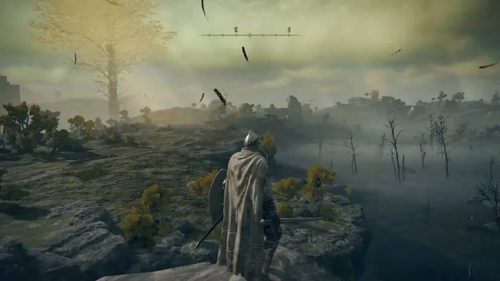

**Elden Ring is net zo moeilijk als bijvoorbeeld de Dark Souls-games, maar is door een grote, open wereld tegelijkertijd beter benaderbaar. De samenwerking met Game of Thrones-auteur George R.R. Martin is echter bijna niet terug te zien.**

> [!NOTE]
> Deze recensie verscheen eerder op [NU.nl](https://www.nu.nl/tech/6185808/review-elden-ring-is-net-dark-souls-maar-dan-grootser-en-mooier.html).

De Japanse gamestudio From Software staat inmiddels om één ding bekend: zijn buitengewoon moeilijke games. In _Dark Souls_, _Demon's Souls_, _Bloodborne_ en _Sekiro_ werd het uiterste gevraagd: achter ieder hoekje staat wellicht een vijand die je wil bespringen, terwijl het uren kan duren voordat je één baas verslaat.

_Elden Ring_ is van diezelfde orde. Je probeert een mysterieuze kracht genaamd de Elden Ring te herstellen en zo de machtige Elden Lord te worden, wat alleen lukt door meerdere demigoden te verslaan. Die zitten ieder diep in hun vestes verstopt, waar je alleen binnenkomt door voorzichtig van kamer naar kamer te bewegen.

Het verhaal van de game is in samenwerking met _Game of Thrones_\-schrijver Martin geschreven, al is onduidelijk hoe groot zijn rol echt was. In grote lijnen is het verhaal namelijk gelijk aan dat van de meeste eerdere _Souls_\-games. Alleen de namen van bepaalde vijanden, voorwerpen en upgrades zijn omgewisseld voor iets anders.

Als dat Martins voornaamste rol was, dan zou hij zijn werk op een paar A4'tjes afgeleverd kunnen hebben. Het voelt alsof de schrijver vooral gebruikt is als marketingtruc en in werkelijkheid niet serieus bij het project betrokken was.

[Bekijk ingesloten media](https://content.jwplatform.com/players/fANPKIEU-whqXCOFb.html)

## Altijd voorzichtig zijn

Bijna iedere vijand is gevaarlijk genoeg om je met een paar klappen dood te maken, waarna je soms lange passages opnieuw moet spelen om weer op hetzelfde punt te komen. Dit maakt _Elden Ring_ een game waarbij je constant op het puntje van je stoel zit; argeloos op de aanvalsknop rammen, zit er niet in.

Wat _Elden Ring_ anders maakt dan zijn voorgangers is de grote, open wereld die je kunt verkennen. In eerdere _Souls_\-titels was je doorgaans gekluisterd aan kleinere, meer gekaderde gebieden waar je op specifieke wijze doorheen kon gaan. In dit nieuwe deel zijn er grote open velden, moerassen en bossen, die allemaal gevuld zijn met dingen om te doen.

Die open gebieden bieden meer vrijheid, maar zijn wel net zo gevaarlijk. Bij oude ruïnes vliegt een draak rond, terwijl je iets verderop een grote groep zombies aantreft die samen met twee trollen een karavaan voorttrekt. Maar vaak leveren deze uitdagingen je ook een grote beloning op, zodat de rest van de game weer iets makkelijker wordt.

## Geen boodschappenlijstje

Het fijne is dat _Elden Ring_ probeert zo weinig mogelijk te verklappen. Veel openwereldgames hebben een kaart waarop je alles kunt zien wat er te vinden is. Hoewel deze game wel een plattegrond biedt, bevat deze vooraf nagenoeg geen informatie: je zult de wereld zelf moeten verkennen om alle geheimen te ontrafelen. Het maakt van _Elden Ring_ een avontuur, terwijl andere games binnen dit genre vaak aanvoelen als het afvinken van een boodschappenlijstje.

Die open wereld maakt de rest van de game bovendien beter benaderbaar. Voorgaande _Souls_\-titels konden namelijk frustrerend zijn: zat je ergens vast, dan moest je vaak talloze keren hetzelfde opnieuw proberen totdat het wel lukte. Deze games hebben altijd een vaste moeilijkheidsgraad, waardoor je ze na uren frustratie niet alsnog op 'easy' kan zetten.

_Review: Elden Ring is net Dark Souls, maar dan grootser en mooier — Beeld: From Software_

## Zit je vast? Verken de wereld

Bij _Elden Ring_ heb je in zulke situaties een alternatief: je kunt de spelwereld nog wat meer gaan verkennen, in de hoop dat je meer upgrades vindt waarmee je het gedeelte waarin je vastzat makkelijker kunt maken. Het zorgt ervoor dat de leercurve bij deze game veel geleidelijker verloopt, zonder dat de makers hoeven terug te grijpen op een lagere moeilijkheidsgraad.

Dat gebeurde ons bijvoorbeeld bij Margit the Fell, de eerste 'echte' baas in de game. Na uren doodgaan trokken we weer de velden in, waar we werden aangevallen door een huurmoordenaar. Eenmaal verslagen pakten we zijn krachtige dolk, die het gevecht met Margit aanzienlijk makkelijker maakte.

## Conclusie

_Elden Ring_ lijkt in de kern op voorgaande _Souls_\-games, maar dan grootser en opener. Dat maakt de game op zijn beurt ook beter benaderbaar, want als je vastzit kun je altijd nog tien kanten op om de wereld te verkennen. En door alles in die wereld geheim te houden en uitdagend te maken, blijft _Elden Ring_ continu spannend. Een geweldige game voor zowel nieuwkomers als fans van vorige delen.

_Elden Ring verschijnt op 25 februari voor PlayStation 4/5, Xbox One/Series en pc._

_4,5 sterren_
