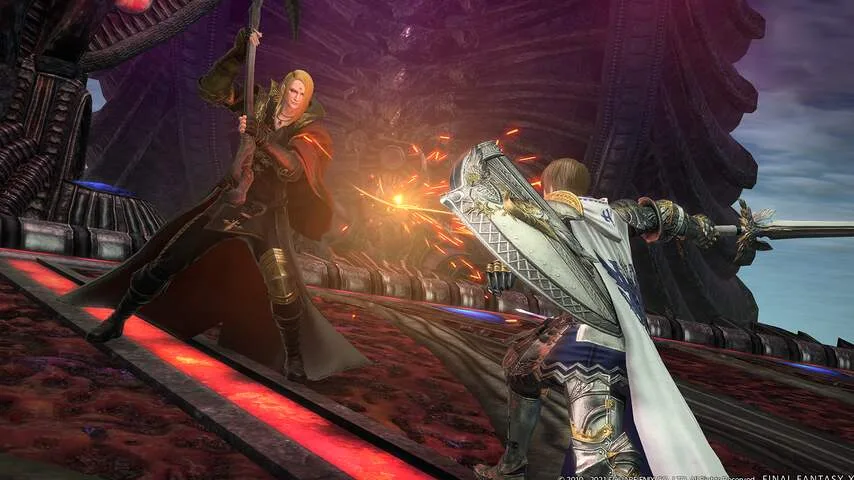

**Het Japanse Square Enix weet met Final Fantasy XIV: Endwalker een van de beste online rollenspellen aller tijden neer te zetten - en is daarmee zelfs slachtoffer geworden van zijn eigen succes.**

> [!NOTE]
> Deze recensie verscheen eerder op [NU.nl](https://www.nu.nl/tech/6174174/review-ffxiv-endwalker-sluit-verhaal-van-elf-jaar-lang-uitmuntend-af.html).

_Final Fantasy XIV_ is inmiddels één groot comebackverhaal geworden. De game werd na verschijning in 2010 een grote flop, waarna de ontwikkelaar besloot de game van voor af aan opnieuw te bouwen. Die herziene versie werd vervolgens een succes, waarna ieder uitbreidingspakket over de jaren steeds hogere waarderingen kreeg.

Dit is een zogeheten _massively multiplayer online role-playing game_, ofwel een MMORPG. Dat zijn games die bestaan uit grootse, vrij verkenbare werelden die je samen met duizenden andere spelers tegelijkertijd betreedt. Ondertussen wordt je held sterker, krijg je betere uitrusting en kun je met medegamers steeds moeilijkere uitdagingen aangaan.

Inmiddels is met _Endwalker_ de vierde uitbreiding voor de game verschenen. Spelers kunnen hun personages ditmaal trainen tot maximaal level negentig, terwijl ze in een nieuw verhaal ontdekken hoe mysterieuze goden dreigen de wereld te verwoesten. Het is een verhaal dat spelers naar gekke locaties sleept, waaronder zelfs de maan.

[Bekijk ingesloten media](https://content.jwplatform.com/players/vgAMEnPx-whqXCOFb.html)

## Sage en Reaper

Nieuw zijn twee speelbare 'jobs', die bepalen hoe je personage werkt. De _Sage_ kan met kleine drones teamgenoten genezen en van schilden voorzien, terwijl de _Reaper_ tegenstanders uitschakelt met een zeis.

Voor beide valt wat te zeggen. De Sage is wat actiever en stoerder dan eerdere geneesjobs in de game, terwijl de Reaper complexer aanvoelt dan veel andere jobs die schade aanbrengen.

## Een goede tv-serie

_Endwalker_ moet het verhaal dat de game in 2010 begon definitief afronden, een belofte die nagenoeg foutloos wordt ingelost. We willen niet te veel verklappen, maar het is knap hoe personages van het eerste uur hier vaak een grote, logische rol spelen. Het is duidelijk dat de makers in de afgelopen elf jaar veel zaadjes hebben geplant, met als doel om alles nu mooi samen te brengen.

Het voelt als het laatste seizoen van een goede televisieserie. Een idee dat we bij de game vaker krijgen, alleen al door de grote hoeveelheid tussenfilmpjes. Hoewel je ook genoeg moet vechten, wat tijdens de tussentijdse kerkers het beste tot uiting komt, bestaat het doorspelen van _Endwalker_ vooral uit veel lezen en kijken.

Dialogen kunnen soms tientallen minuten duren en geregeld waarschuwt het spel om even goed te gaan zitten voor een nieuwe verhaalscène. Bij een minder goed geschreven game zou dit een doodzonde zijn, bij _Endwalker_ is het nog net acceptabel.

Overigens sluit _Endwalker_ het verhaal af, maar blijft de game voortbestaan en groeien. De makers willen met het volgende uitbreidingspakket een nieuw verhaal beginnen.

_Review: FFXIV Endwalker sluit verhaal van elf jaar lang uitmuntend af_

## Het beste van hetzelfde

Heb je eenmaal het verhaal doorgespeeld, dan wacht een wat traditionele game op je. _Endwalker_ vraagt je dan om je personage sterker te maken door kerkers opnieuw te doorkruizen of moeilijkere versies van bazen te verslaan. In januari wordt een nog moeilijkere raid toegevoegd, die wekenlang kan duren om te verslaan, net zoals bij eerdere uitbreidingen van _Final Fantasy XIV_.

Het zal voor fans van het eerste uur geen groot bezwaar zijn, zij weten al jarenlang wat voor game ze voor hun kiezen krijgen. Maar tegelijkertijd doet _Endwalker_ niks om de kerngame écht op de schop te gooien. Dit is simpelweg het allerbeste van een al bestaande spelformule.

## Geweldige muziek en serverproblemen

Gelukkig wordt die kern door het nodige ondersteund. Naast het uitmuntende verhaal wordt _Endwalker_ vergezeld door een geweldige soundtrack, die zich kan meten met muziek uit eerdere, klassieke delen van _Final Fantasy_. Ook is de online gemeenschap met wie je de game samen speelt een van de vriendelijkste die je in een online spel zult aantreffen.

Eigenlijk is er maar één echt groot nadeel aan _Endwalker_, namelijk de serverproblemen. Op het moment van schrijven duurt het wegens ongekende populariteit uren voordat je in de middag of avond kunt inloggen bij het spel.

In de afgelopen maanden stapten spelers massaal over van _World of Warcraft_, na meerdere tegenvallende uitbreidingen en verhalen over wangedrag bij de ontwikkelaar. Voor Square Enix een commercieel succes, maar een succes dat de game lastig speelbaar maakt.

## Chiptekort zorgt voor problemen

Square Enix hoopt de serverproblemen op te lossen, maar loopt daarbij aan tegen het huidige chiptekort. Er zijn simpelweg niet genoeg servers om de grote vraag tegemoet te komen. Sommige edities van het spel zijn zelfs uit de winkels gehaald, in een poging de grote drukte te temperen.

Wie wil spelen, zal daarom wellicht even geduld moeten hebben. Hopelijk is de game beter speelbaar in januari. Het is het wachten waard.

_4,5 sterren_
