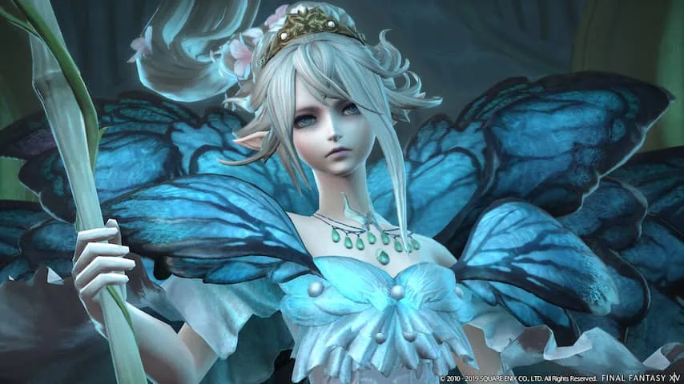
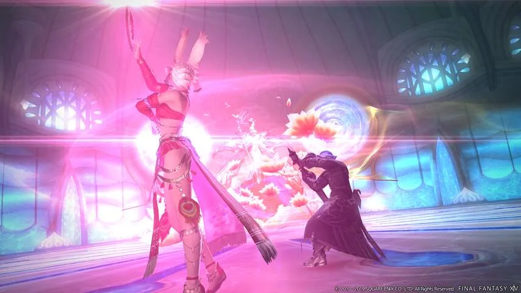
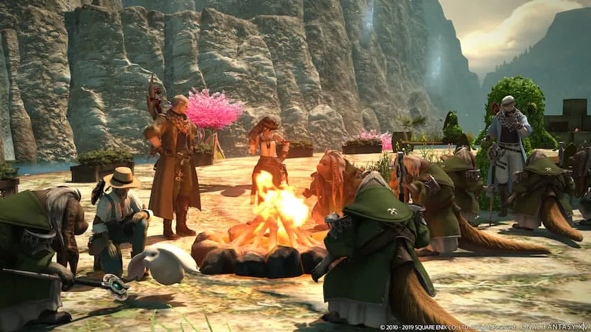

**Het befaamde World of Warcraft heeft er een geduchte concurrent bij. Final Fantasy XIV is een onwijs uitgebreide game, die met zijn nieuwste uitbreiding Shadowbringers toegankelijker wordt voor meer spelers.**

> [!NOTE]
> Deze recensie verscheen eerder op [NU.nl](https://www.nu.nl/reviews/5967059/review-final-fantasy-xiv-shadowbringers-is-een-uitstekend-online-rollenspel.html).

_Final Fantasy XIV_ is een zogeheten massively multiplayer online roleplayinggame (MMORPG), waarin duizenden spelers tegelijkertijd in dezelfde spelwereld op avontuur gaan.

Veel van de gebruikelijke aspecten van dit genre zijn in de game terug te vinden: je kunt teams vormen met medespelers om kerkers te verkennen, om zo zeldzame uitrusting te vinden.

Daarbij is een goede balans belangrijk: één speler vangt alle klappen op, terwijl een tweede de wonden geneest. Hierdoor kan de rest van het team zoveel mogelijk schade aanrichten zonder zich zorgen te maken.

[Bekijk ingesloten media](https://content.jwplatform.com/players/tuIxXJks-whqXCOFb.html)

## Een echte economie

Ook is het mogelijk een ambacht te kiezen en bijvoorbeeld een leerbewerker of een wapensmid te worden, zodat je zelf uitrusting voor medespelers kunt smeden, die je op de markt kunt verkopen voor virtueel geld. Wie genoeg verdient, kan zelfs een eigen huis kopen en inrichten, waar medespelers je weer kunnen bezoeken.

Door al die spelsystemen ontstaat er een wereld waarin spelers constant met elkaar in contact staan. Ze zijn op zoek naar medespelers om mee op avontuur te gaan, of bespelen de economie in een poging om multimiljonair te worden. Grote groepen spelers vormen speciale gildes, die zowel binnen als buiten de game constant met elkaar in contact staan en afspreken om de moeilijkste spelgebieden samen te doorkruisen.

_Final Fantasy XIV — Beeld: Square Enix_

_Naarmate het spel vordert, leer je nieuwe vaardigheden, afhankelijk van de klasse van je personage._

## Een nieuwe wereld

Spelers gaan in _Shadowbringers_ naar een nieuwe wereld, waar de krachten van het licht de overhand hebben. Het is al jarenlang geen nacht geweest en mensen veranderen steeds vaker in vreemde monsters. Door langzaamaan deze monsters te verslaan, moet je de nacht laten terugkeren in deze wereld.

Het maximumlevel in het spel is verhoogd, waardoor je met het vervullen van missies en verkennen van kerkers maximaal level 80 kunt halen. Naarmate het spel vordert, leer je ook nieuwe vaardigheden, afhankelijk van de klasse van je personage.

## Twee nieuwe spelersklassen

Ook kan er gekozen worden uit twee nieuwe speelbare klassen. De Gunbreaker is een zogeheten tank, die de klappen opvangt voor andere spelers. Deze gebruikt een zwaard dat tevens als geweer gebruikt kan worden. Door speciale ammunitie in dat wapen te stoppen kun je speciale aanvallen uitvoeren. De Gunbreaker kan flink wat meer schade aanrichten dan de andere tanks in het spel, al voelt de speelstijl van de klasse wel wat simpel.

Daarnaast is er de Dancer, die op afstand schade aanrichten door met twee speciale ringen te gooien. Tussendoor kan deze klasse zijn of haar team ook motiveren met speciale danspassen, waardoor ze bijvoorbeeld meer schade aanrichten. Die dansen steken altijd net iets anders in elkaar, waardoor je goed moet opletten welke knoppen je precies indrukt. Het maakt de Dancer een stuk dynamischer dan andere klassen in het spel.

Ook kunnen personages met twee nieuwe rassen worden gemaakt: de konijnenmensen Viera en de beestmensen Hrothgar. Elk is beperkt tot een specifiek geslacht, waardoor Viera alleen vrouwen kunnen zijn en de Hrothgar worden beperkt tot mannen.

_Final Fantasy XIV — Beeld: Square Enix_

_De dansen steken altijd net iets anders in elkaar, waardoor je goed moet opletten welke knoppen je indrukt._

## Gestroomlijnd en versimpeld

Alle klassen in het spel zijn opnieuw gestructureerd. Flink wat oude aanvallen zijn niet langer beschikbaar, en de overgebleven vaardigheden zijn gestroomlijnd. Hierdoor hoef je minder verschillende knoppen in te drukken. Dat maakt de game toegankelijker voor nieuwkomers en spelers die bijvoorbeeld een gamepad gebruiken, maar _Final Fantasy XIV_ voelt hierdoor ook iets simpeler dan eerder het geval was.

Daarnaast is het makkelijker gemaakt om de game te spelen zonder samen te werken met medespelers. Het is bijvoorbeeld mogelijk om kerkers in je eentje te verkennen, samen met drie computergestuurde personages die meehelpen.

_Final Fantasy XIV_ weet zich te onderscheiden met een uitgebreid verhaal - en in _Shadowbringers_ is dit verhaal verrassend goed uitgewerkt. Verspreid door het uitbreidingspakket zit de ene na de andere plottwist, en het geheel wordt op sublieme wijze afgesloten op level 80. Een unicum, gezien online rollenspellen zelden zo'n goed verhaal weten te vertellen.

_Final Fantasy XIV — Beeld: Square Enix_

_Verspreid door het uitbreidingspakket zit de ene na de andere plottwist._

## Conclusie

De gestroomlijnde klassen, de nog grotere nadruk op het verhaal en de mogelijkheid om alleen de kerkers te spelen zijn allemaal belangrijke stappen voor de game. Dit alles maakt de game namelijk interessant voor een veel grotere groep gamers, die vooral een leuk verhaal wil doorspelen en niet zit te wachten op de complexiteit van een MMORPG.

De stroomlijning zorgt er echter zelden voor dat het spel te simpel aanvoelt - een kritiekpunt dat fans van concurrent _World of Warcraft_ steeds vaker opperen. Dat maakt _Final Fantasy XIV_ met _Shadowbringers_ misschien wel het meest toegankelijke spel in zijn genre, zowel voor nieuwkomers als veteranen.

_4 sterren — Beeld: NU.nl_
