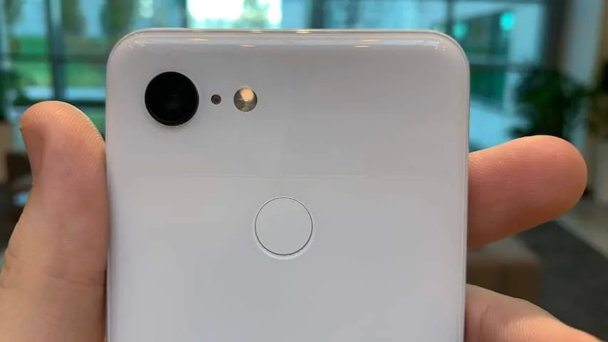
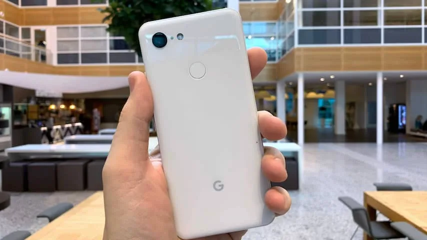
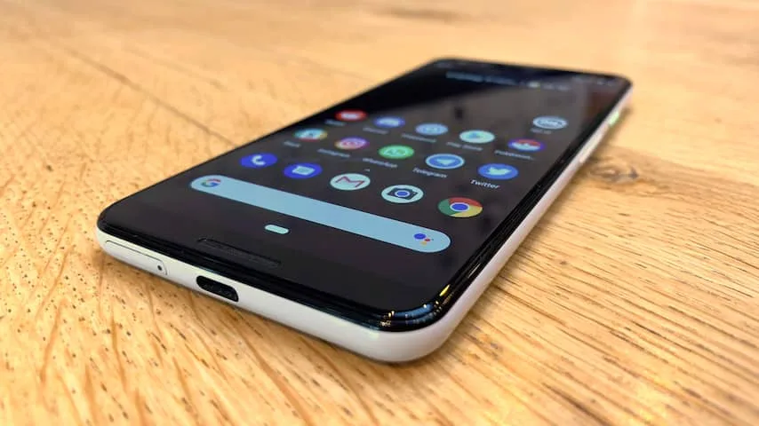
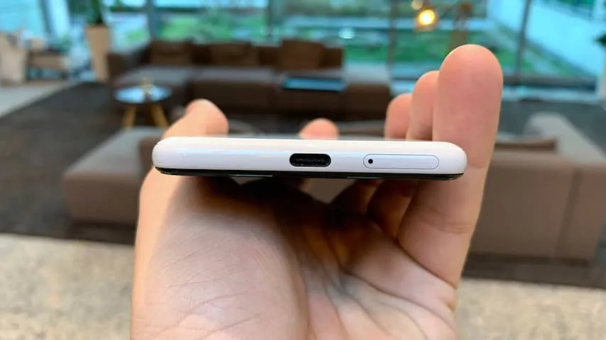
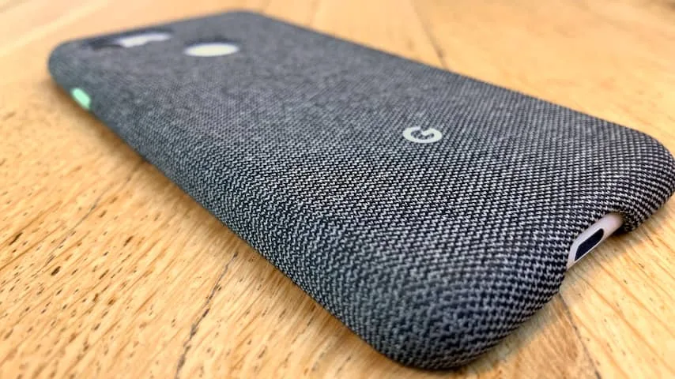

**In oktober kondigde Google de Pixel 3 aan. Een Android-telefoon helemaal gemaakt door het bedrijf zelf, die officieel niet in Nederland te koop is. Is het de moeite waard om hem vanuit het buitenland te importeren?**

> [!NOTE]
> Deze recensie verscheen eerder op [NU.nl](https://www.nu.nl/reviews/5563616/review-pixel-3-is-fijnste-android-smartphone-die-je-niet-zomaar-kan-kopen.html).

Google maakt al jaren het Android-besturingssysteem. Iedere telefoonmaker mag hier ook gebruik van maken, waardoor op telefoons van Samsung, OnePlus en veel andere fabrikanten het besturingssysteem geïnstalleerd is. Deze telefoonmakers geven Android altijd een eigen lik verf, waardoor Android er op iedere telefoon anders uitziet.

Er is een 'gewone' versie van Android zonder al die aanpassingen, maar die wordt zelden aangeboden. De grote uitzondering is de Pixel-telefoonlijn van Google zelf. Het bedrijf wil hiermee het beste van zijn eigen besturingssysteem demonstreren, zonder de poespas van andere telefoonmakers.

Bij de Pixel 3 is dat goed terug te zien. Het beginscherm ziet er strak en gestroomlijnd uit, in de stijl die we kennen van veel Google-apps. Android oogt op de Pixel 3 simpel en minimaal, zonder echt beperkt te zijn. Het is het fijnste softwareontwerp op een moderne Android-telefoon.

In de software zitten een paar leuke trucs verborgen. Je kunt bijvoorbeeld over de vingerafdrukscanner vegen om het notificatiescherm te openen, waardoor de Pixel 3 makkelijker met één hand bediend kan worden. Je hoeft namelijk niet meer naar de bovenkant van het scherm te grijpen.

Daarnaast is er een praktisch voordeel: Pixel-telefoons krijgen over het algemeen sneller nieuwe Android-updates dan de telefoons van andere fabrikanten. Met een Pixel 3 ben je er dus vrij zeker van dat je volgend jaar zo snel mogelijk de grote Android Q-update krijgt.

Heb je de bijbehorende oplaaddock, dan kan de Pixel 3 tijdens het opladen veranderen in een slim fotolijstje met een Google Assistent-knop. Een speciale wekker kan dan het scherm langzaam helderder maken, waardoor de telefoon een soort wake-uplight wordt. Dat werkt verrassend goed.

_Google Pixel 3 — Beeld: NU.nl/Bastiaan Vroegop_

_Google Pixel 3 — Beeld: NU.nl/Bastiaan Vroegop_

_Google Pixel 3 — Beeld: NU.nl/Bastiaan Vroegop_

_Google Pixel 3 — Beeld: NU.nl/Bastiaan Vroegop_

_Google Pixel 3 — Beeld: NU.nl/Bastiaan Vroegop_

## Een ander ontwerp dan concurrenten

De buitenkant van de Pixel 3 voelt hoogwaardig aan. De achterkant bestaat uit een combinatie van glimmend en mat materiaal, met in het midden de vingerlezer. De ontgrendelknop aan de zijkant heeft een unieke kleur, afhankelijk van welk toestel je hebt. Op onze witte Pixel 3 is de knop bijvoorbeeld groen.

Google levert zelf een stoffen hoesje voor de Pixel-telefoons, waardoor het ontwerp aansluit op dat van bijvoorbeeld de Google Home-speakers. Het ontwerp wijkt hierdoor flink af van de vele andere vlaggenschepen op de markt, die allemaal een glimmende behuizing en standaardhoesjes hebben.

## Alsnog relatief dikke schermranden

De schermranden van de Pixel 3 zijn iets dunner geworden dan die op de Pixel 2. Desalniettemin zijn de randen nog wat dikker dan op veel andere Android-toestellen. Jammer, want hierdoor oogt de voorkant een beetje ouderwets.

Met de XL-versie probeert Google een moderner ontwerp neer te zetten, met een deels randloos ontwerp en een inkeping boven in voor de camera. Dat is alleen niet helemaal goed gelukt. De inkeping is zo dik, dat hij wat lijkt op een Charlie Chaplin-snor. Daarnaast heeft de telefoon alsnog een dikke kin aan de onderkant.

Het scherm zelf is wel indrukwekkend. Google heeft voor zowel de Pixel 3 als de Pixel 3 XL gekozen voor een oled-scherm, waarbij zwartwaarden ook echt gitzwart lijken. Bij oled worden alleen de delen van het scherm geactiveerd waarop ook echt iets getoond wordt. Kleuren zijn helder en divers, zonder dat het beeld ooit heel erg wordt vertekend.

## Eén cameralens die het fantastisch doet

De Pixel 3 heeft achterop slechts één camera. Dat is opmerkelijk, want veel concurrerende toestellen hebben er inmiddels twee of meer. Nokia zou zelfs werken aan een telefoon met maar liefst vijf lenzen. Die camera's worden doorgaans gebruikt om tussen kijkhoeken en zoomopties te schakelen, of om grotere foto's te maken.

Met zijn enkele lens weet de Pixel 3 desondanks te imponeren. Gemaakte foto's zien er fenomenaal uit. Beelden zijn haarscherp en mooi van kleur. Tegenlicht zorgt ook verrassend weinig voor problemen bij het schieten van beelden.

Vooral in omstandigheden met weinig licht weet de camera een goede indruk achter te laten. Foto's hebben amper ruis en zijn overwegend scherp - mits je ze natuurlijk maakt zonder de camera veel te bewegen.

Een testversie van de camera-app op de Pixel 3 maakt nachtfoto's nog mooier. Een speciale Night Mode vraagt je om de camera een seconde stil te houden, waarna er met slimme computeralgoritmes een zo scherp mogelijke, heldere foto wordt gemaakt. In een kamer met amper licht kregen we een foto die zowaar beter belicht was dan de werkelijkheid. Uniek. Deze app wordt op een niet nader moment voor iedereen uitgebracht.

## Diep in de buidel tasten

Wie een Pixel 3 wil, moet wel diep in de buidel tasten. Het goedkoopste model van de telefoon wordt verkocht voor 849 euro, een XL-model kost 949 euro.

Dat is misschien goedkoper dan de steeds duurder wordende vlaggenschepen van de concurrentie, maar de Pixel 3 wordt niet officieel in Nederland verkocht. Je zal dus een ritje naar bijvoorbeeld Duitsland moeten maken om de telefoon te kopen. Er zijn ook webwinkels die hem via een omweg in Nederland verkopen, maar dan betaal je al snel minstens 1.000 euro.

## Conclusie

De Pixel 3 is misschien wel één de uniekste Android-telefoons van het moment. Je krijgt Android zonder alle opsmuk van andere telefoonfabrikanten, met een paar leuke extra functies en een ontwerp dat echt afwijkt van de norm.

Bovendien heeft deze telefoon één van de beste camera's van het moment, ondanks dat er slechts één lens op zit. Voor sommigen zal dat genoeg reden zijn om door hoepels te springen en de Pixel 3 uit het buitenland of tegen een hogere prijs te kopen.

_4 sterren — Beeld: NU.nl_
