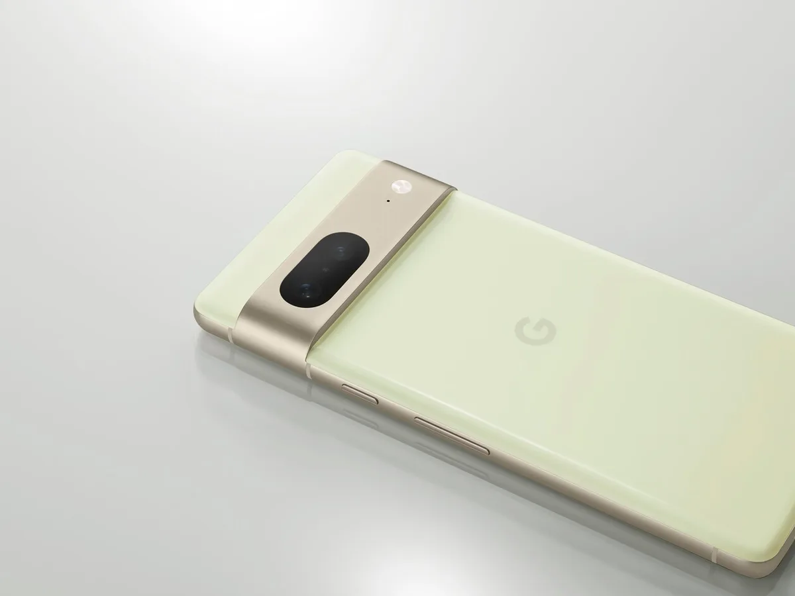
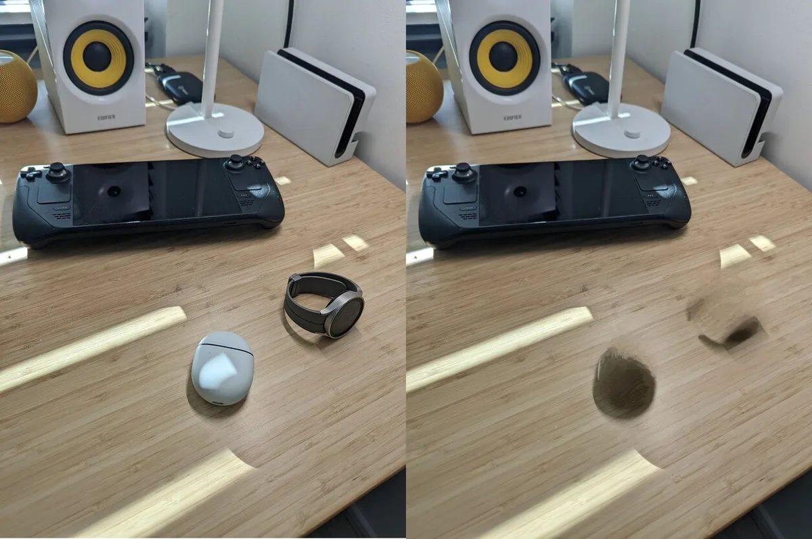

Na zes jaar wachten verkoopt Google eindelijk zijn Pixel-telefoons in Nederland. We hebben de nieuwe Pixel 7 en Pixel 7 Pro alvast getest, om te zien of het geduchte concurrenten zijn voor Apple en Samsung.

> [!NOTE]
> Deze recensie verscheen eerder op [AD](https://www.ad.nl/tech/cameratrucs-van-de-pixel-7-en-7-pro-zijn-geweldig-als-ze-werken~aa9662cf/).

Google maakt al jarenlang Android, het besturingssysteem dat je vindt op bijvoorbeeld telefoons van Samsung en Xiaomi. Maar daarnaast maakt het bedrijf met zijn Pixels ook zelf smartphones die op Android draaien. Die worden vaak gezien als de meest pure vorm van Android: het is een onaangepast besturingssysteem, zoals Google het zelf bedoeld had.

In het buitenland smullen ze al jaren van die Pixels, vooral toen de Pixel 2 in 2018 verscheen. Die smartphone had een camera die dankzij allerlei softwaretrucs ineens prachtige foto’s kon maken, zelfs ’s nachts als het pikkedonker is. Daarnaast hebben de telefoons allerlei andere handigheidjes, zoals de mogelijkheid om objecten uit foto’s weg te gummen.

Met de Pixel 7 en Pixel 7 Pro verkoopt Google zijn smartphones nu ook eindelijk in Nederland. We hebben beide smartphones ruim een halve week kunnen testen, waarbij we vooral de camera’s onder de loep hebben genomen. Want is dit echt de beste camera die je nu in een smartphone kunt vinden?

## Heel veel megapixels

De Pixel 2 moest het vooral hebben van zijn slimme software, die met een vrij gewone camerasensor heel mooie foto’s wist te maken. Dat is bij de Pixel 7-reeks niet het geval: beide smartphones hebben een sensor van maar liefst 50 megapixel. Daarnaast zit een ultrawide-camera van 12 megapixel, met op de Pro-telefoon ook 48 megapixel voor een telefotolens.

Die grote hoeveelheid megapixels zorgt er niet meteen voor dat je ook gigantische fotobestanden hebt. In plaats daarvan analyseert de smartphone het vastgelegde beeld, waarna de pixels worden teruggebracht naar een kleiner, scherper bestand. Het resulteert bij onze tests in buitengewoon mooie foto’s. Alles is scherp en goed te zien, met natuurlijk ogende kleuren.

Bijzonder is dat je de smartphone echt kunt zien werken om je foto’s mooier te maken. Schiet je een foto en bekijk je hem onmiddellijk, dan zie je daarin soms lelijke artefacten en fletse kleuren. Maar na een seconde of drie verspringt het beeld met het vaak veel mooiere eindresultaat. Het is nog steeds indrukwekkend hoeveel Google gebruikmaakt van software om een foto zoveel mooier te maken.

© Google

## Nachtmodus

Net als voorgaande Pixels hebben de nieuwe telefoons ook een speciale nachtmodus. Hierbij houd je het toestel een paar seconden stil, zodat met de vastgelegde pixels vervolgens een helder en scherp beeld kan worden gemaakt. Het is een truc die veel andere telefoons sinds de Pixel 2 ook hebben overgenomen.

Bij de Pixel 7-telefoons hoef je de smartphone voortaan minder lang stil te houden bij zo’n nachtfoto. Het gaat om een verschil van één tot twee seconden. Dat lijkt weinig, maar helpt ontzettend om een scherper beeld te maken. Want hoe minder lang je de telefoon stil hoeft te houden, hoe kleiner de kans dat je trilt en de foto alsnog verpest.

_De redactie van BestGetest zette recent_ [de beste smartphones van 2022](https://bestgetest.nl/de-beste-smartphones-van-2022?utm_source=ad&utm_medium=tekstlink&utm_term=byo&utm_campaign=redactioneel&utm_content=a9662cf) _op een rij._

## Slim weggummen werkt - soms

Een bijzonder idee is de magische gum. Druk op een knop en je telefoon analyseert het beeld, waarna objecten worden geselecteerd die je met een tik erop kunt weghalen. Zo haal je bijvoorbeeld wildvreemden die in de achtergrond voorbijlopen uit de foto.

Als de telefoon suggesties doet van te verwijderen beelden, dan werkt dit in veel gevallen best oké. Je moet er wel op letten dat de achtergrond waarvoor je iets weghaalt relatief effen is: toen we dit probeerden op bijvoorbeeld een eikenhouten tafel, bleven er allemaal onnatuurlijk ogende strepen achter.

Links de originele foto, rechts de foto waarbij het doosje en het horloge zijn weggegumd. De schaduw en het reliëf van de tafel zorgen voor problemen. © Bastiaan Vroegop

Ziet de telefoon niks, dan kun je met de hand alsnog objecten die je kunt weghalen. Bij ons ging het in die gevallen alleen amper goed: slechts delen werden weggehaald, of de achtergrond raakte vreemd vertekend. Als deze functie werkt is hij magisch, maar helaas is dat nog niet altijd het geval.

## Scherpstellen maakt vooral scherper

Nieuw is de mogelijkheid om een foto achteraf scherp te stellen. Dat werkt alleen op de Pixel 7-telefoons, maar ook met foto’s die je ooit hebt gemaakt met een ander toestel. Het is daarmee goed nieuws voor bijvoorbeeld oude familiefoto’s geschoten met een analoge camera, waarvan pas achteraf bleek dat ze onscherp waren.

Verwacht echter niet dat foto’s meteen haarscherp worden. Onderstaand voorbeeld laat zien wat we meestal merkten bij onze tests: een foto wordt inderdaad beter te zien, maar een klein beetje wazigheid blijft wel altijd aanwezig. Het is zeker een verbetering, maar reken niet op wonderen.

Links een oude, onscherpe foto, rechts dezelfde foto maar dan scherpgemaakt op de Pixel 7. © Bastiaan Vroegop

## Live meeschrijven is geweldig, maar nog Engels

Misschien wel onze favoriete app op de Pixels is trouwens de transcriptie-app. Tijdens het maken van opnames wordt automatisch meegeschreven wat wordt gezegd; een transcriptie die vele malen preciezer is dan we bij alternatieven gewend zijn. De telefoon kan bovendien al het afgespeelde geluid live uitschrijven in ondertiteling, zodat je bijvoorbeeld een grappige TikTok kunt kijken zonder je geluid aan te zetten.

Er is echter een vervelende keerzijde: deze transcripties werken nog niet in het Nederlands. Ze zijn geweldig bij Engelstalige video’s of bijvoorbeeld een interview met een Amerikaan, maar als Nederlander heb je er nog relatief weinig aan. Hopelijk komt daar snel verandering in, maar dat is nu nog lastig te zeggen.

## Conclusie

We kunnen er simpel over zijn: de Pixel 7 en Pixel 7 Pro zijn smartphones met uitmuntende camera’s. Met prijskaartjes van 649 en 899 euro zijn ze bovendien goedkoper dan concurrenten in ditzelfde segment, wat het makkelijk maakt om de telefoons aan te raden.

Er zijn natuurlijk wat schoonheidsfoutjes, zoals de gumfunctie die niet altijd even goed werkt. Het zijn echter kleine smetjes op verder prachtige telefoons. Hiermee kan Google de Nederlandse markt best goed opschudden.
