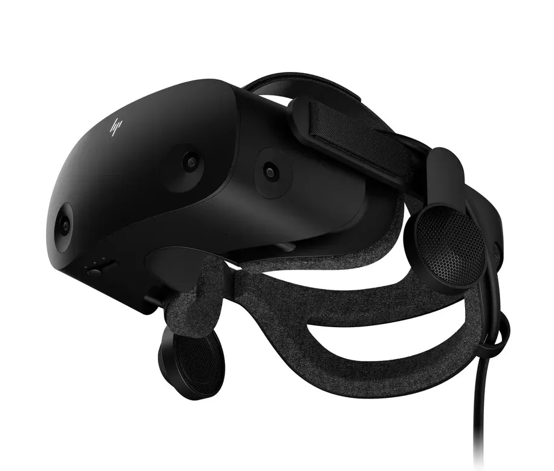
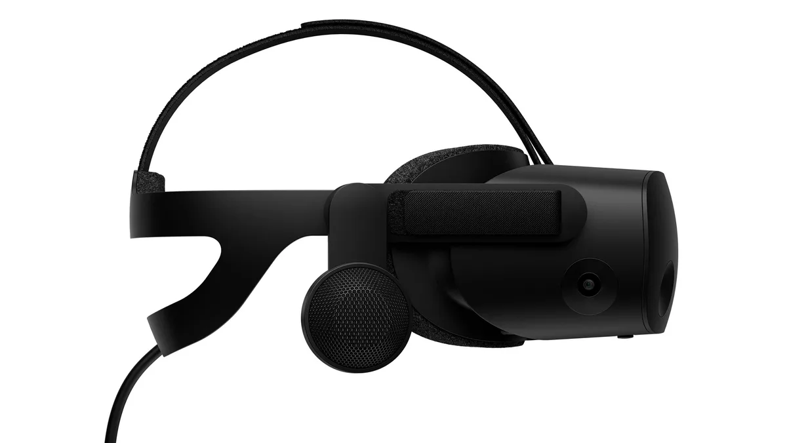

**Bright Review**

> [!NOTE]
> Deze recensie verscheen eerder op [Bright](https://www.bright.nl/nieuws/1128531/de-hp-reverb-g2-de-beste-vr-bril-die-bijna-niemand-gaat-kopen.html).

Virtual reality zoals we het nu kennen is inmiddels alweer vijf jaar oud: Oculus en HTC verkopen sinds het voorjaar van 2016 VR-headsets voor het grote publiek, waarna steeds meer fabrikanten zich op diezelfde markt hebben gestort.

Dat geldt ook voor HP, dat in 2019 zijn HP Reverb-bril introduceerde. Met een resolutie van 2160 bij 2160 per oog was het één van de eerste 4K-VR-brillen, een trend die met de nieuwe Reverb G2 wordt voortgezet.

## Geen hordeur

Dat is te zien: HP liet ons de bril gebruiken om een virtuele persconferentie van het bedrijf bij te wonen, waarbij nagenoeg alles in de omgeving haarscherp was. Van die rare 'hordeur' bovenop het beeld, die je de randjes tussen pixels laat zien, is bij de Reverb G2 nagenoeg geen sprake meer.

De pasvorm van de G2 is verbeterd, met speciale stoffen kussentjes om hem comfortabeler dan zijn voorganger te maken. Hij voelt ook een stuk lichter, waardoor we zelfs bij langere speelsessies amper druk op het gezicht voelde. Het is misschien wel de meest comfortabele headset die we tot nu toe hebben gebruikt.

## Zwevende speakers

In plaats van een koptelefoon heeft de bril twee kleine speakers die vlak boven je oren zweven. Hierdoor voel je niet dat je oren zijn afgedekt en lijkt geluid echt uit je omgeving te komen.

Een audiosysteem dat ook al op de Valve Index zit. Sterker nog, de Reverb G2 heeft verrassend veel weg van Valves concurrent: ook de pasvorm is hetzelfde en beide brillen werken alleen met een pc. Maar de Reverb G2 is met zijn prijskaartje van 699 euro een stuk goedkoper dan de ruim duizend euro kostende Index. Bovendien werkt de G2 met cameratracking in de bril zelf, terwijl je voor een Index sensoren in je huis moet ophangen.

## Maar...

Eigenlijk is er maar weinig aan te merken bij de Reverb G2: hij is vederlicht, comfortabel en heeft één van de scherpste schermen die je in een VR-bril kunt vinden. Maar toch denken we dat bijna niemand die deze bril in huis zal halen, simpelweg om één reden: de toch wat hoge prijs.

Met een prijskaartje van 699 euro is de Reverb G2 goedkoper dan de Valve Index en vergelijkbaar met de Vive Cosmos, maar concurrent Facebook heeft de markt compleet verstoord. De [Oculus Quest 2](https://www.bright.nl/nieuws/1127466/facebook-vr-bril-oculus-quest-2.html) kost namelijk slechts 350 euro en verschilt met een resolutie van 1832 bij 1920 niet zo héél veel van HP's bril.

## Conclusie

De HP Reverb G2 vereist naast de aanschaf van de bril ook dat je een goede pc in huis hebt staan. Voor onze test stuurde HP een gaminglaptop en bijbehorend dockingstation toe om alle goed aan te sluiten. De gecombineerde prijs voor dit gamingpakket: ruim 2.000 euro. Dan heb je de beste ervaring die virtual reality kan bieden, maar Facebooks concurrent vereist alleen de bril en kan optioneel met een pc verbinden.

Is de ervaring bij HP zoveel beter dat je er bijna zes keer zoveel voor moet betalen? Dat denk ik niet. Het is als een Ferrari: je kunt waarderen wat HP hier doet, maar de aanschaf is zelden te rechtvaardigen.

Dat maakt de Reverb G2 niet meteen een nutteloos apparaat. Heb je al een forse game-pc in huis staan, dan is de hogere prijs van deze bril prima te rechtvaardigen. Daarnaast zijn er genoeg mensen die principieel geen producten van Facebook willen kopen, voor wie de lagere prijs van de Quest 2 daarom geen rol speelt. Maar die groep mensen is een kleine niche, terwijl Facebook juist van VR een mainstreamproduct wil maken.

De Reverb G2 zal vast zijn publiek vinden, maar verwacht niet dat deze bril de wereld gaat veranderen.
