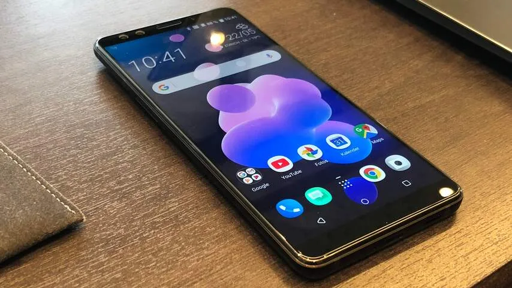
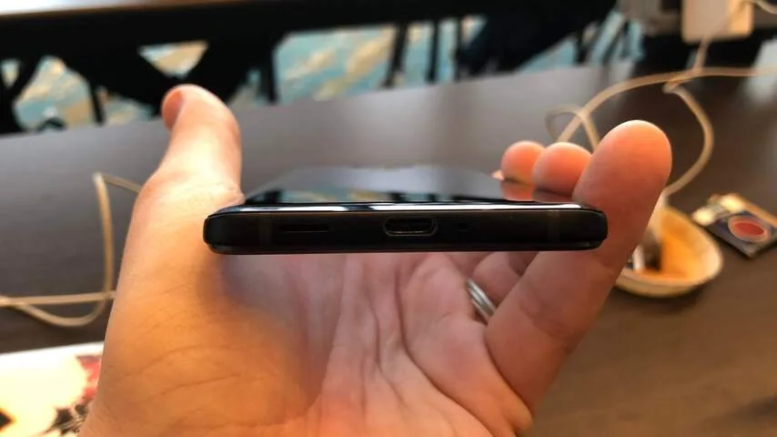
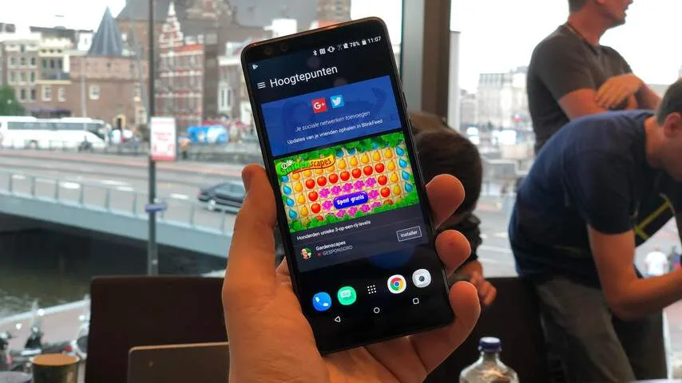
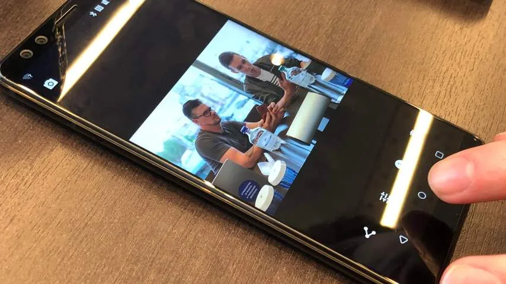
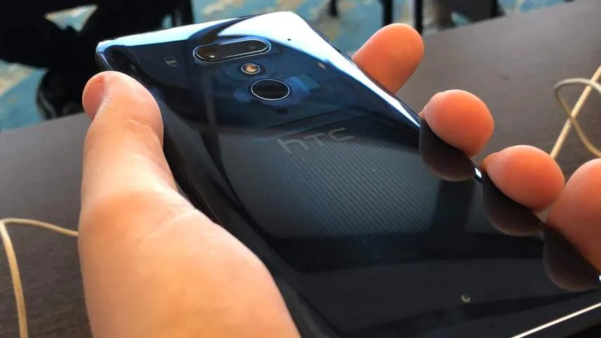
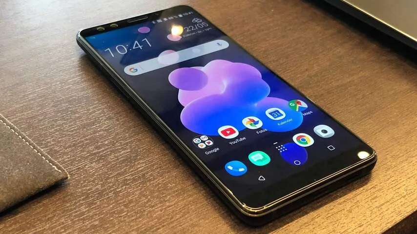

**HTC presenteerde deze week zijn nieuwe vlaggenschip, de U12 Plus. Het toestel is op een aantal punten licht verbeterd, maar is op één punt nog vreemd: het heeft een premiumprijskaartje, maar toont ook reclame binnen het besturingssysteem.**

> [!NOTE]
> Deze recensie verscheen eerder op [NU.nl](https://www.nu.nl/reviews/5278559/eerste-indruk-htc-u12-plus-dure-smartphone-met-advertenties.html).

De achterkant van de nieuwe U12 Plus heeft veel weg van zijn voorganger. HTC gebruikt nog steeds een glazen behuizing, die beschikbaar is in het rood, zwart en een transparantblauwe variant.

Het is een design dat vrijwel iedere telefoonmaker op het moment gebruikt. Bij de U12 Plus gelden daarom dezelfde plus- en minpunten die we in het afgelopen jaar vaker vaststelden bij telefoons; het glazen materiaal ligt fijn in de hand, maar is wel wat glad. Daarnaast is de behuizing vrij vlekgevoelig.

De randen rondom het scherm zijn iets dunner, maar zijn alsnog relatief dik vergeleken met bijvoorbeeld de Galaxy S9 en LG G7. Hierdoor oogt de telefoon wat ouderwets op een markt die op het moment wordt gedomineerd door vrijwel randloze alternatieven.

## Knijpbediening

HTC introduceerde vorig jaar knijpbediening bij de U11. Door korte of lange tijd in het toestel te knijpen, is het mogelijk om apps zoals de camera of Google Assistant te starten. Deze functie is in de U12 Plus uitgebreid, waardoor het ook mogelijk is om op de randen te tikken. Hierdoor verkleint het telefoonscherm, waardoor de U12 Plus met één duim volledig bediend kan worden.

Het knijpsysteem is wat onhandig in gebruik. We moesten de grip om de telefoon meermaals aanpassen voordat een knijpbeweging werd geregistreerd. De tikjes op de zijkant om het scherm te verkleinen, worden daarnaast lang niet altijd geregistreerd. De handelingen van de knijpbediening zouden eigenlijk vele malen handiger zijn met een extra fysieke knop op de telefoon.

De U12 Plus heeft wel knoppen om de telefoon mee te ontgrendelen en het volume aan te passen. Dat zijn geen 'gewone' knoppen, maar aanraakgevoelige bultjes op de telefoon. De telefoon weet wanneer je in de knoppen knijpt, waarna een trilling de feedback van een gewone knop probeert te simuleren. Het is wat Apple ook deed in de thuisknop van onder meer de iPhone 7 - en ook bij HTC werkt het prima.

[Bekijk ingesloten media](https://content.jwplatform.com/players/EMShwuoQ-whqXCOFb.html)

## Advertenties

Op de U12 Plus staat standaard Android O geïnstalleerd. De telefoonmaker belooft dat Android P beschikbaar zal worden gesteld zodra Google de definitieve versie van dat besturingssysteem heeft uitgebracht.

HTC heeft wederom zijn eigen skin boven op Android geïnstalleerd. Het grootste pijnpunt daarbij is de reclame die in het besturingssysteem is gebakken. Bij het ontgrendelen van het toestel wordt standaard reclame getoond voor bijvoorbeeld een gratis mobiele game, die je met een enkele klik kunt installeren.

Het is lastig deze opdringerige reclame op de U12 Plus te rechtvaardigen, aangezien deze geïnstalleerd staat op een telefoon die 799 euro gaat kosten. HTC verkoopt zijn nieuwe vlaggenschip voor de hoofdprijs, waarmee de telefoon concurreert met premiumtoestellen zoals de Galaxy S9 en de iPhone 8.

Bij zulke bedragen verwacht je niet dat het toestel ook nog eens wordt doordrenkt met reclame. Het is alsof je flink investeert in een dure auto, waarna je alsnog een reclame op je deur moet laten drukken.

## Camera's

Met de dubbele camera's, voor- en achterop de telefoon, is het mogelijk portretfoto's te schieten. Het onderwerp is dan scherp, terwijl de achtergrond wazig wordt gemaakt. Bij onze tests werkte die functie naar verwachting - al was de telefoon wel vaak geneigd het gehele beeld onscherp te maken.

De camera's achter op de telefoon hebben resoluties van 12 en 16 megapixels, net als op de U11 vorig jaar. Volgens HTC presteert de camera beter dan het eerdere model, wat deels te danken zou zijn aan een verbeterde HDR-functie. Daarmee worden drie HDR-foto's gemaakt, waarvan de beste automatisch wordt geselecteerd.

Bij het maken van HDR-foto's worden zowel de voor- als achtergrond goed belicht, zelfs bij moeilijke lichtomstandigheden. Bij onze tests was het alleen niet mogelijk om in de voorvertoning te kiezen welk object dan wordt belicht, waardoor het maken van een foto vaak een grote gok is.

De dubbele camera voor op de telefoon wordt ook gebruikt voor gezichtsherkenning. Dat werkte bij ons naar behoren, al herkent de camera personen minder goed in een donkere ruimte.

_HTC U12 Plus — Beeld: NU.nl/Bastiaan Vroegop_

_HTC U12 Plus — Beeld: NU.nl/Bastiaan Vroegop_

_HTC U12 Plus — Beeld: NU.nl/Bastiaan Vroegop_

_HTC U12 Plus — Beeld: NU.nl/Bastiaan Vroegop_

_HTC U12 Plus — Beeld: NU.nl/Bastiaan Vroegop_

_HTC U12 Plus — Beeld: NU.nl/Bastiaan Vroegop_

## Veel onzeker

Bij onze korte testsessie konden we een hoop functies van de telefoon nog niet onder de loep nemen. HTC verbood bijvoorbeeld het draaien van benchmarksoftware, waardoor we de snelheid van het toestel niet goed konden vergelijken met concurrerende telefoons. We kunnen wel zeggen dat het toestel 'gewoon' snel aanvoelt.

Daarnaast weten we nog niet hoelang de accu het volhoudt. Met een capaciteit van 3.500 mAh vermoeden we dat de telefoon de dag prima doorkomt.

## Voorlopige conclusie

De upgrades die HTC de U12 Plus heeft gegeven, zijn helaas summier. Het toestel heeft iets dunnere randen, maar loopt alsnog achter op de concurrentie. De verbeterde knijpbediening doet alsnog onder voor een simpele knop op de telefoon en het besturingssysteem bevat nog steeds advertenties. En dat is toch vrij bizar bij een telefoon van 799 euro. Dan zijn er genoeg alternatieven die iets voorlopen en waarbij je niet tegen reclame aan hoeft te kijken.
