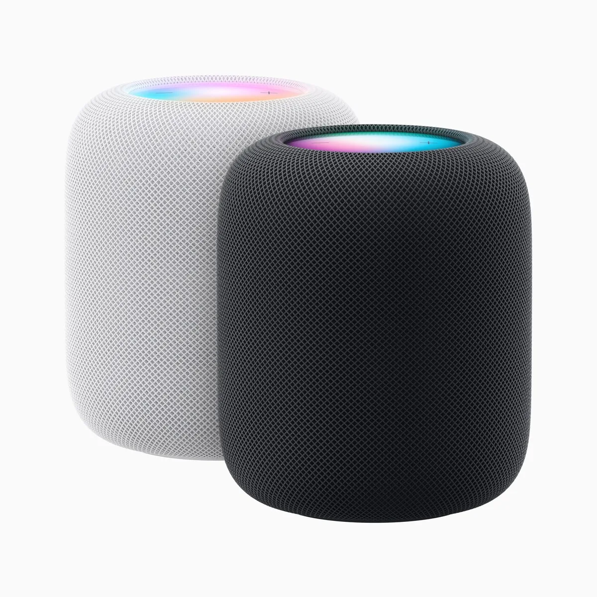

In 2017 introduceerde Apple zijn eerste slimme speaker, die hier in Nederland nooit in de winkels verscheen. Wij hadden hier alleen de kleinere mini-variant. Nu heeft Apple weer een nieuwe grote, die verdacht veel lijkt op de eerste. Maar deze wordt wél in ons landje aangeboden.

> [!NOTE]
> Deze recensie verscheen eerder op [AD](https://www.ad.nl/tech/apples-nieuwe-speakers-zijn-ook-perfect-als-homecinemaset~a3cadbea/).

De nieuwe HomePod is in de kern hetzelfde gebleven: een slimme luidspreker die je met stemassistent Siri kunt bedienen. Hij is met 349 euro duurder dan veel concurrenten, maar daar staat ook uitstekende geluidskwaliteit tegenover: hij klinkt wat ons betreft beter dan bijvoorbeeld de 230 euro kostende Sonos Ones, die je met Googles stemassistent kunt bedienen. Het geluid is ruimer en de bas wat dieper, zonder dat het vertroebeld raakt.

## Zoek de verschillen

Vergelijk je hem met de HomePod uit 2017, dan zijn de verschillen haast niet te zien. Aan de binnenkant zitten minder microfoons en luidsprekers, maar Siri luistert nog net zo goed terwijl muziek wat ons betreft nagenoeg hetzelfde klinkt. Op zich een mooi compliment voor Apple, dat met minder apparatuur pakweg hetzelfde weet neer te zetten. Oh, en de stroomkabel achterop kan nu worden losgekoppeld. Bij de eerste HomePod kon dat niet.

Vermoedelijk heeft Apple deze nieuwe HomePod uitgebracht als een soort productie-revisie. De oude was van de markt verdwenen, dus nu is er één die ongeveer hetzelfde kan maar efficiënter geproduceerd wordt. Het is een gekke situatie die vooral interessant is voor de meest fanatieke Apple-fan, die bijvoorbeeld de oude HomePod uit Duitsland had geïmporteerd. Voor de gemiddelde Nederlander is dit gewoon een nieuw product.

## Slimmer aan de binnenkant

Er zijn nog wel een paar kleinigheden aan de binnenkant die de HomePod van zijn voorganger onderscheiden. Zo zit er bijvoorbeeld een temperatuursensor in de luidspreker, zodat je Siri kunt vragen hoe warm het in een kamer is. Diezelfde sensor ziet ook hoeveel vocht er in de lucht zit. Omdat de sensoren ook te zien zijn in Apples woning-app, kun je die gebruiken om je slimme huis te automatiseren. Is een kamer te droog, dan kun je bijvoorbeeld een gekoppelde humidifier inschakelen. Je vindt diezelfde tech trouwens ook in de HomePod Mini's.

Daarnaast bevat het nieuwe apparaat ook de U1-chip die in de eerdere HomePod Mini zat, die wordt gebruikt om te zien hoe dichtbij je iPhone precies is. Je moet dan wel een telefoon met diezelfde chip hebben, dus een iPhone 11 of nieuwer. Houd je deze boven de HomePod terwijl je muziek afspeelt, dan wordt het nummer daarop verder gespeeld. Het is een fijne, simpele manier om je muziek te verplaatsen, zonder dat je meteen door allerlei menuutjes moet navigeren.

HomePod (2023). © Apple

## Ook fijn als tv-speakers (als je de juiste Apple TV hebt)

Wie een Apple TV heeft, kan de HomePods ook gebruiken om het geluid van je tv af te spelen. Al is dat eigenlijk pas echt handig als je er twee hebt: die kun je dan in stereomodus met elkaar koppelen en aan weerszijden van de tv plaatsen. Voor 700 euro is dat niet per se goedkoper dan een redelijke soundbar, al merkten we dat het basgeluid diep genoeg is om een subwoofer in een kleine kamer overbodig te maken. De HomePods ondersteunen Dolby Atmos, wat bij moderne films meteen merkbaar is.

Heb je een Apple TV uit 2021 of later, dan kun je ook een nieuwe doorschakelfunctie gebruiken om alle kanalen van je tv aan de speakers te koppelen. Zo wordt het geluid van je PlayStation 5-game of tv-kastje ook op die manier afgespeeld. Het is een setup die alleen werkt als je diep in Apples ecosysteem zit, maar die dan wel uitstekend werkt. Je kunt zelfs het volume van de tv dan aanpassen vanaf het beginscherm van je iPhone.

## Conclusie

De HomePods zijn fantastische speakers als je in Apples ecosysteem zit: ze zijn nauw verbonden met je iPhone, zodat je muziek en tv-geluid kunt bedienen zonder dat je steeds losse apps moet opstarten. En is je huis al met Apples Woning-app verbonden, dan kun je alles naadloos bedienen met behulp van Siri.

Ze klinken buitengewoon goed, maar daar betaal je ook de hoofdprijs voor: 350 euro voor een slimme speaker is veel geld, en dat bedrag verdubbelt als je een stereo-opstelling wil. Bij Sonos en Google betaal je dan een stuk minder, maar aan de andere kant: wie beter geluid wil, is gewend om soms duizenden euro’s daarvoor te betalen.
