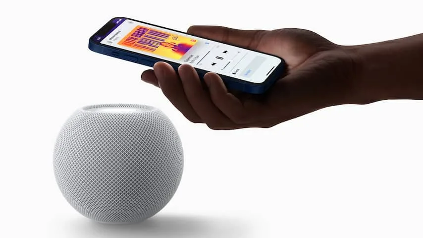
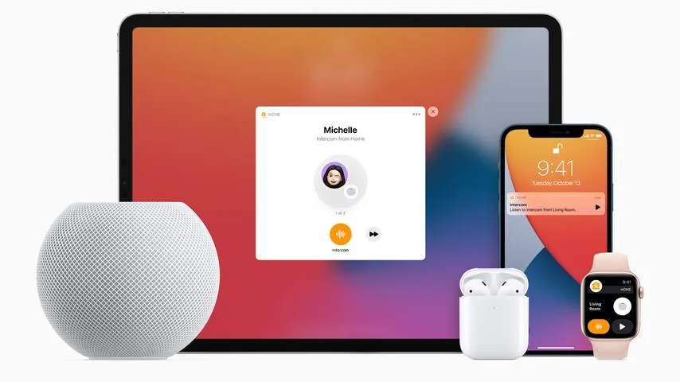

**De slimme luidsprekers van Apple bestaan al een tijd, maar zijn pas sinds kort in Nederland verkrijgbaar. Bij onze tests klonk de HomePod Mini een stuk beter dan zijn Google-concurrenten, maar Spotify-abonnees kunnen hem wellicht beter links laten liggen.**

> [!NOTE]
> Deze recensie verscheen eerder op [NU.nl](https://www.nu.nl/reviews/6191219/review-de-homepod-mini-klinkt-uitstekend-maar-werkt-matig-met-spotify.html).

De HomePod Mini is een klein bolletje met bovenop een aanraakpaneel, waarop je kunt tappen om muziek te pauzeren of het volume aan te passen. Je activeert de stemassistent met het commando "Hé Siri". Daarna kun je de HomePod vragen om bijvoorbeeld een slimme lamp aan te zetten, muziek te starten of het huidige weerbericht op te zoeken.

Leuk is ook de mogelijkheid je muziek vanaf een iPhone door te geven. Tap boven op de speaker en de track op je iPhone wordt hier automatisch op afgespeeld. Dat werkt ook andersom, zodat je bijvoorbeeld een afgespeeld audioboek op de HomePod weer naar je iPhone kunt sturen, om buiten de deur verder te luisteren.

De eerste HomePod stamt alweer uit 2017, terwijl de minivariant sinds 2020 wordt verkocht, maar al die tijd werd de Nederlandse markt vermeden. Stemassistent Siri lijkt de reden waarom Apple zijn HomePod Mini nu pas in Nederland verkoopt. Want hoewel Siri op je iPhone gewoon Nederlands spreekt, was dat op de slimme speakers lange tijd niet het geval.

De stemondersteuning werkt sinds de laatste update voor de speakers in elk geval prima in het Nederlands. We hebben het idee dat Siri onze commando's altijd goed begrijpt, ook als we de speaker vanaf een meter of tien halfschreeuwend toespreken.

_Review: De HomePod Mini klinkt uitstekend, maar werkt matig met Spotify — Beeld: Apple_

## Slimme speaker zonder Spotify

Qua basisfuncties lijkt Siri grotendeels gelijk aan de concurrent bij Google, op één belangrijk punt na: de slimme assistent op de HomePod kan geen muziek via Spotify afspelen. Wie rechtstreeks met stemcommando's muziek wil starten, is beperkt tot Apple Music of Deezer. Het is onduidelijk waarom Spotify de HomePod niet ondersteunt, aangezien de muziekdienst wel is geïntegreerd met Siri op de iPhone en iPad.

Dat betekent overigens niet dat je helemaal geen Spotify-muziek op de HomePod kunt draaien. Je kunt altijd nog je iPhone pakken, daar een track op starten en vervolgens via AirPlay het geluid naar de HomePod sturen. Maar dat is omslachtiger dan bediening via je stem, waar de speaker juist voor bedoeld is.

Het zal weinig uitmaken voor wie al een abonnement heeft op bijvoorbeeld Apple Music, maar we wonen in een land waar Spotify de marktleider is. Voor veel Spotify-gebruikers zal de HomePod niet heel nuttig zijn, tenzij ze van muziekabonnement willen wisselen. Ook onhandig: de speaker kan alleen worden ingesteld vanaf een Apple-apparaat, waardoor een fervent Android-gebruiker er eigenlijk niks aan heeft.

_Review: De HomePod Mini klinkt uitstekend, maar werkt matig met Spotify — Beeld: Apple_

## Best klinkende slimme speaker voor deze prijs

De problemen met Spotify zijn vervelend, want hierdoor zullen veel mensen een uitstekend klinkende speaker links laten liggen. De muziek klinkt ondanks het kleine formaat vol en luid, en en lijkt nooit vanaf één klein apparaat te komen. In plaats daarvan klinkt het alsof de audio van een grotere geluidsinstallatie komt.

Volgens Apple komt dat door een ingebouwde chip, die constant je muziek analyseert en de instellingen hierop aanpast. Het zorgt er in elk geval voor dat de goedkopere Nest Mini's van Google worden weggeblazen, en ook de Nest Audio klinkt wat ons betreft minder goed.

Daar staat uiteraard wel een hogere prijs tegenover. Apple verkoopt de HomePod Mini voor 110 euro, al kun je hem bij winkels vaak voor een tientje goedkoper vinden. De Nest Audio is met een prijs tussen de 60 en 85 euro een stuk goedkoper. De Sonos One klinkt wel wat voller en zuiverder, maar die kost dan weer twee keer zoveel als de HomePod.

## Conclusie

De HomePod Mini is een uitstekend klinkende slimme speaker, die met zijn stemassistent en tikbesturing op je smartphone handig te bedienen valt. Het grootste nadeel is echter het ontbreken van Spotify-ondersteuning. Dat maakt de HomePod vooral interessant als je naar Apple Music of Deezer wil overstappen, maar niet iedereen zal die stap zomaar maken.
