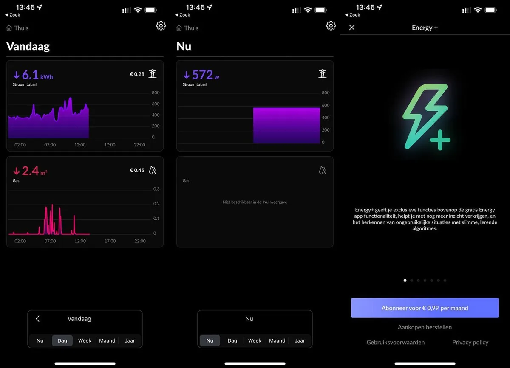

Met de stijgende prijzen kijken we steeds meer naar ons dagelijkse energieverbruik. Vaak kan dat via een app van je provider, maar met een speciaal apparaatje kun je het verstoken van stroom en gas ook tot in de kleinste details bekijken met een eigen app.

> [!NOTE]
> Deze recensie verscheen eerder op [AD](https://www.ad.nl/tech/deze-gadget-laat-zien-hoeveel-stroom-en-gas-je-op-dit-moment-verbruikt~a3565e53/).

In steeds meer Nederlandse huizen hangt een slimme meter. Die geeft automatisch door wat jij op een bepaald moment verbruikt, zodat je niet meer zelf de meterstanden hoeft door te bellen naar je energieleverancier.

Sommige stroom- en gasbedrijven geven je ook inzicht in die gegevens, zodat je zelf een beter beeld hebt van wanneer je nou veel verstookt. Handig, maar niet iedere leverancier is even open met die informatie. Je bent vaak beperkt tot hun eigen website of app, waar je alleen informatie ziet die op een specifieke manier getoond wordt.

## Slimme meter voor je slimme meter

Het Nederlandse HomeWizard heeft een apparaatje waarmee je een iets beter idee krijgt. Je prikt de Wi-Fi P1 Meter in een poort van je meterkast, waarna je de gadget via een bijbehorende app met je wifinetwerk verbindt. Vervolgens kun je in diezelfde app zien wat je op een specifiek moment verbruikt, of hoe zuinig je de afgelopen dagen, weken of maanden was.

De P1 Meter werkt op alle slimme meters die in Nederland worden verkocht. Die zijn uitgerust met een zogeheten P1-poort - een soort ouderwetse telefoonaansluiting rechtsboven op de kast. Staat op je meterkast de tekst ‘SMR 5', dan kun je de meter verbinden zonder dat hij een extra stroombron nodig heeft - de P1-poort voorziet hem van elektriciteit.

## Live of afgelopen periode

Met wifi verbinden gaat makkelijk en de app is best uitgebreid. In lijngrafieken zie je wat je hebt verbruikt, waarbij je kunt wisselen tussen een liveoverzicht en je verbruik de afgelopen dag, week, maand of jaar. Het overzicht toont alleen stroom, je vindt gas wel bij de overige grafieken.

Leuk is dat je jouw huidige stroom- en gastarief kan invullen, zodat je een liveoverzicht krijgt van wat je op een specifiek moment moet betalen. Daarnaast verkoopt de appmaker een abonnement voor 1 euro per maand, waardoor een zelflerend algoritme ongebruikelijke situaties bij je meldt. Zo slaat de app bijvoorbeeld alarm als de verwarming nog op 20 graden staat terwijl je al in bed ligt.

Je kunt live niet zien hoeveel gas je verbruikt. © HomeWizard

## Losse stekkers

HomeWizard verkoopt naast de P1 Meter ook stopcontacten die op vergelijkbare wijze je energieverbruik in kaart brengen. Dan kun je bijvoorbeeld zien wat alleen de wasmachine of droger gebruikt. Dat kan bij de P1 Meter namelijk niet: die ziet alleen alles dat door je meterkast gemeten wordt.

Maar waar de P1 Meter met zijn 30 euro een goedkope oplossing is, moet je bij die stopcontacten wat dieper in de buidel tasten. Eén exemplaar kost je rond de 30 euro. Wil je dus weten wat je vaatwasser, wasmachine en droger verbruiken, dan loopt de prijs op naar 90 euro.

Daardoor voelt de P1 Meter wat als een lokkertje. Het is leuk om je energieverbruik zo duidelijk te zien voor een paar tientjes, maar het smaakt naar meer. En voor je het weet geef je nog veel meer geld uit bij de fabrikant.

## Open voor andere apps

Het is wel mooi om te zien hoe HomeWizard zijn gegevens beschikbaar stelt voor andere apps. Je koppelt de apparaten bijvoorbeeld vrij makkelijk met smarthomeplatform Home Assistant, waardoor je stroomverbruik op allerlei manieren slim kan worden ingezet.

Het vergt wat technische kennis en gepuzzel, maar dan heb je ook wat. Home Assistant kan bijvoorbeeld waarschuwen als je wasmachine zijn stroompiek voorbij is, wat betekent dat je was waarschijnlijk af is. Vervolgens kan een slimme speaker of knipperende lamp je waarschuwen, zodat je de was op tijd in de droger doet.

## Conclusie

Het maakt de P1 Meter en zijn bijbehorende stopcontacten een geweldige gadget voor wie meer inzicht wil hebben in stroom- en gasverbruik. De informatie komt op uitgebreide wijze binnen in de app, en het bijbehorende abonnement is een leuke stok achter de deur voor chaoten die vergeten de verwarming of tv uit te zetten.

De getoonde informatie is soms wel al bij je energieleverancier verkrijgbaar, en als hun app dat goed genoeg voor je toont, is deze gadget wellicht wat overkill. We vermoeden dat hij in de praktijk daarom vooral leuk is voor smarthome-hobbyisten: die kunnen hun energieverbruik ineens aan de rest van hun huis koppelen.
