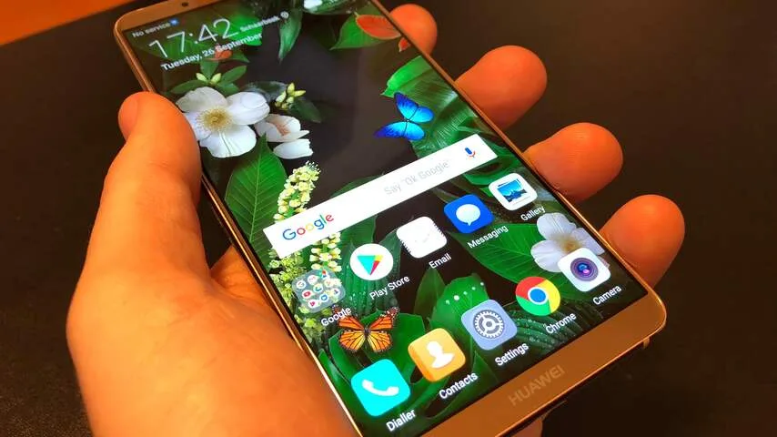
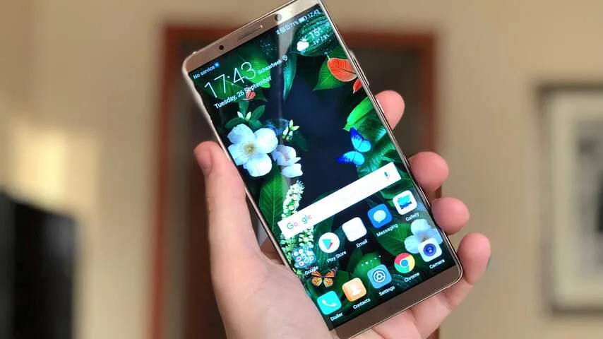
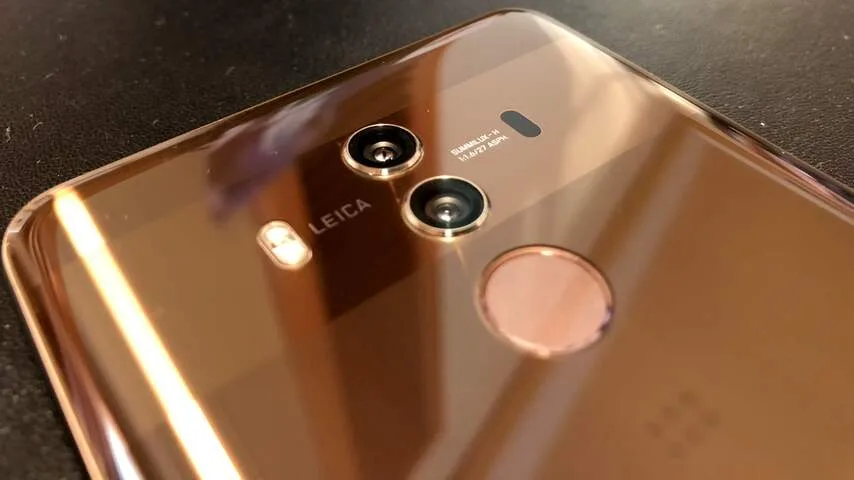
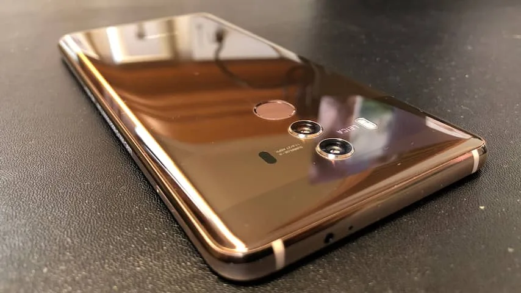
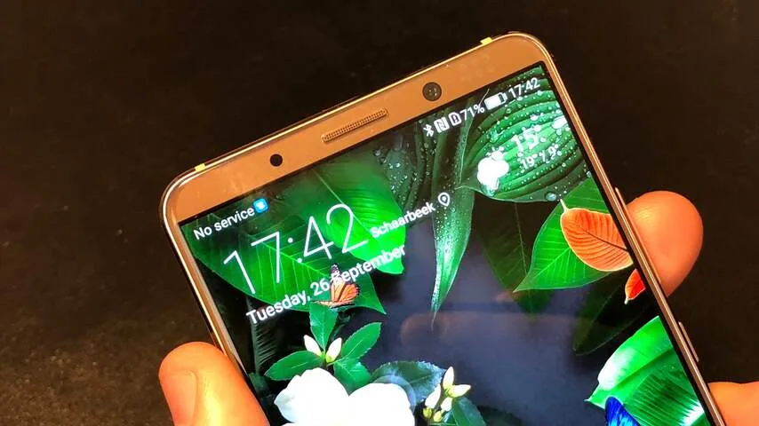

**De nieuwe Huawei Mate 10 Pro is een smartphone met een eigen processor voor kunstmatige intelligentie. Maar is de tijd daar wel rijp voor?**

> [!NOTE]
> Deze recensie verscheen eerder op [NU.nl](https://www.nu.nl/reviews/4966130/eerste-indruk-huawei-mate-10-pro-zet-vol-in-op-kunstmatige-intelligentie.html).

De buitenkant van de Huawei Mate 10 Pro is duidelijk geïnspireerd door concurrenten. De significant dunnere schermranden hebben ervoor gezorgd dat er geen plek meer is voor een fysieke thuisknop. Daar staat tegenover dat er ruimte is voor een 6 inch-scherm, zonder dat de telefoon buitensporig groot aanvoelt.

Het toestel ligt prima in de hand, maar voelt wel erg bekend aan. De achterkant van glas doet sterk denken aan de behuizingen van bijvoorbeeld de Galaxy S8 en HTC U11. De behuizing van de Mate 10 raakt net als deze telefoons ook vrij snel bevlekt en is wat glad. Huawei belooft dat het AMOLED-scherm diepe kleurwaarden presenteert, en tijdens een eerste blik op het toestel valt hier ook weinig op aan te merken.

## Neural processing unit

De ingebouwde neural processing unit (NPU) moet de Mate 10 voornamelijk onderscheiden. Deze losse subprocessor wordt gebruikt voor kunstmatige intelligentie, om bijvoorbeeld beelden te herkennen die met de camera worden gefilmd. De chip leert naarmate hij meer handelingen uitvoert, waardoor een telefoon in feite slimmer. Huawei belooft dat augmented reality-apps hierdoor veel zuiniger zijn.

Bij onze tests was er slechts een beperkt aantal apps dat gebruikmaakte van de NPU, waaronder de camera-app. Deze kijkt of er een mens of bepaald object in beeld staat, zodat de juiste foto-instellingen automatisch geselecteerd worden. Over het algemeen werkt dat zoals gewenst. De telefoon heeft slechts een fractie van een seconde nodig om het onderwerp te identificeren, waarbij slechts een enkele keer de verkeerde conclusie werd getrokken.

Een losse app voor blinden zegt welke objecten in het camerabeeld te zien zijn, maar dat werkte bij onze tests helaas minder goed. Vlakke muren werden geïdentificeerd als liftdeuren, wat in een echte situatie met een blind persoon vermoedelijk vooral voor problemen zorgt.

[Bekijk ingesloten media](https://content.jwplatform.com/players/wGfVwWNW-whqXCOFb.html)

Vermoedelijk is de herkenningssoftware van Huawei nog niet geavanceerd genoeg om veel specifieke objecten te identificeren. De fotofunctie werkt vermoedelijk beter omdat deze enkel hoeft enkel te zien of het gaat om een plant, terwijl de app voor blinden ook direct de plantensoort probeert te identificeren.

De NPU-chip moet ervoor zorgen dat beeldherkenning significant minder stroom verbruikt dan met andere systemen, omdat er niet telkens een verbinding met een externe server gemaakt hoeft te worden. Juist deze belofte is bij onze eerste test echter niet te verifiëren, omdat we de telefoon slechts korte tijd in handen hadden.

De grote accu moet juist wel een flink voordeel zijn aan de Mate 10. Met maar liefst 4.000mAh is de capaciteit significant hoger dan bij toestellen als de Galaxy S8, waardoor de telefoon het in theorie langer op een dag volhoudt. Of dat inderdaad zo is, zal ook nog uit een uitgebreidere test moeten blijken.

## Vroeg

De neurale subprocessor voelt vooral nog als een investering in de toekomst. Geen van de gedemonstreerde NPU-apps voelt direct als een reden om de Mate 10 Pro te kopen. Het zijn op dit moment vooral kleine gimmicks, die met verloop van tijd wellicht hoogwaardige toevoegingen kunnen worden.

Op een dag worden smartphones misschien wel veel afhankelijker van kunstmatige intelligentie, en wordt zo’n chip essentieel. Dat moment is echter nog niet hier.

Het is de vraag hoe snel dat moment komt. Onlangs toonde Google zijn nieuwe app Lens, die op de Pixel 2-smartphone zeer specifieke objecten zoals bijvoorbeeld een bepaald boek kan herkennen. Daarvoor is echter vooralsnog een directe verbinding met de servers van Google vereist.

De NPU leek bij onze tests nog niet in staat te zijn om dit soort complexe conclusies te trekken. De chip leert naarmate je de telefoon vaker gebruikt, maar alleen op basis van je eigen foto’s en acties. Google Lens baseert zich op miljarden beelden in de databanken van het zoekbedrijf.

_Huawei Mate 10 Pro — Beeld: NU.nl/Bastiaan Vroegop_

_Huawei Mate 10 Pro — Beeld: NU.nl/Bastiaan Vroegop_

_Huawei Mate 10 Pro — Beeld: NU.nl/Bastiaan Vroegop_

_Huawei Mate 10 Pro — Beeld: NU.nl/Bastiaan Vroegop_

_Huawei Mate 10 Pro — Beeld: NU.nl/Bastiaan Vroegop_

## Snel genoeg

De ‘gewone’ processor in de nieuwe Kirin 970-chip voert algemene processen uit op de telefoon, maar het is lastig om deze op waarde te schatten. Binnen de prijsklasse van de Mate 10 Pro zijn telefoons namelijk zelden langzaam. Heb je de Mate 9 van afgelopen jaar, dan is de kans klein dat je nu al last hebt van significante vertragingen. Bij de Mate 10 waren hoe dan ook geen snelheidsproblemen te bespeuren. Apps starten snel op en draaien zonder problemen. Een benchmarktest uitvoeren tijdens de korte hands-on-periode was helaas niet mogelijk.

Huawei introduceert op de Mate 10 Pro de nieuwe versie van zijn eigen Android-aanpassing EMUI. Daarin zijn weinig grote nieuwe functies te bespeuren, maar is het ontwerp wel iets gelikter. EMUI lijkt dit jaar weer iets minder op een kloon van Apples iOS. Naarmate Huawei zijn Android-variant doorontwikkelt, begint het bedrijf steeds meer een eigen ontwerpstijl en identiteit te ontwikkelen.

Onderaan het toestel staat een virtuele thuisknop, maar het is ook mogelijk om een digitaal pookje ergens op het scherm te tonen. Door deze naar links of rechts te bewegen, is het mogelijk om bijvoorbeeld het multitaskvenster te openen of een scherm terug te gaan. Ook kan het notificatiescherm zo worden geopend, waardoor je niet vanaf de bovenkant van het scherm omlaag hoeft te vegen. Dat is op papier een leuk idee, maar het voelt in de praktijk niet heel intuïtief.

## Camera

Op de telefoon zit een 12 megapixel- en 20 megapixel-camera, waarbij één lens een object van dichtbij kan tonen. Bij onze tests produceerde deze camera prima foto’s, waarbij het resultaat slechts bij slechte lichtomstandigheden indrukwekkend was. Beelden geschoten in een donkere ruimte hadden relatief weinig ruis, wat doet vermoeden dat de telefoon net als de Mate 9 een hoogwaardige sensor bevat.

Veel basisfuncties van eerdere Huawei-telefoons zijn nog aanwezig. Een pro-modus laat gebruikers bijvoorbeeld nog steeds aanpassingen zoals sluitertijd en diafragma wijzigen, terwijl een portretmodus de achtergrond onscherp maakt. Het zijn kleine details, die de camera fijn maken om te gebruiken.

## Voorlopige conclusie

Met een prijs van 799 euro is de Mate 10 een premiumtelefoon, die qua prijs niet heel veel afwijkt van vergelijkbare concurrenten. Daar staat tegenover dat de Mate 10 Pro een veelbelovend toestel is, dat zich wellicht zal meten met de populaire alternatieven.
