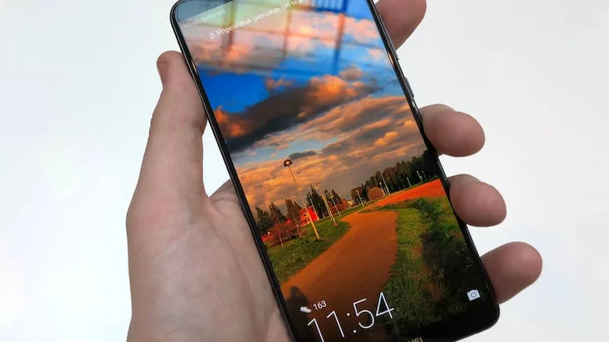
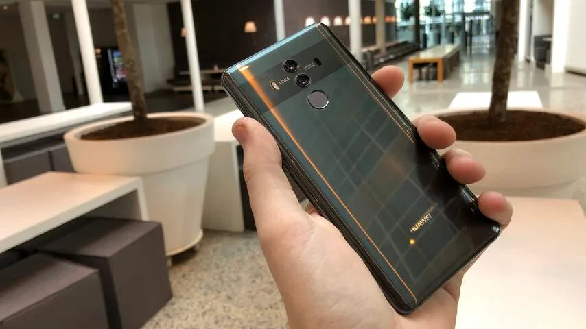
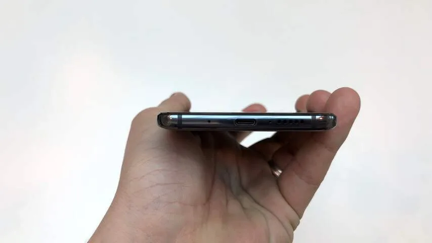
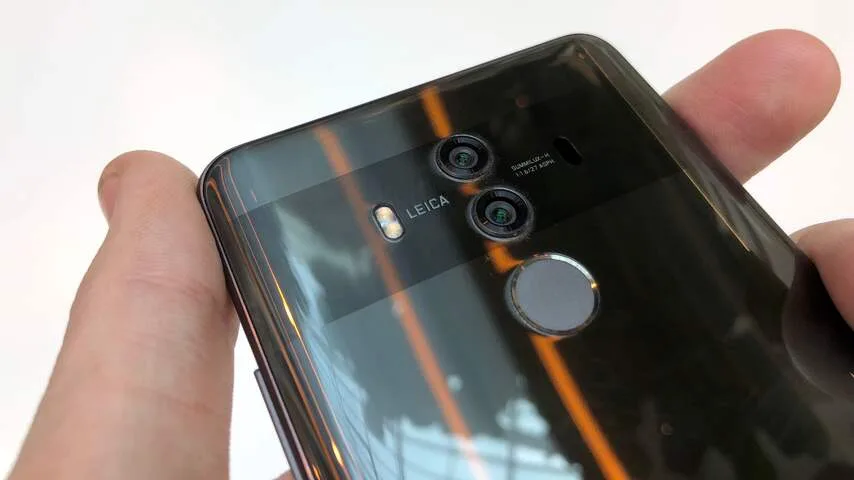
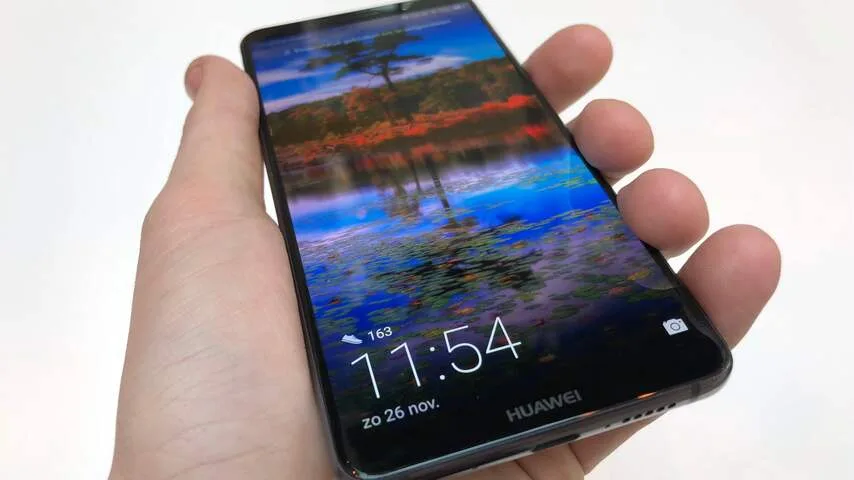

**De Huawei Mate 10 Pro doet verdacht veel denken aan de Galaxy S8 en Note 8 van Samsung, maar heeft daarnaast een verrassend goede accu.**

> [!NOTE]
> Deze recensie verscheen eerder op [NU.nl](https://www.nu.nl/reviews/5023331/review-huawei-mate-10-pro-heeft-vooral-een-lange-accuduur.html).

Het is inmiddels wel duidelijk dat 2017 het jaar van de 'randloze' smartphones is. Samsung, LG, Apple en veel andere telefoonmakers introduceerden allemaal een toestel met zeer dunne schermranden. De Huawei Mate 10 Pro volgt dit voorbeeld.

Ook de achterkant van de Mate 10 Pro doet verdacht veel denken aan zijn concurrenten. Huawei heeft net als bijvoorbeeld Samsung gekozen voor een glazen behuizing, die net als andere telefoons dit jaar wat glad aanvoelt en snel bevlekt raakt. Wel ligt het toestel fijn in de hand en voelt hij hoogwaardig aan.

Die trend zet voort op vrij veel vlakken. De nieuwe Kirin 970-processor doet het in benchmarks ongeveer even goed als de Snapdragon-chip gebruikt in de premiumtelefoons van Android-fabrikanten dit jaar. Het grote 6 inch-scherm voelt door de dunne randen alsnog handzaam aan, net als bij concurrenten.

Het scherm heeft een mooi kleurbereik, met een resolutie van 2.160 bij 1.080. Daarmee heeft de telefoon niet de hoogste pixeldichtheid in zijn klasse, maar het verschil met de concurrentie is klein.

## Kunstmatige intelligentie

De Mate 10 Pro heeft een speciale co-processor voor kunstmatige intelligentie. De telefoon kan volgens Huawei sneller objecten in foto’s herkennen en verbanden leggen dan een gewone smartphone.

In de praktijk zijn er maar weinig apps die van deze losse processorchip gebruikmaken. Volgens Huawei benut de vertaalapp van Microsoft de nieuwe hardware, maar een groot verschil in vertaalsnelheid was bij onze tests niet merkbaar.

De camera-app weet er wel op leuke wijze gebruik van te maken, door met beeldherkenning voorwerpen te identificeren en de instellingen aan te passen. Ziet de camera dat er een persoon wordt vastgelegd, dan wordt hier een filter over geplaatst om rimpels en puistjes te verbergen. Foto’s zien er hierdoor soms wat onnatuurlijk uit, maar het effect kan met een schuifbalk worden verminderd.

Kunstmatige intelligentie is echter niet de definiërende functionaliteit die Huawei belooft dat het is. Wellicht dat ontwikkelaars in de toekomst apps zullen ontwikkelen voor de chip, maar op het moment is dit nog niet het geval. En er is geen concreet betwijs dat dit snel zal veranderen.

_Huawei Mate 10 Pro — Beeld: NU.nl/Bastiaan Vroegop_

_Huawei Mate 10 Pro — Beeld: NU.nl/Bastiaan Vroegop_

_Huawei Mate 10 Pro — Beeld: NU.nl/Bastiaan Vroegop_

_Huawei Mate 10 Pro — Beeld: NU.nl/Bastiaan Vroegop_

_Huawei Mate 10 Pro — Beeld: NU.nl/Bastiaan Vroegop_

## Camera

De dubbele cameralens achterop de telefoon functioneert net als op voorgaande Huawei-telefoons prima. Foto’s zien er in de meeste situaties goed uit, zelfs bij lage lichtomstandigheden. Daarnaast kun je net als bij eerdere toestellen ook een speciale Pro-modus activeren om zaken zoals sluitertijd en diafragma aan te passen.

De camera’s gebruiken sensoren van respectievelijk 12 megapixels en 20 megapixels. Door over te schakelen naar een zoomlens, kan een voorwerp van dichterbij worden bekeken zonder dat er sprake is van kwaliteitsverlies. Tenminste, als je het hebt over de resolutie. De zoomlens lijkt minder goed licht door te laten, waardoor foto’s hiermee genomen iets meer ruis bevatten.

## Lange gebruiksduur

De ingebouwde accu van maar liefst 4.000mAh is misschien wel het voornaamste pluspunt van de Mate 10 Pro. Deze bovengemiddeld grote batterij zorgt ervoor dat je de telefoon langer kunt gebruiken dan je misschien gewend bent.

Bij gewoon gebruik had de Huawei-telefoon aan het einde van de dag meestal nog zo’n 40 procent van zijn lading over. Werd de telefoon iets minder gebruikt, dan hield hij het soms zelfs twee dagen achter elkaar vol.

In de praktijk is het alsnog verstandig om hem iedere avond aan een stopcontact te hangen, maar de grotere accu biedt enige gemoedsrust. De kans dat hij bij intensief gebruik te snel leeg raakt, is namelijk vrij klein.

## Conclusie

Met een prijskaartje van 799 euro is de Mate 10 Pro best duur voor een Huawei-smartphone. Het bedrijf prees zichzelf altijd voor toestellen die net iets goedkoper waren dan de grote vlaggenschepen van dit moment. Met deze prijs zit de Mate 10 Pro eigenlijk een klein beetje tussen de Galaxy S8 en Note 8 van Samsung in.

De Mate 10 lijkt met zijn ontwerp en processorkracht ook best veel op deze Samsung-telefoons, en de prestaties zijn ook vergelijkbaar. De processor voor kunstmatige intelligentie doet vrij weinig om het toestel te onderscheiden, maar de langere batterijduur is wel prijzenswaardig. Dat is misschien wel de beste reden om dit toestel te overwegen.
