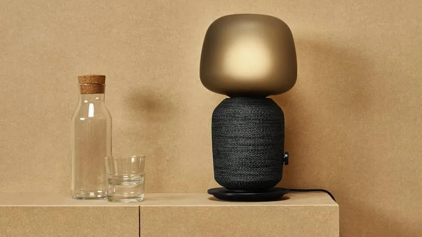
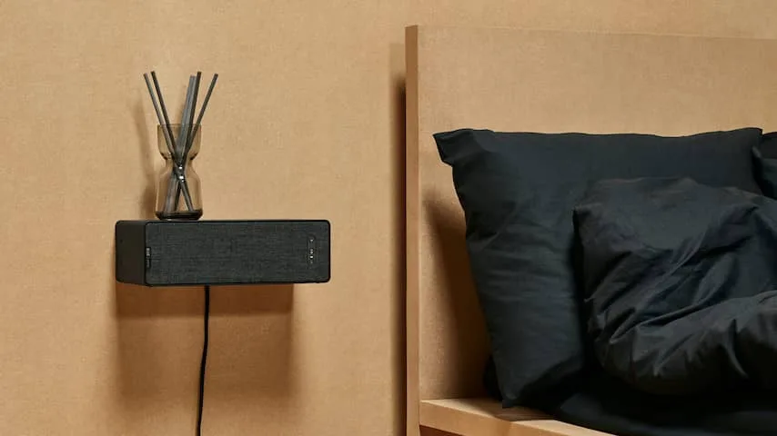

**Woonwinkelgigant IKEA heeft samen met Sonos een reeks eigen in een boekenplank en bureaulamp verstopte speakers gemaakt. Daarmee heeft Sonos een betaalbare variant van zijn slimme speakers, maar dan wel zonder een virtuele assistent.**

> [!NOTE]
> Deze recensie verscheen eerder op [NU.nl](https://www.nu.nl/reviews/5970168/review-symfonisk-meubelspeakers-van-ikea-zijn-betaalbaar-en-veelzijdig.html).

De nieuwe Symfonisk-speakers werken niet zoals je wellicht zou verwachten. Een smartphone kan niet gekoppeld worden met behulp van een geluidskabel of bluetooth, maar moet worden verbonden met behulp van wifi.

Dat kan op verschillende manieren. Zo is er de Sonos-app, waarmee je bij muziekdiensten inlogt en de speakers bedient met een pc of smartphone, maar kun je ook gebruikmaken van bijvoorbeeld de Cast-functie van Google en AirPlay van Apple om een smartphone rechtstreeks te verbinden en muziek af te spelen.

## Geen bluetooth of geluidskabel

Wil je de luidsprekers aansluiten op bijvoorbeeld een versterker of een televisie, dan moet je diep in de buidel tasten. In veel gevallen moet je dan namelijk een Sonos Amp aansluiten, waarmee je analoge aansluitingen met het Sonos-systeem op je wifinetwerk verbindt. Zo'n Amp kost op het moment van schrijven 700 euro. De speakers zijn met een tv te verbinden via een soundbar van Sonos die voor 400 euro verkocht wordt.

Ben je bereid om ze alleen vanaf een pc of smartphone te bedienen, dan bieden de Symfonisk-luidsprekers wel een hoop. In de bijbehorende app kun je iedere gangbare muziekdienst koppelen, waaronder Spotify en Apple Music. Zelfs meerdere podcastapps kunnen worden verbonden, zodat je op de IKEA-speakers rechtstreeks naar afleveringen kunt luisteren. De ondersteuning voor AirPlay en Google Cast zorgt ervoor dat er ook nauwelijks apps zijn waarvan je geluid niet kunt afspelen.

_Symfonisk — Beeld: Ikea_

## Boekenplanken aan je surroundset

Omdat de speakers met de Sonos-app verbinden, kun je ze ook combineren met bestaande Sonos-apparaten in huis. Een bestaande soundbar en subwoofer kunnen bijvoorbeeld met twee boekenplankspeakers worden gekoppeld om een 5.1-surroundset voor bij je televisie te creëren. Omdat deze boekenplankluidspreker minder kost dan bestaande Sonos-speakers, is het een goedkope manier om je bestaande geluidssysteem uit te breiden.

De geluidskwaliteit van beide speakers is prima in orde. Bij gemiddelde volumes klinkt muziek vol en gebalanceerd. Pas bij hogere volumeniveaus beginnen ze ietwat hol te klinken. Je kunt meerdere speakers aan elkaar koppelen om muziek verspreid over de hele kamer af te spelen, zodat je niet afhankelijk bent van een hoog volume om de andere kant van een ruimte te bereiken.

Voor op de luidsprekers zitten drie knoppen. Met de middelste knop kan muziek worden gepauzeerd of afgespeeld, terwijl de toetsen aan weerszijden het volume verhogen of verlagen. Een lampje laat zien of de speaker goed met het netwerk is verbonden.

Beide speakers klinken ongeveer vergelijkbaar met de Sonos One, maar verschillen op één belangrijk punt: er zit bovenop geen microfoon om een virtuele assistent mee te bedienen. Je kunt dus niet met een stemcommando een afspeellijst opzetten of slimme verlichting bedienen. Het is zelfs niet mogelijk om de Symfonisk-luidsprekers aan de Google Home-app te koppelen om hier via een andere speaker met een stemassistent muziek op af te spelen, iets dat met de Sonos Play:1 wel kan.

_Symfonisk — Beeld: Ikea_

## Niet te dimmen

De boekenplankspeaker wordt voor 100 euro verkocht en is in feite een platte, wat brede gadget. Je kunt hem aan de muur monteren zodat je er iets bovenop kunt zetten. Het montagesysteem hiervoor wordt echter los verkocht, waardoor de totaalprijs iets hoger kan uitkomen.

De lampvariant kost 180 euro en is vrij groot. Op een klein bureau neemt hij een significant deel van het tafelblad in beslag. Het is geen lamp die je via een app kunt bedienen, maar het is wel mogelijk om een slimme lamp in de fitting te draaien, zodat je hem op een smarthomeplatform kunt aansluiten. De draaiknop doet vermoeden dat je hem kunt dimmen, maar dat is niet het geval: hij kan alleen aan of uit.

## Conclusie

Sonos heeft betere en veelzijdigere luidsprekers uitgebracht dan de Symfonisk-modellen die bij de IKEA komen te liggen. Daar staat tegenover dat het bedrijf nog nooit eerder zulke goedkope apparaten, die ondanks hun prijskaartje nog vrij goed klinken, heeft uitgebracht. Dat maakt dit ideale speakers om eens mee in het Sonos-ecosysteem te duiken, of om je geluidssysteem uit te breiden zonder buitensporig veel geld te besteden.

_4 sterren — Beeld: NU.nl_
