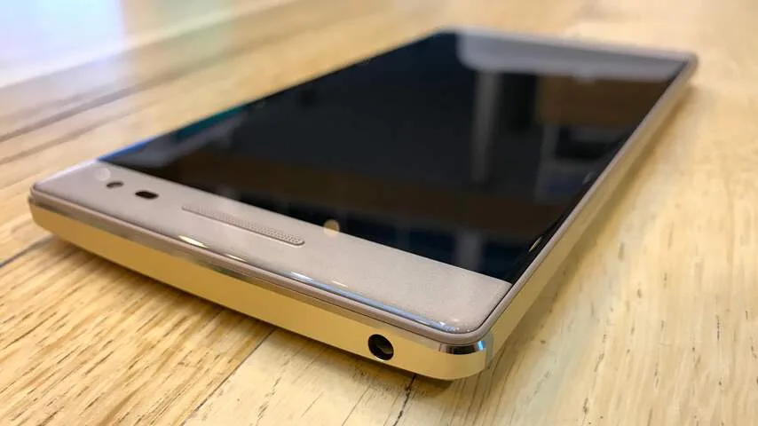
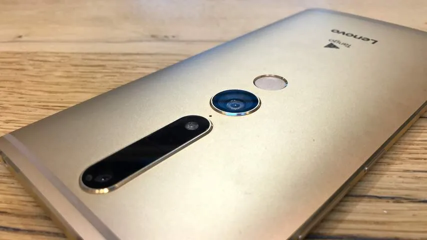
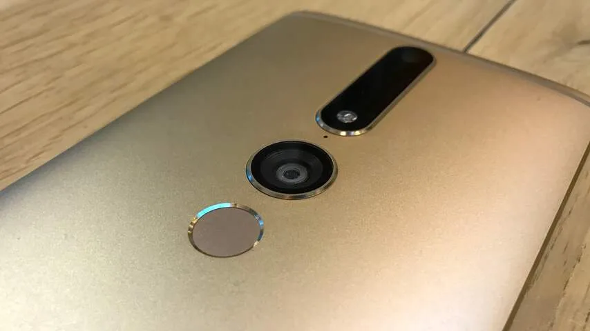
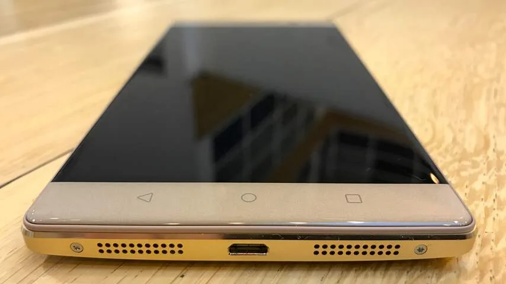

**Afgelopen jaar presenteerde Google zijn augmentedrealityplatform Tango, waarmee een smartphone digitale objecten in de echte wereld kan zien. De Lenovo Phab 2 Pro is de eerste smartphone die daar gebruik van maakt. Leuk, maar hoe nuttig is zo’n AR-telefoon?**

> [!NOTE]
> Deze recensie verscheen eerder op [NU.nl](https://www.nu.nl/reviews/4452780/review-tango-telefoon-lenovo-toont-beperkingen-van-augmented-reality.html).

Augmented reality op smartphones kan er bijvoorbeeld voor zorgen dat een 3D-model in het camerabeeld van de echte wereld wordt getoond. Hierdoor kan een navigatie-app bijvoorbeeld pijlen op de weg tonen, of zet een webwinkel meubels alvast virtueel in de woonkamer.

Achterop de Phab 2 Pro zitten drie camera’s, die samen ook diepte-informatie verzamelen om een digitale 3D-wereld op te bouwen. Bijbehorende apps kunnen vervolgens virtuele objecten in het camerabeeld plaatsen.

Omdat de camera diepte kan waarnemen, beweegt dit beeld op realistische wijze mee als de smartphone bijvoorbeeld van links naar rechts wordt bewogen. Het zorgt ervoor dat de camera een virtueel object van alle kanten kan laten zien, simpelweg door er omheen te lopen in de echte wereld.

De technologie achter Tango werkt als verwacht: objecten bewegen op realistische wijze mee met de omgeving, waardoor het idee ontstaat dat de virtuele wereld aanwezig is in de 'echte' wereld. Beweeg de camera naar een augmentedrealityvoorwerp toe, en deze zal ook echt dichterbij komen.

Bij snelle camerabewegingen zijn er wat lichte haperingen te zien, maar objecten blijven grotendeels op de juiste locatie staan. Zo wisten we bijvoorbeeld een AR-hologram van Donald Trump in een kamer te zetten, die er op foto's uitzag alsof hij 'echt' aanwezig was. Het is pas duidelijk dat het gaat om een virtueel persoon als hij van dichtbij wordt bekeken, omdat de resolutie van de digitale Trump beperkt is.

[Bekijk ingesloten media](https://content.jwplatform.com/players/Vx0a9OQM-whqXCOFb.html)

## Gimmicks

Hoewel de technologie achter Tango goed in elkaar zit, lijken de praktische toepassingen hiervoor op het moment nog minimaal te zijn. De Tango-app verwijst naar een reeks AR-apps die op de Phab 2 Pro geïnstalleerd kunnen worden, maar het gaat daarbij vooral om software met simpele trucs.

De meeste apps die we installeerden doen hetzelfde: ze projecteren een virtueel object in de ruimte. Dat kan een hologram zijn van van Donald Trump, maar ook een dinosaurus of een schattige kat.

Hoewel het grappig is om virtuele wezens in een ruimte te zetten, heb je daar in de praktijk niet veel aan. Na het maken van een paar foto’s verliezen deze apps hun nut, waardoor de Tango-functionaliteit minder interessant wordt. Functies met veel meewaarde, zoals de theoeretische navigatie-app die bovenin deze review werd benoemd, lijken nog grotendeels afwezig in de Play Store.

Een paar spellen maken het mogelijk om met AR de echte ruimte te gebruiken, maar geen van deze games bieden enige diepgang. Na het kapotschieten van een paar aliens in een woonkamer verdwijnt de lol hiervan zelf.

De enige echt nuttige app die we tegenkwamen was een meetlint, waarmee de camera gebruikt kan worden om bijvoorbeeld de hoeken van een kamer te meten. Achterliggende software berekent hoe groot de afstand tussen gemarkeerde hoeken in de echte wereld is. De app vertrouwt echter niet heel erg in dit systeem en zegt dat het enkel gaat om 'schattingen'. Ook apps op smartphones zonder Tango kunnen al zulke schattingen geven.

_Lenovo Phab 2 Pro — Beeld: NU.nl/Bastiaan Vroegop_

_Lenovo Phab 2 Pro — Beeld: NU.nl/Bastiaan Vroegop_

_Lenovo Phab 2 Pro — Beeld: NU.nl/Bastiaan Vroegop_

_Lenovo Phab 2 Pro — Beeld: NU.nl/Bastiaan Vroegop_

## Onhandige smartphone

Als gewone smartphone is de Phab 2 Pro een wat lomp toestel. Met 6,4 inch is het scherm zeer groot, met aan de boven- en onderkant behoorlijke randen die het geheel (te) fors doen aanvoelen. De telefoon weegt 259 gram, waardoor hij ook zwaar in de hand ligt. De resolutie van 1440 bij 2560 pixels is wel indrukwekkend. Deze biedt een pixeldichtheid van 459 pixels per inch.

De vingerafdrukscanner achterop is wat onhandig geplaatst. Als de duim op de zijkant van het toestel op de volumeknoppen ligt, bevindt de scanner zich net wat te laag om met een andere vinger aan te raken. Het betekent dat de telefoon steeds net wat anders moet worden vastgegrepen als hij moet worden ontgrendeld. Bij zo’n grote telefoon is dat vervelend. Het geeft al snel het idee dat de telefoon per ongeluk op de grond kan vallen.

De ingebouwde Snapdragon 652-processor biedt prima prestaties, al is de chip minder efficiënt dan populairdere Snapdragon 820-chip in andere toestellen.

De 16 megapixel-camera is misschien wel het enige voordeel naast de vroege Tango-ondersteuning. Deze maakt foto's van een indrukwekkend hoge resolutie. De frontcamera voor selfies heeft een sensor van 8 megapixels.

## Conclusie

De technologie achter Tango is interessant en het is prijzenswaardig dat Lenovo daar met zijn telefoon al vroeg gebruik van maakt. Het is echter lastig om een echt nuttige toepassing voor augmented reality in de telefoon te vinden. Tango voelt op het moment nog als een gimmick – en helaas biedt de Phab 2 Pro als smartphone verder weinig meerwaarde. Het lijkt simpelweg nog te vroeg om een Tango-telefoon aan te schaffen.
