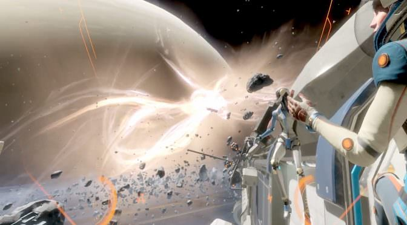
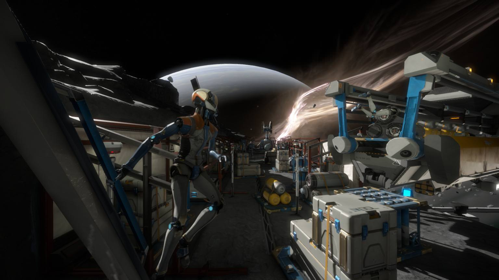
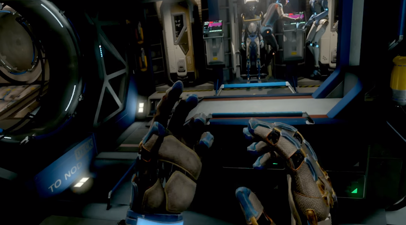

**Nieuwe standaard voor VR.**

De nieuwe ruimtegame Lone Echo is een mijlpaal. Dit is misschien wel de beste virtualrealitygame van dit moment, die ook echt alléén speelbaar is in dit medium.

> [!NOTE]
>
> Deze review verscheen eerder op [Insidegamer](https://inside.gamer.nl/129044-lone-echo-review-nieuwe-standaard-voor-vr/).

Wellicht klinkt het je bekend in de oren. In Lone Echo zweef je door een veraf gelegen ruimtestation, dat ineens door mysterieuze problemen wordt getroffen. Waarom zijn grote delen van de basis ineens onbruikbaar? En wat is toch die rare anomalie die vlakbij Saturnus hangt?

Verlaten ruimtestations zijn een beetje gemeengoed geworden in games. Je hebt het nagenoeg lege station uit ADR1FT, de door een AI bestuurde basis uit Tacoma en uiteraard de met monsters gevulde locaties uit Alien: Isolation en Dead Space. Logisch ook, want locaties als deze weten de meest prikkelende elementen uit ruimtegames te combineren. Ze geven een voorproefje van wat de mensheid ooit kan bereiken in een angstaanjagend en beklemmend vacuüm.

## Ik, robot

Niet dat het vacuüm van de ruimte in Lone Echo een erg grote bedreiging vormt. Je speelt in de game een kunstmatige intelligentie die van robot naar robot kan springen, waardoor je nooit zorgen hebt over bijvoorbeeld een zuurstoftekort. Je bestaan als machine weet in het verhaal bijzondere vormen aan te nemen. Naast jou is er namelijk ook een menselijke astronaut, die een bijzonder goede band met de binaire hoofdpersoon lijkt te hebben.

Lone Echo is op dit moment alleen te spelen met een Oculus Rift en de bijbehorende Touch-controllers. Daar is een reden voor: deze gamepads houden je hand- en armbewegingen bij, die rechtstreeks naar de game worden doorgezet. Je armen zijn meteen ook je voornaamste manier om voort te bewegen. Grijp een virtuele stang aan de muur vast en trek je voorwaarts, en je zult in de game vooruit zweven. Met twee stuwmotors aan je armen kun je vervolgens wat bijsturen.

De bedieningsmethode van Lone Echo is briljant. De game biedt een manier om je voort te bewegen zonder dat je in de echte wereld een stap vooruit zet, die tegelijkertijd hartstikke logisch is binnen het universum van de game. Nog bijzonderder: in de uren die wij in Lone Echo hebben gestoken, zijn we geen enkele keer misselijk geworden. Wellicht dat menselijke hersenen de zweefbewegingen goed weten te plaatsen, waardoor deze bijzondere bewegingsmethode natuurlijk aanvoelt.

We zouden voor het spelen van Lone Echo wel adviseren om een derde sensor voor de Oculus Rift te kopen. Door deze achterin de kamer te plaatsen, kan de vr-bril al je bewegingen namelijk in een boog van 360 graden bijhouden. Heb je die sensor niet, dan moet je af en toe met de rechter analoge stick de camera bijstellen.

## Meer dan een walking simulator

Het was zo makkelijk geweest om van Lone Echo een ‘walking simulator’ te maken. Alleen rondzweven in de game terwijl je het verhaal beleeft voelt immers al magisch aan. De game heeft echter meer diepgang dan dat, in de vorm van een scanner en laser op je armen. Deze gebruik je om de wereld om je heen te beïnvloeden, waarbij je simpele puzzels in de omgeving oplost. Zo moet je bijvoorbeeld op een bepaald punt een batterij vastgrijpen, een paneel wegsnijden, die batterij in de opening plaatsen en met de scanner de computer activeren.

De puzzels en uitdagingen in Lone Echo worden nooit héél spannend. Ze dienen vooral ter ondersteuning van het verhaal, dat een aantal geweldige twists maakt voordat je door de acht uur durende campagne heen bent. De simpele interacties met het ruimtestation geven je vooral het idee dat je deel uitmaakt van de wereld en deze niet alleen gadeslaat. Iets dat we in veel ‘walking simulators’ missen.

De manier waarop je voortbeweegt is niet te evenaren met een gamepad. Dat maakt Lone Echo een schoolvoorbeeld van een hoogwaardige vr-game – misschien wel de beste in zijn soort van het moment. Dat maakt het ook zo jammer dat de game technisch niet helemaal in orde is.

## Slecht geoptimaliseerd

De optimale systeemvereisten van Lone Echo liggen bijzonder hoog. Heb je een pc gekocht die precies aan de eerste eisen van de Rift voldeed, dan zul je flink in de buidel moeten tasten om nu een krachtiger systeem te bouwen. Terugschakelen naar een lagere instelling voor de game is vaak geen optie, omdat dit weinig verandert aan hoe zwaar het spel draait.

We zouden de hoge systeemeisen kunnen accepteren als Lone Echo er buitensporig goed uitzag, maar grafisch wijkt het spel niet héél veel af van titels zoals Robo Recall. Gameplaytechnisch is Lone Echo een baanbrekende titel, maar technisch behoort hij tot de middenmoot. Dit is niet de Crysis van vr-games, maar vereist wel een pc om aan deze metaforische standaard te voldoen. Het wijst er op dat de game slecht is geoptimaliseerd, wat de ontwikkelaar indirect ook lijkt te bevestigen. Er wordt gewerkt aan een update om dit op te lossen.

[Bekijk ingesloten media](https://www.youtube.com/embed/2pmV2mwAV9k)
