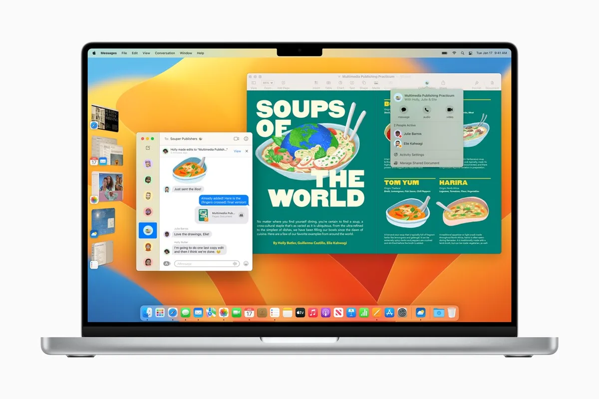
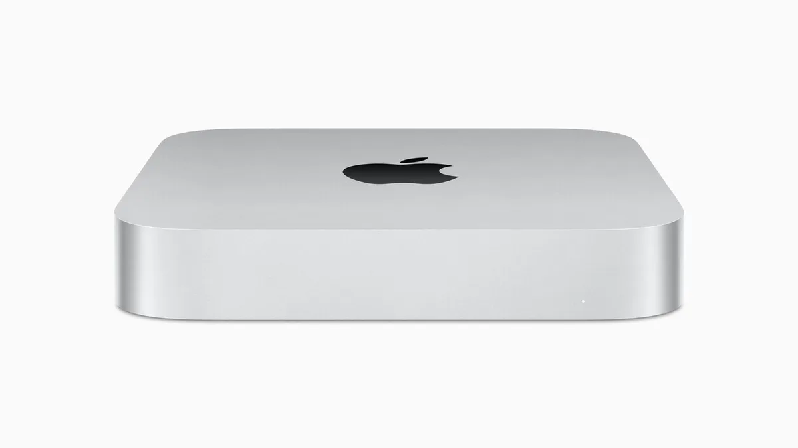

De nieuwste Mac Mini en MacBook Pro zijn eigenlijk maar saai: qua ontwerp en functies zijn ze goed als identiek aan hun voorgangers, met aan de binnenkant vooral krachtigere hardware. Toch zijn het de beste die je nu in hun klasse kunt halen.

> [!NOTE]
> Deze recensie verscheen eerder op [AD](https://www.ad.nl/tech/de-nieuwste-macs-zijn-niet-zo-revolutionair-als-in-2020~a5ed8c63/).

Apples Mac-computers zijn eigenlijk sinds 2020 bezig met een comeback-tour. Daarvoor waren ze een beetje verwaarloosd: met iedere Mac verdwenen er weer handige functies, terwijl nieuwe Intel-chips ervoor zorgden dat ze bloedheet werden, altijd stonden te blazen en maar een matige accuduur hadden.

Daar kwam verandering in toen Apple zijn eigen chips begon te maken. De M1 was zowel krachtig als energiezuinig, die daarna nog sterkere varianten kreeg voor duurdere computers. Van vastlopers en ander gedoe was ineens amper sprake en de accuduur liep op naar vele uren op een MacBook. De Pro-laptops werden bovendien weer van extra poorten en een dikkere chassis voorzien, waarmee het capabele werkpaarden zijn geworden.

Sinds vorig jaar maakt Apple de opvolger van die chip, genaamd de M2. Die zat al in de nieuwe MacBook Air en sinds deze week vind je hem ook in de vernieuwde Mac Mini. Die wordt ook verkocht met sterkere, duurdere M2 Pro- en M2 Max-chips, die tevens in de nieuwe MacBooks Pro zitten.

## Ietsje sneller dan de M1

We hebben de Mac Mini met een M2 Pro en een MacBook Air met de M2 Max getest, en daaruit blijkt dat die chips inderdaad sneller zijn. Speciale testsoftware laat iets betere prestaties zien dan bij de eerdere M1 Pro en M1 Max. Doet een videobestand er op de M1 Pro drie minuten over om te exporteren, dan zal dat bij de M2 Pro twee minuten en vijftig seconden zijn.

Dat kleine verschil zat er ook dik in. Als je het met auto’s vergelijkt, dan heeft Apple in 2020 feitelijk een nieuwe motor ontwikkeld. Omdat alles daarin helemaal opnieuw uitgedacht was, waren de verschillen met de vorige motor gigantisch groot. Maar met de nieuwe M2-motor is eigenlijk slechts een verfijnde versie van wat ze met de M1 hebben bedacht. Je kunt immers niet verwachten dat ze iedere paar jaar een compleet nieuw soort motor maken.

De nieuwe MacBook Pro (2023) © Apple

## Goedkope M1-Macs zijn ook een goede optie

Eigenlijk zijn deze nieuwe Macs vooral Apples manier om hun grote stap uit 2020 actueel te houden. Je zult een M1-Mac niet upgraden naar een nieuw M2-model, maar als je een oudere computer wil upgraden? Dan is een M2 wellicht aantrekkelijker. Aan de andere kant: met de komst van de nieuwe Mac Mini en MacBooks Pro zullen er geheid meer aanbiedingen voor de oude M1-varianten komen. En die computers zijn ook nog razendsnel, en bij een lagere prijs heel erg de moeite waard.

Het is overigens wel jammer dat Apple de Macs op echt geen enkele noemenswaardige manier hebben aangepast aan de buitenkant. De MacBook Pro heeft bijvoorbeeld nog steeds bovenin het scherm een dikke inkeping voor de webcam, waarvan we hadden gehoopt dat die zou verdwijnen bij latere modellen. Wellicht doen ze dat over een jaar of drie met de M3-modellen.

De nieuwe Mac Mini (2023) © Apple

## Conclusie

Bovenal zijn dit gewoon iets snellere Macs. De nieuwe Mac Mini is Apples goedkoopste manier om de krachtige nieuwe chip in huis te halen - deze computer wordt voor 719 euro verkocht, terwijl je voor een MacBook meer dan het dubbele betaalt. Al loopt de prijs snel op als je extra werkgeheugen op meer opslag wil.

Wil je het beste van het beste in een Mac mini of MacBook Pro? Deze moet je één van deze Macs hebben. Wil je ‘gewoon’ een snelle computer? Dan kun je voor iets minder ook een M1-variant op de kop tikken. Die computers zijn misschien ietsje langzamer, maar lopen nog steeds mijlenver voor op wat je bij concurrenten vindt binnen dit segment.

En dat is misschien wel het grootste compliment dat we Apple meegeven: zelfs bij deze kleine snelheidswinst, blijft de grootste concurrent vooral nog Apples eigen, eerder uitgebrachte alternatief.
