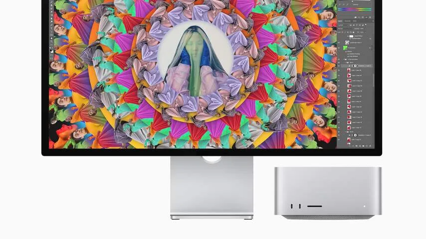
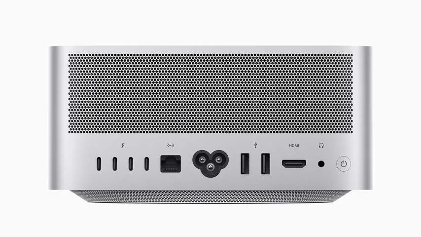
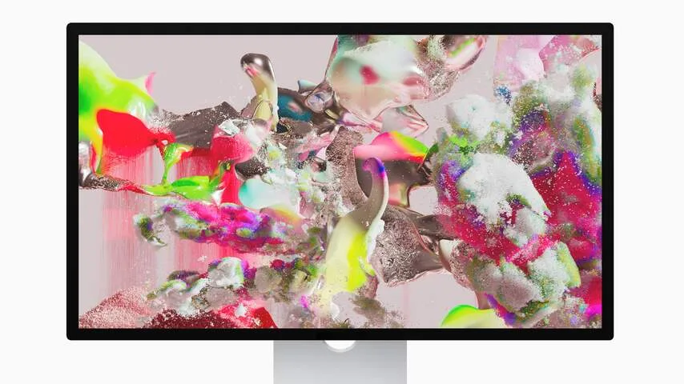

**Apples nieuwste Mac lijkt haast op een traditionele Windows-computer, met een losse kast die je zelf op een scherm, muis en toetsenbord aansluit. Goedkoop is hij niet, maar het is wél de betaalbaarste Mac in zijn klasse.**

> [!NOTE]
> Deze recensie verscheen eerder op [NU.nl](https://www.nu.nl/reviews/6189602/review-de-mac-studio-is-een-goedkope-versie-van-de-krachtigste-macbook.html).

In een poging alles zo simpel mogelijk te houden, verkocht Apple jarenlang alles-in-een-Macs. De iMac was een computer en beeldscherm ineen, zodat je niet met allerlei snoeren verschillende apparaten aan elkaar hoefde te verbinden. Uitzonderingen waren de kleine Mac Mini en de Mac Pro, waarvan die laatste voor een specifiek, professioneel publiek is gemaakt.

Met zijn nieuwe Mac Studio verkoopt de techreus nu een serieuze computer voor een breder publiek. Het is een kast met voor- en achterop aansluitingen, waar je jouw scherm en andere accessoires in kunt prikken. Het maakt Apple weer een traditionelere computerverkoper, al heeft deze Mac wel de zelfontworpen processor-chip die we sinds 2020 in alle computers van het bedrijf zien.

## Snel door de M1 Max-chip

Het model dat wij hebben getest heeft de M1 Max-chip die vorig jaar in de nieuwe MacBook Pro werd geïntroduceerd. Die is in deze desktop-Mac razendsnel: het gehele systeem ontgrendelt nagenoeg zonder wachttijd en ook apps starten zonder dat je naar een laadscherm hoeft te kijken. Het is een computer waarbij je bijna nooit hoeft te wachten.

Bij zwaardere handelingen komt die chip ook goed uit de verf: video's die we op een MacBook Air met Intel-chip probeerden te exporteren namen daarop tientallen minuten in beslag, om op de Studio in enkele momenten al klaar te zijn. Dat maakt het een goede productiviteitsmachine voor videomakers.

Apple verkoopt ook een variant met de M1 Ultra-processor - die bestaat in feite uit twee keer de M1 Max aan elkaar vastgeplakt. Die hebben we niet getest, hij lijkt ons wat overdreven voor alledaags computergebruik. De M1 Ultra is duidelijk bedacht voor professionals die de hele dag met zeer zware bestanden werken.

_Review: De Mac Studio is een goedkope versie van de krachtigste MacBook — Beeld: Apple_

## Je hoort altijd de ventilator

We merkten wel dat de Mac Studio bijna altijd geluid maakt: aan de binnenzijde zit een ventilator die nooit ophoudt met draaien, zelfs als er bijna geen apps openstaan. Dat geluid hoor je alleen in een doodstille kamer, maar valt dan wel meteen op.

Ons model leek soms zelfs een klein beetje te fluiten - alsof de akoestiek van de Mac-behuizing het geluid ietwat versterkte. Voor desktopcomputers niet ongehoord, maar de MacBook Pro's met dezelfde chip waren bij onze tests stiller.

## Duur, maar goedkoper dan een MacBook

Met een prijskaart van 2.329 euro is de Mac Studio niet goedkoop te noemen, maar het is tegelijkertijd de goedkoopste computer met zo'n M1 Max-chip. Deze zit verder alleen in de MacBook Pro, en een configuratie van die laptop met diezelfde instellingen komst 3.439 euro - ruim 1.000 euro meer.

Voor simpeler desktopwerk kun je nog steeds een Mac Mini kopen voor een derde van de prijs van een Studio, maar dan heb je wel een zwakkere, gewone M1-chip. De Mac Studio biedt goede, krachtige hardware voor professionals voor een wat lagere prijs.

_Review: De Mac Studio is een goedkope versie van de krachtigste MacBook — Beeld: Apple_

## Studio Display is niet noodzakelijk

De Mac Studio werkt met ieder denkbaar scherm met een USB-c- of HDMI-aansluiting, maar de techreus wil het liefst dat je hun nieuwe Studio Display erbij koopt. Dan springt de prijs flink omhoog: dat beeldscherm kost 1.779 euro, of 2.329 euro als je een in hoogte verstelbare voet erbij wilt.

Voor dat geld krijg je een 5K-monitor die op veel fronten lijkt op de LG UltraFine-monitor die het techbedrijf lange tijd in zijn winkels verkocht: beide hebben een 5K-resolutie met een ververssnelheid van 60 beeldjes per seconde. LG's monitor is met 1.399 euro goedkoper, maar daar staat tegenover dat Apples alternatief een ingebouwde camera en beter klinkende luidsprekers heeft.

Die webcam werkt ook met Center Stage - speciale software waarmee Apple de videobeller altijd in het midden van het beeld houdt. Dat werkt uitstekend bij apps als FaceTime, maar in bijvoorbeeld Google Meet blijft de webcam statisch op één plek. En als Center Stage niet werkt, is het standaardbeeld onhandig uitgelijnd waardoor er veel ruimte boven je hoofd is te zien.

_Review: De Mac Studio is een goedkope versie van de krachtigste MacBook — Beeld: Apple_

## Conclusie

Met de nieuwe Mac Studio is Apples eerdere krachtigste chip nu voor minder geld verkrijgbaar. Een budget-pc is het daarmee nog niet, maar het is wel een goede optie voor wie een krachtige Mac voor iets minder geld in huis wil halen.

Het is lastiger te zeggen of het bijbehorende scherm zijn prijs waard is. De 550 euro extra voor een in hoogte verstelbare voet is lastig te rechtvaardigen, en voor dit geld hadden we gehoopt op een hogere ververssnelheid. Maar gelukkig werkt de Mac Studio ook op andere displays, en kun je deze monitor zo nodig overslaan.
