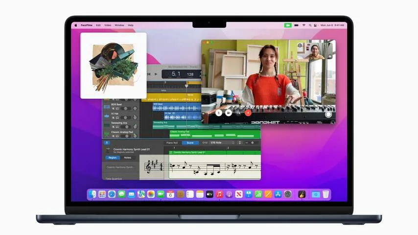
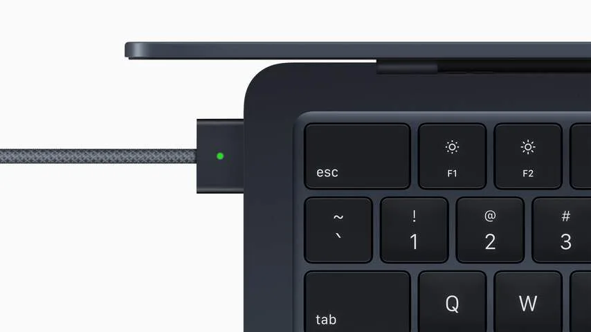

**De nieuwe MacBook Air heeft een vernieuwd design en een snellere M2-chip. Dat maakt het een buitengewoon krachtige notebook - maar hij valt wat tussen en wal en schip door zijn Mac-genoten, die we net iets eerder zouden aanraden.**

> [!NOTE]
> Deze recensie verscheen eerder op [NU.nl](https://www.nu.nl/tech/6211968/review-nieuwe-macbook-air-heeft-giga-accu-2020-model-blijft-favoriet.html).

Na jarenlang wachten heeft de MacBook Air eindelijk een compleet nieuw ontwerp gekregen. De randen van het scherm zijn net als de MacBook Pro (14 inch) dunner, met bovenin plek voor een betere webcam.

Daarnaast is het aflopende ontwerp van de oude Airs ingeruild voor een steviger, hoekigere behuizing. Het blijft een uitermate dunne en lichte laptop, maar door deze nieuwe vorm klap je het scherm makkelijker open zonder de hele laptop de lucht in te tillen. De laptop is met een magneetlader van stroom te voorzien, waardoor je allebei de USB-c-poorten vrijhoudt.

Aan de binnenzijde zit Apples nieuwe M2-processor, de opvolger van Apples eerste eigen laptopchip. De M1 was al een bliksemsnelle chip met lange batterijduur, zeker vergeleken met de Intel-processor in de Air-laptop die Apple daarvoor maakte. De M2 is op papier nog wat sneller, maar een minder wereldschokkende upgrade.

_De redactie van BestGetest zette eerder [de beste MacBooks](https://bestgetest.nl/de-beste-macbook-van-2022?utm_source=nu&utm_medium=tekstlink&utm_term=byo&utm_campaign=redactioneel&utm_content=macbookairm2) op een rij._

## De accu is niet kapot te krijgen

Dat merken we ook bij onze tests. Tabbladen in webbrowsers, chatapps en beeldbewerkers openen ongeveer even snel als op de MacBook Air M1. De verschillen worden pas merkbaar bij zwaardere taken: het exporteren van een bewerkte video gaat op de MacBook Air M2 bijvoorbeeld een stukje sneller.

De accu van de nieuwe MacBook Air is niet kapot te krijgen. We konden de laptop slechts een paar dagen gebruiken, maar bij onze tests bleef hij constant presteren. Een volle werkdag browsen, video's kijken en aan documenten werken ging met gemak, met aan het eind van de dag nog een halve accu over.

_Review: Nieuwe MacBook Air heeft giga-accu, 2020-model blijft favoriet — Beeld: Apple_

Zelfs toen we de accu moedwillig leeg probeerden te trekken, was daar nog best lang voor nodig. Het streamen van de 2,5 uur durende film _Paddington 2_ op Netflix kostte slechts 21 procent van de accu. We speelden de 3D-game Divinity Original Sin 2 voor een uurtje, wat zo'n 31 procent van de accu aftrok. Het zou betekenen dat grafisch intensieve games zo'n drie uur gespeeld kunnen worden - best oké voor een laptop.

Die lange accuduur hadden we ook wel verwacht. Uit tests van onze collega's bij Tweakers bleek dat dezelfde processor in Apples nieuwe MacBook Pro 13 inch buitengewoon lange batterijduur biedt, en die laptop heeft ook nog een ingebouwde ventilator. Die ontbreekt op de Air, waardoor deze laptop minder uit de processor kan halen, maar ook minder stroom verbruikt.

Het maakt de nieuwe MacBook Air een prima laptop, die door zijn nieuwe, hogere prijs van 1.519 euro alleen wat lastig aan te raden is. Vroeger was de MacBook Air de goedkoopste optie in Apples stal, maar die titel gaat nu naar de MacBook Air M1 van 2020, die de techreus nog steeds verkoopt. Deze kost op het moment 1.219 in de Apple Store, of rond de 1.000 euro als je online een aanbieding vindt. En die laptop met M1-chip is twee jaar later nog steeds een uitstekende machine.

_Review: Nieuwe MacBook Air heeft giga-accu, 2020-model blijft favoriet — Beeld: Apple_

## Luxe optie versus de MacBook Pro (14 inch)

Daarmee is de nieuwe M2-variant niet langer een prijsvechter, maar voor een iets serieuzere doelgroep. Wil je Apples iets nieuwere chip, dan kun je ervoor kiezen iets meer bij te betalen.

Maar als je bereid bent dieper in de buidel te tasten voor betere hardware, wil je vermoedelijk ook 16 gigabyte werkgeheugen in plaats van de standaard 8 gigabyte, en misschien zelfs 512GB opslag in plaats van 256GB.

En dan kost de nieuwe MacBook Air tegen de 2.000 euro, terwijl de luxere MacBook Pro (14 inch) bij veel winkels voor rond de 2.100 euro over de toonbank gaat. En dan heb je een M1 Pro-processor die in de praktijk nog wat sneller is en een mooier miniled-beeldscherm dat een hoger contrast biedt. Bovendien heeft deze Pro-laptop extra poorten aan de zijkant voor een beeldscherm en SD-kaart.

## Conclusie

Het is bijzonder dat juist Apple's vorige computers nog zo fier overeind blijven staan naast dit nieuwe model. Daar komt vast verandering in als Apple zijn verdere aanbod van updates voorziet - waarschijnlijk kost deze MacBook Air over een paar jaar een stuk minder.

Tot die tijd denken we dat de MacBook Air M1 en de MacBook Pro (14 inch) de beste aanraders blijven voor respectievelijk licht en intensief werk. En de Air M2 alleen interessant is voor hele specifieke situaties daar tussenin.
