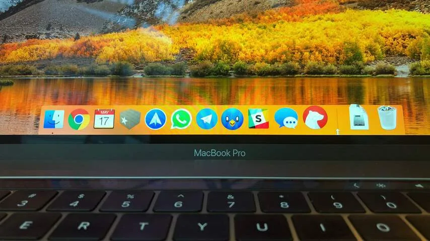
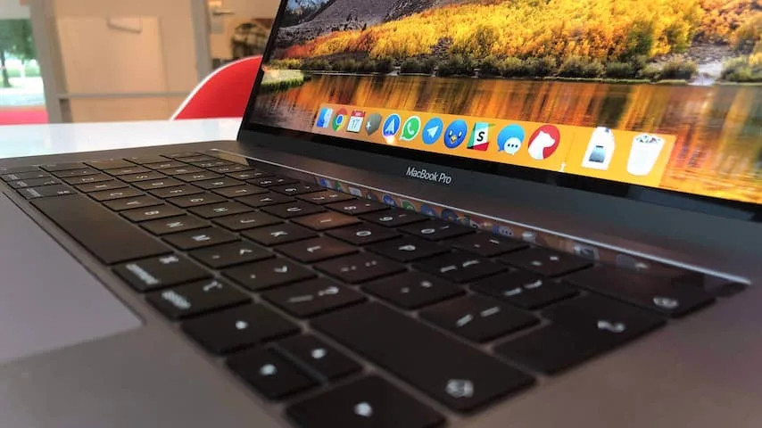
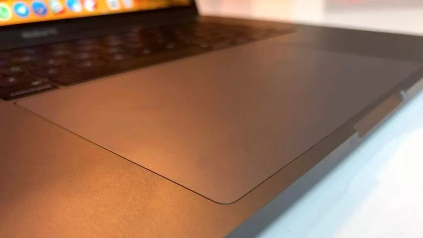
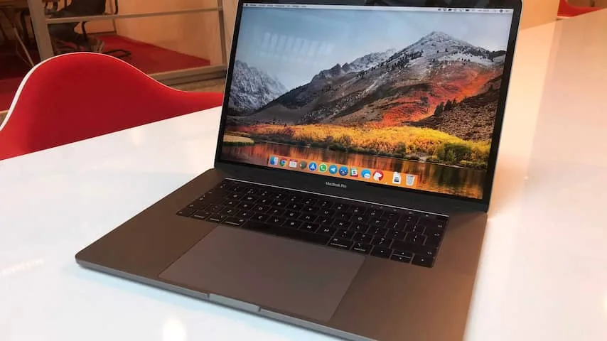
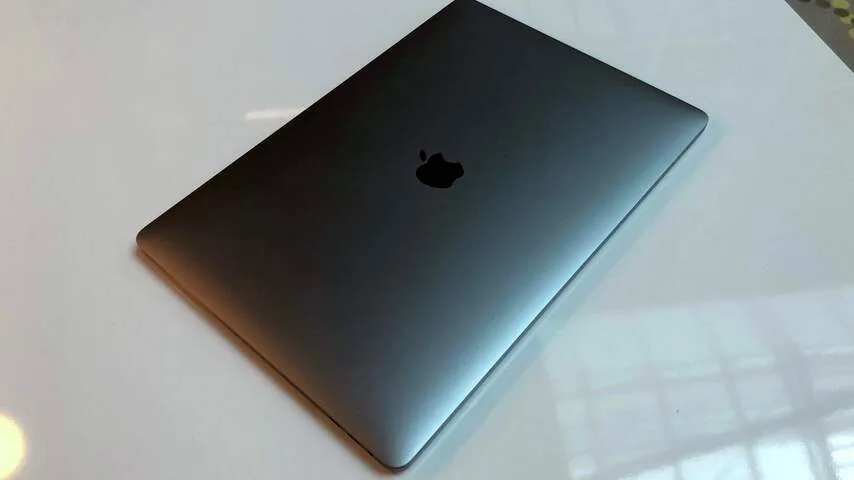

**Een gebrek aan USB-poorten en een toetsenbord dat snel kuren vertoont, zorgden er de afgelopen jaren voor dat de MacBook Pro veel kritiek te verduren kreeg. Weet Apple zich met het nieuwste model te herpakken?**

> [!NOTE]
> Deze recensie verscheen eerder op [NU.nl](https://www.nu.nl/gadgets/5418455/review-macbook-pro-2018-is-krachtpatser-met-weinig-grote-veranderingen.html).

Aan de buitenkant is de nieuwe MacBook Pro vrijwel onveranderd vergeleken met zijn voorganger. De laptop heeft nog steeds een aluminium behuizing, een door een dunne rand omringd scherm en wordt nog steeds in de kleuren zilver en grijs verkocht.

Het 15-inchmodel dat wij hebben getest is 1,49 centimeter dik - iets dunner dan de voorganger, die een dikte van 1,55 centimeter heeft. Dat verschil valt echter alleen op als je ze naast elkaar legt. Op het eerste gezicht ziet hij er hetzelfde uit.

Boven het toetsenbord zit dezelfde smalle aanraakstrip die Apple in 2016 voor het eerst introduceerde. Deze zogenoemde Touch Bar vervangt de traditionele F-knoppen van een laptop en laat knoppen van de actieve apps zien. Aan de rechterzijde hiervan zit wederom een vingerafdrukscanner om de laptop snel te ontgrendelen.

We vonden de aanraakbalk bij onze eerste tests in 2016 wat onhandig - en eigenlijk is er weinig aan dit oordeel veranderd nu we hem op het nieuwe 2018-model konden gebruiken. Het is lastig om de knoppen op de Touch Bar blind met je vingers te vinden, waardoor je altijd naar beneden moet kijken om ze te gebruiken. Daarnaast is het aantal apps dat de balk ondersteunt nog vrij beperkt.

Onder het toetsenbord zit nog steeds een trackpad. Die kan met één vinger de muis bedienen, of met veegbewegingen van meerdere vingers tegelijk bijvoorbeeld snel een pagina in de browser terugspringen of naar het bureaublad navigeren.

De manier waarop de trackpad van Apple reageert is nog steeds onovertroffen, maar dit aanraakveld is op de 15-inch-MacBook wel buitensporig groot. Gebruik je het toetsenbord, dan is het haast niet te voorkomen dat je hem met je palm aanraakt en per ongeluk een veegbeweging maakt. Palmdetectie zou dit moeten voorkomen, maar bij ons werkte dit zelden goed.

## Een scherm dat zich aanpast

De MacBook Pro wordt wederom met een True Tone-beeldscherm geleverd, maar ditmaal wordt zogeheten True Tone-technologie gebruikt om de kleurtoon van het beeld aan te passen. Diezelfde truc zit al langer in iPhones en iPads: door met sensoren naar het omgevingslicht te kijken, kan het beeld zich aanpassen om zo natuurlijk mogelijk over te komen.

Bij alledaags gebruik valt True Tone eigenlijk niet op. Je denkt dat een wit oppervlak ook echt wit is, totdat je de schermoptie uitzet om het verschil te zien. Bij lage lichtomstandigheden hadden we het idee dat het scherm minder fel overkwam, waardoor het comfortabeler in gebruik is.

_MacBook Pro (2018) — Beeld: NU.nl/Bastiaan Vroegop_

_MacBook Pro (2018) — Beeld: NU.nl/Bastiaan Vroegop_

_MacBook Pro (2018) — Beeld: NU.nl/Bastiaan Vroegop_

_MacBook Pro (2018) — Beeld: NU.nl/Bastiaan Vroegop_

_MacBook Pro (2018) — Beeld: NU.nl/Bastiaan Vroegop_

## Wederom vier keer USB-C

Op USB-gebied is de nieuwe MacBook ook een herhaaloefening: vier USB-C-poorten en één aansluiting voor een koptelefoon. De USB-aansluitingen kunnen gebruikt worden voor zowel het aansluiten van een apparaat als het verbinden met een oplader.

Tijdens een demonstratie van Apple, nog voordat de testlaptops aan journalisten overhandigd werden, liet Apple uitgebreid zien wat voor accessoires met USB-C er allemaal beschikbaar zijn. Zo heeft LG bijvoorbeeld een monitor die rechtstreeks met de MacBook Pro-poorten kan verbinden en tegelijkertijd de laptop van stroom kan voorzien. Hierdoor hoef je in feite maar één kabel aan te sluiten.

Het is echter nog de vraag hoeveel laptopbezitters al vol op deze USB-C-apparatuur overgestapt zijn. Als we om ons heen kijken, dan zien we dat een hoop professionals nog steeds apparatuur met gewone USB-poorten en andere aansluitingen hebben. De meeste beeldschermen vereisen ook nog steeds een HDMI-aansluiting en fotografen willen nog steeds graag een microSD-kaart in een laptop steken.

Apple verkoopt nog steeds een losse dongel, zodat apparaten met al deze andere aansluitingen ook op de MacBook Pro aangesloten kunnen worden. Dat is echter - net als in 2016 - nog een wat omslachtig proces.

## Geen broodkruimels meer in het toetsenbord?

Het toetsenbord van de MacBook Pro gebruikt nog steeds het zogeheten vlinderontwerp, waardoor knoppen een minder diepe aanslag hebben. Het gebruik hiervan leidde recent tot klachten van gebruikers waarvan het toetsenbord door bijvoorbeeld zandkorrels en broodkruimels niet goed meer werkte.

In het nieuwe toetsenbord heeft Apple een membraan onder de toetsen aangebracht. Dat was volgens het bedrijf in eerste instantie om het geluid van knopaanslagen te dempen, maar later gaf het bedrijf toe dat het ook bescherming biedt tegen stof en andere verstoppende materialen.

We konden niet testen of de toetsen ook echt allemaal perfect blijven werken - dat moet pas na verloop van tijd blijken. Wel merkten we dat het tikken op de knoppen nog steeds een stuk minder geluid genereert. Heel comfortabel zijn de knoppen vooralsnog niet. Omdat je snel de 'onderkant' van een knopindruk bereikt, voelt typen hard en onhandig.

## Zes processorkernen

De MacBooks worden verkocht met minstens een Intel i5-processor, maar worden ook aangeboden een Intel i9-processor die maar liefst zes kernen bevat. Deze zit alleen in het duurste model, die met uitzonderlijk hoge specificaties geleverd kan worden, waaronder 32 GB werkgeheugen en 4 TB aan SSD-opslag.

Dat zijn indrukwekkende specificaties, al betaal je daar ook de hoofdprijs voor. De goedkoopste MacBook Pro wordt voor 1.500 euro aangeboden, terwijl het hoogwaardigste exemplaar met alle upgrades maar liefst 8.000 euro kost.

Maar wat betekenen die hoge specificaties in de praktijk? Wij hebben de duurste MacBook Pro gebruikt om videobestanden te renderen. Bij dit proces wordt het beeld op een bepaalde manier omgezet zodat het bestandsformaat niet buitensporig groot is.

Op een MacBook Pro uit 2015 met een 2,5GHz-i5-processor en 16 GB RAM duurde het een uur en een kwartier om de video volledig te renderen. En op het nieuwe topmodel van de recente MacBook? Daarop was de video in drie kwartier af. Dat betekent dat de videomaker in feite een half uur winst boekt en hierdoor meer tijd heeft voor andere klussen.

Een softwarebug zorgde er bij veel MacBook-bezitters voor dat de processor lange tijd werd ingeperkt, waardoor hij langzamer was dan bij oudere modellen. Apple heeft voor dat probleem inmiddels een update uitgebracht - en zelf hebben we geen hinder ondervonden.

## Logge grafische kaarten

Wie écht veel rekenkracht wil, kan een externe grafische kaart aansluiten met een USB-C-poort, maar dan moet je wel bereid zijn om dit logge apparaat met je mee te dragen. Dat doet af aan de draagbaarheid van de laptop. En dan kan je voor een vergelijkbaar bedrag net zo goed een iMac Pro kopen waarbij het nodige intern aanwezig is.

Gebruik je de MacBook vooral om het web af te gaan en af en toe te schrijven? Dan zijn de vernieuwingen aan de binnenkant minder significant. De MacBook is snel - maar dat zijn de vorige modellen bijna ook allemaal nog steeds.

## Conclusie

De nieuwe MacBook Pro is een product voor een zeer specifieke subset professionele gebruikers. Een laptop met een i9-processor en maar liefst 4 TB opslag is een indrukwekkend gegeven, maar daar staat ook een fors prijskaartje tegenover. En dan moet je bereid zijn om vol over te stappen op USB-C-accessoires, of om constant dongels met je mee te dragen.

_3sterren — Beeld: NU.nl_
