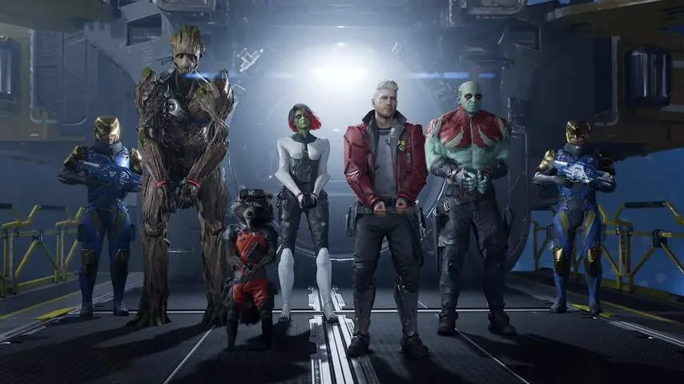

**Het nieuwe Guardians of the Galaxy is misschien wel een van de leukste games die dit jaar verschijnt. Verrassend, aangezien dezelfde uitgever recent nog teleurstelde met Marvel's Avengers.**

> [!NOTE]
> Deze recensie verscheen eerder op [NU.nl](https://www.nu.nl/reviews/6164097/review-guardians-of-the-galaxy-is-een-verrassend-geweldige-game.html).

De Japanse uitgever Square Enix mag sinds een paar jaar games maken die gebaseerd zijn op de stripboeken van Marvel. De samenwerking werd afgetrapt met een gamevariant van de Avengers van Tomb Raider-studio Crystal Dynamics, waarbij helden zoals Iron Man, Thor en Captain America samenwerkten.

Dat spel viel tegen door het wat eenzijdige verhaal en de opgeplakte multiplayermodus, waardoor de verveling al snel toesloeg. Het spel moest met updates en toevoegingen jarenlang speelbaar blijven, maar spelers klaagden vooral over hoe steeds weer geld voor nieuwe content wordt gevraagd.

Met _Guardians of the Galaxy_ zijn de touwtjes ditmaal in handen van de studio Eidos-Montréal, een bedrijf dat eerder zijn naam vestigde met _Deus Ex_ en _Thief_. Het resultaat is een game met veel meer focus, die bij het spelen steeds weer weet te verbazen.

## Vol met verwijzingen naar jaren tachtig

Je speelt als Peter Quill, die in de jaren tachtig van de aarde werd ontvoerd door aliens. Hij probeert een groep huurlinghelden te vormen die tegen betaling problemen oplost. De soundtrack zit vol met jarentachtignummers, die Peter nog herinnert van zijn puberteit op aarde. Het geeft de sfeer van de game een rauw randje, al is die truc overgenomen uit recente verfilmingen van dezelfde stripboeken.

Peters groep ruimtehuurlingen komt niet goed van de grond. In een eerste missie probeert hij samen met zijn teamgenoten een zeldzaam monster te vangen voor een verzamelaar, maar dat mislukt. Wat volgt, is een soort misdaadfilm: ze worden gearresteerd, zoeken naar creatieve manieren om geld te verdienen en worstelen om moreel het juiste te doen.

[Bekijk ingesloten media](https://www.youtube.com/embed/7MH1BLrUAuw)

## Samenwerken tijdens gevechten

In _Guardians of the Galaxy_ staat het groepsgevoel centraal. Peter vecht zelf met zijn pistolen, maar kan ook teamgenoten opdrachten geven. Krijger Drax kan bijvoorbeeld een monster op zijn rug werpen, zodat de sluipmoordenaar Gamora hem met haar zwaard doorklieft.

Naarmate de game vordert, worden gevechten langzaamaan steeds complexer. Je kunt met Peters pistolen bijvoorbeeld met ijs schieten om een vijand te bevriezen. Ook kun je op een penibel moment het team bij elkaar roepen om ze aan te moedigen, als een soort voetbalcoach tijdens de rust.

## Meepraten tijdens familieruzies

Tijdens het verkennen van de gamewereld praat het team ook constant met elkaar, momenten waarop _Guardians of the Galaxy_ op zijn sterkst is. De game heeft een ijzersterk script, vol met geintjes, sneren en andere scherpe passages. De Guardians schelden elkaar de huid vol, maar achter al dat gekissebis schuilt duidelijk een liefdevol familiegevoel.

Je doet als Peter zelf ook mee aan die ruzies. Vaak zijn dat onschuldige momentjes, waarop je bijvoorbeeld iemands kant kunt kiezen in een ruzie of een sip teamlid kunt troosten. Tussen de levels door pauzeer je op het ruimteschip van de piraten, waar je je teamgenoten een-op-een kunt spreken om ze nog iets beter te leren kennen.

_Review: Guardians of the Galaxy is een verrassend geweldige game_

## Een game met een ziel

Al die gesprekken geven _Guardians of the Galaxy_ een ziel. Het is alsof je er echt bij bent. Loop je bijvoorbeeld een zijstraatje in om naar upgrades te zoeken, dan mopperen je metgezellen dat je de verkeerde kant opgaat. Je bouwt een band met de vier teamgenoten die je begeleidt door een redelijk lineaire game. En naarmate je verder komt, laat de game je ineens steeds significantere keuzes maken die het verhaal een specifieke kant opduwen.

We hadden bij onze speelsessie wel last van een paar kleine bugs, zoals menu's die bleven hangen. Vervelend, maar de meeste hiervan werden opgelost met een update die inmiddels is verschenen.

## Conclusie

_Guardians of the Galaxy_ is een van de beste lineaire games van de afgelopen tijd. Genregenoten beloven vaak een strak geregisseerde achtbaanrit. _Guardians_ geeft je het idee dat je werkelijk invloed hebt op wat er gebeurt, zonder dat het meteen een groots rollenspel hoeft te zijn. Een game die door zijn uitmuntende schrijfwerk van begin tot eind geweldig blijft.

_4,5 sterren_
