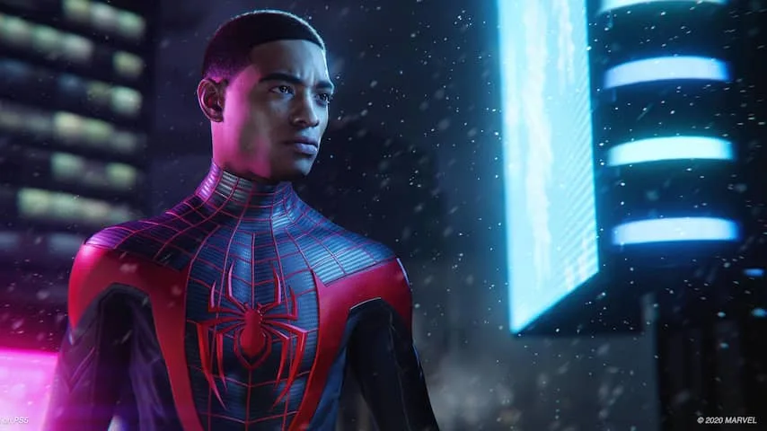
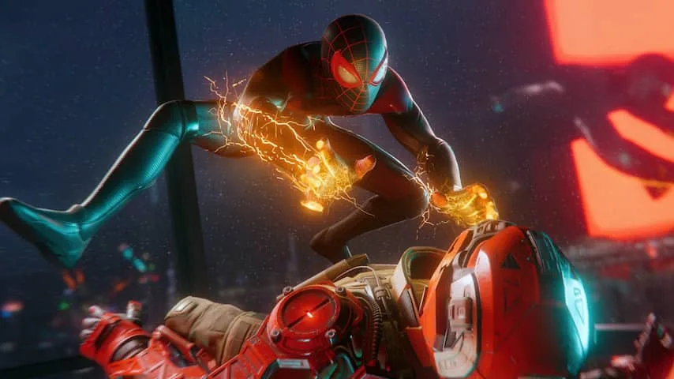

**Sony's tweede Spider-Man-game is significant korter dan zijn voorganger, maar de focus is wel beter. Daarom is Miles Morales de betere van de twee.**

> [!NOTE]
> Deze recensie verscheen eerder op [NU.nl](https://www.nu.nl/reviews/6091068/review-spider-man-miles-morales-is-korter-intiemer-en-vooral-mooier.html).

Hoewel _Miles Morales_ het in 2018 verschenen spel _Spider-Man_ opvolgt, is het lastig om de game een volwaardig vervolg te noemen. Het spel bevat een nieuw verhaal met dit keer de zwarte hoofdpersoon Miles Morales in de hoofdrol. Maar het speelt zich af in dezelfde stad met grotendeels dezelfde besturing.

Wellicht wordt de game daarom in een bundel verkocht: wie de duurste editie in huis haalt, krijgt daarbij ook een verbeterde versie van het origineel. Die is geoptimaliseerd voor de PlayStation 5. In de Verenigde Staten kost _Miles Morales_ niet de volle mep, in Nederland betaal je alsnog 60 euro.

Superheld in spé Miles wordt in dit deel door Spider-Man-nestor Peter Parker opgeleid. Miles moet in zijn eentje New York beschermen als zijn mentor op vakantie is. Dat biedt ruimte voor een wat traditioneler _Spider-Man_\-verhaal. Miles is een zeventienjarige middelbare scholier die zijn nieuwe bestaan als held een plekje probeert te geven.

_Spider-Man: Miles Morales — Beeld: Marvel_

_Still uit Spider-Man: Miles Morales. (Bron: Marvel)_

## Door New York slingeren is geweldig

Het hergebruik van gameplay en de stad uit de eerste _Spider-Man_ betekent dat veel van de hoogtepunten uit het origineel in _Miles Morales_ herhaald worden. Zo heb je wederom de vrijheid om door de binnenstad van New York te slingeren en misdaad te bestrijden in optionele zijmissies.

Dat bewegen doe je aan de hand van een genuanceerd en complex slingersysteem, dat je het gevoel geeft de volledige controle te hebben over Miles' razendsnelle bewegingen. Dat blijft ook na uren spelen ontzettend leuk. Hoewel je snel naar sommige locaties kunt teleporteren, slingerden we er daarom alsnog vaak zelf naartoe.

Miles vecht en beweegt net als Peter Parker uit de eerste game, maar kan daarnaast met stroomaanvallen vijanden uitschakelen. Tijdens sluipmissies kan hij bovendien onzichtbaar worden. Beide systemen gooien de game niet compleet op zijn kop, maar houden hem fris ten opzichte van zijn voorganger.

[Bekijk ingesloten media](https://www.youtube.com/embed/NTunTURbyUU)

## Minder te doen

Dit vervolg heeft wel beduidend minder te bieden dan het origineel. Het aantal zijmissies is fors gereduceerd en ook het hoofdverhaal bereikt sneller zijn eind. Enerzijds is dat jammer, maar het geeft de game wel meer focus. Achter iedere optionele missie schuilt bijvoorbeeld een klein verhaal dat de stad iets meer tot leven brengt.

De uiteindelijke strijd tussen Miles en twee criminele organisaties voelt ook wat minder vergezocht dan de gigantische oorlogen tussen facties in de vorige game. Het aantal helden en schurken blijft klein, waardoor iedereen een logische rol is toebedeeld.

_Spider-Man — Beeld: Marvel_

_Still uit Spider-Man: Miles Morales. (Bron: Marvel)_

## Geen laadschermen meer

_Miles Morales_ is beschikbaar voor zowel de PlayStation 4 als de PlayStation 5. Wij speelden de PlayStation 5-versie, die een voorproefje geeft van waar de nieuwe hardware toe in staat is.

Waar de oude console soms een minuut lang moet laden, is deze nieuwe editie meteen opgestart. Dat is vooral fijn als je bijvoorbeeld in een optionele race zit en je vliegensvlug wil herstarten als het misgaat.

De glimmende wolkenkrabbers van New York zijn ook perfect voor het demonstreren van de nieuwe raytracingtechnologie van de spelcomputer. De wereld wordt zeer realistisch weerspiegeld in de gebouwen, terwijl lichteffecten van een laaghangende zon voor mooie stadsaanzichten zorgen.

_Miles Morales_ is een game die je verleidt om soms op de pauzeknop te drukken en een screenshot van de mooie beelden te maken. Daarmee bewijst ontwikkelaar Insomniac Games dat hij nu al iets prachtigs op Sony's nieuwe hardware kan tonen.

## Conclusie

_Spider-Man: Miles Morales_ biedt meer van hetzelfde, maar dan korter, intiemer en vooral mooier op de nieuwe PlayStation. Daarmee is _Miles Morales_ een van de beste games die je voor deze nieuwe generatie in huis kunt halen.

_4,5 sterren_
