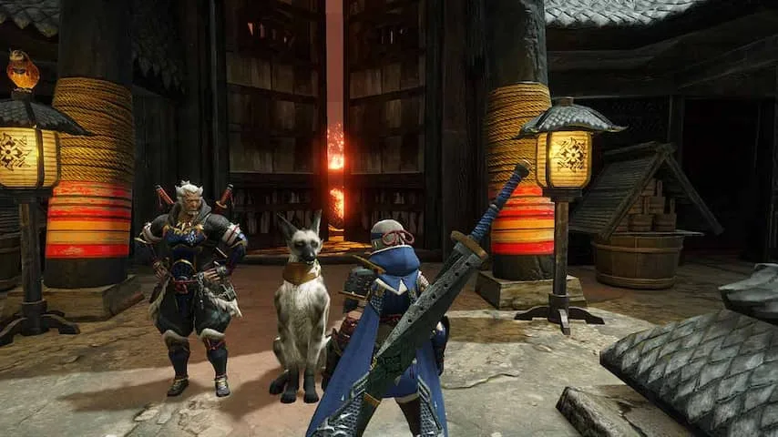
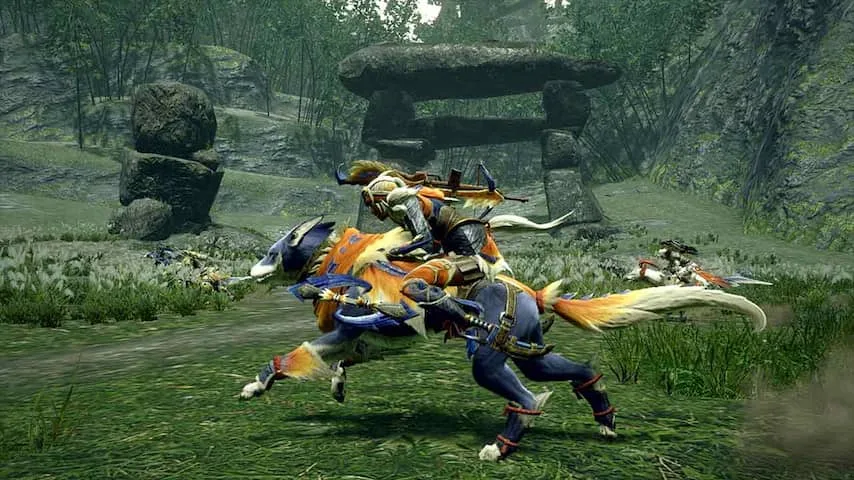

**Monster Hunter Rise is een vloeiend en buitengewoon uitgebreid actiespel, waar je met gemak honderden uren in kunt stoppen. Toch is de game toegankelijker dan ooit.**

> [!NOTE]
> Deze recensie verscheen eerder op [NU.nl](https://www.nu.nl/reviews/6123552/review-monster-hunter-rise-is-de-beste-en-toegankelijkste-game-in-de-reeks.html).

De _Monster Hunter_\-reeks heeft al jarenlang gigantisch succes in thuisland Japan, maar met de introductie van _Monster Hunter World_ werd de reeks een internationaal begrip. Met zestien miljoen verkochte exemplaren werd het de succesvolste titel die Resident Evil-ontwikkelaar Capcom ooit maakte.

Het idee achter de game zit al in de naam: bij _Monster Hunter_ jaag je op steeds grotere en gevaarlijke monsters, waarvan je de huiden vilt en de tanden afbreekt om nieuwe pantsers en wapens mee te maken. Het doet denken aan spellen zoals _World of Warcraft_, waarin spelers steeds sterkere vijanden verslaan om betere uitrusting te bemachtigen.

[Bekijk ingesloten media](https://www.youtube.com/embed/TdCec2GRg-w)

## Staarten snijden en door water rollen

Genregenoten zijn vaak gevuld met statistieken en andere cijferbrij, maar dat is bij deze game niet het geval. _Monster Hunter_ is een verrassend fysiek voelende game. Sta je in brand door een vuurbal van een monster, dan blus je dat door in waterplassen te rollen. Mept een monster vaak met zijn staart? Dan snijd je die met een paar goed gemikte slagen los om het gevecht makkelijker te maken.

Hoewel je uitrusting tijdens het jagen steeds beter wordt, kan je pantser niet veel klappen weerstaan. Je zult vooral zelf aanvallen moeten ontwijken en blokkeren. Maar omdat de spelwereld zo direct op jouw acties reageert, is het een game waar je met oefening steeds beter in wordt. En naarmate je beter wordt kun je vervolgens nog sterkere monsters bevechten.

_Monster Hunter Rise_ kan met maximaal vier mensen online of lokaal met vier spelcomputers worden gespeeld. Bij zo'n online jacht kan ieder een eigen rol aanmeten. Gebruikers van de Hunting Horn, een soort hamer met ingebouwde doedelzak, kunnen bijvoorbeeld met liedjes teamgenoten sterker maken. Tegelijkertijd kan een boogschutter het monster bestoken met gif en verlammende pijlen om hem te verzwakken.

_Review: Monster Hunter Rise is de beste en toegankelijkste game in de reeks — Beeld: Capcom_

## Moderner en toegankelijker dan vorige games

_Monster Hunter Rise_ lijkt erg op zijn voorganger _World_, die de toen wat verouderde gamereeks naar de moderne tijd trok. Wie met pijl en boog op jacht gaat, speelt bijvoorbeeld een game die lijkt op een modern schietspel. De nadruk ligt bovendien meer op het jagen, waardoor je nog zelden op verkenning hoeft te gaan om plantjes en paddestoelen te vinden.

_Rise_ zet deze trend voort en probeert de speler zo snel mogelijk naar de actie te brengen. Binnen een uur vecht je tegen grote monsters, waarna je eigenlijk zelden iets anders hoeft te doen. Dat kan soms wat intimiderend overkomen: in dat eerste uur worden gigantisch veel spelsystemen aan je uitgelegd, waardoor je soms kunt vergeten hoe alles werkt.

Het is nu ook mogelijk monsters te bestijgen en tijdelijk te besturen, zodat je andere vijanden op het speelveld kunt aanvallen. Ook kunnen jagers voortaan door de lucht slingeren met speciale insecttouwen, om de spelwereld ook verticaal te verkennen. Die wereld zit nu ook verborgen met geheimen op lastig te beklimmen locaties, waardoor de wereld veel levendiger dan eerder aanvoelt.

_Review: Monster Hunter Rise is de beste en toegankelijkste game in de reeks — Beeld: Capcom_

## Conclusie

Met _Monster Hunter Rise_ probeert Capcom het succes van het goed verkochte _World_ te herhalen. Dat doet het bedrijf ditmaal op de Nintendo Switch, wat alle lof verdient: dit is een game die net zo compleet, afgewerkt en uitgebreid aanvoelt als op een spelcomputer, die in handheldmodus ook buiten de deur gespeeld kan worden.

Wie nog nooit een _Monster Hunter_ heeft gespeeld, vindt in _Rise_ het perfecte instappunt. Het is een game die met kleine verfijning zijn oude, Japanse en archaïsche imago los probeert te schudden, met een uitstekend actiespel dat honderden uren boeit als gevolg. Je moet alleen wel bereid zijn om het eerste uur eventjes goed op te letten en alle systemen uit te vogelen.

_4,5 sterren_
