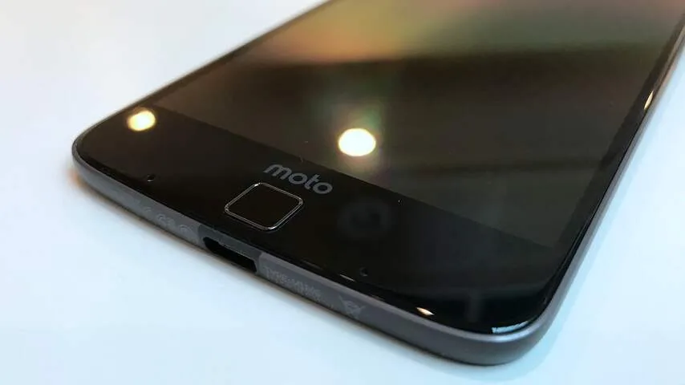
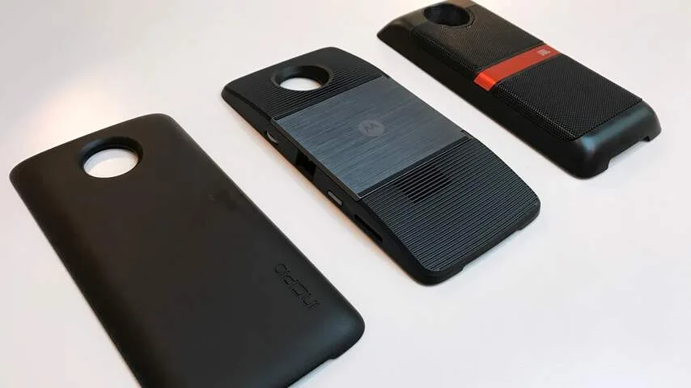
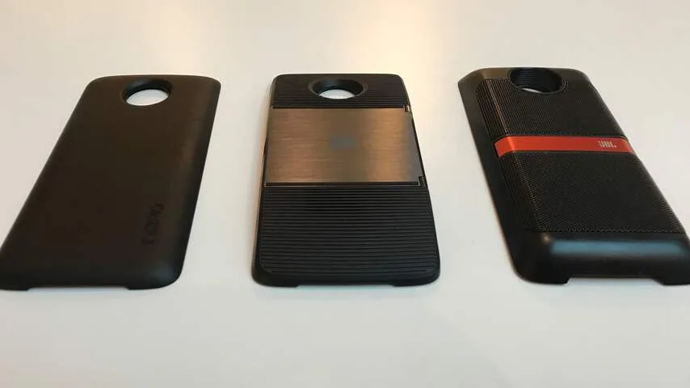

**De Moto Z is modulair, waardoor de smartphone ineens in bijvoorbeeld een speaker veranderd kan worden.**

> [!NOTE]
> Deze recensie verscheen eerder op [NU.nl](https://www.nu.nl/tech/4349508/review-moto-z-is-een-modulaire-middenmoter.html).

Hoe krijgt een smartphone meer mogelijkheden, zonder dat het toestel gigantisch veel dikker wordt gemaakt? De meeste techbedrijven proberen onderdelen compacter en geavanceerder te maken zodat ze makkelijker in een toestel passen, maar Lenovo kiest met de Moto Z voor een andere tactiek.

De smartphone heeft achterop een aansluiting voor verscheidene modules, die achterop de telefoon geplakt kunnen worden. Wie bijvoorbeeld een betere camera wil, kan een extra camera bevestigen.

Het zorgt voor een interessante situatie, waarin iedere smartphonegebruiker een toestel naar eigen smaak kan aanpassen. Liever een lange accuduur? Dat kan, maar dan wordt de telefoon wel iets dikker.

[Bekijk ingesloten media](https://content.jwplatform.com/players/vmHLP4YB-whqXCOFb.html)

## Modulebevestiging

De modules worden achterop de smartphone bevestigd met behulp van ingebouwde magneten. Op het toestel zitten gouden bevestigingspunten waarmee een module verbinding maakt, zodat het apparaat rechtstreeks met de telefoon verbindt.

De magneten zitten op specifieke locaties, zodat de module niet snel heen en weer schuift zodra hij op zijn plek zit. Omdat de camera van de smartphone wat uitsteekt, hebben modules op de Moto Z een 'klempunt' waardoor ze aan de bovenkant amper bewogen kunnen worden.

Aan de onderkant kunnen ze een paar millimeter opzij worden geduwd. Er is forse kracht voor nodig om hem van zijn algemene positie te krijgen. Wie niet zijn best doet de module los te krijgen, heeft in feite één stevige telefoon.

_Moto Z — Beeld: NU.nl_

_Moto Z — Beeld: NU.nl_

_Moto Z — Beeld: NU.nl_

## Middenmoot

Qua specificaties kan de Moto Z prima mee, maar bijzonder is de telefoon niet. De ingebouwde Snapdragon 820-processor weet bijvoorbeeld nooit de snelheid van de Galaxy Note 7 te bereiken.

In de praktijk is de telefoon snel genoeg voor gewoon, dagelijks gebruik. Hoewel hij niet de top in benchmarks weet te bereiken, zal dit nooit een groot bezwaar zijn bij gewoon gebruik van bijvoorbeeld Twitter, Instagram en e-mailapps.

Met een resolutie van 1440 bij 2560 pixels heeft de telefoon een pixeldichtheid van 545 pixels per inch. Lenovo gebruikt voor het toestel een AMOLED-scherm. Deze technologie wordt gebruikt om basale informatie op het scherm bij toestelbewegingen te tonen, zoals recente notificaties en de tijd.

[Bekijk ingesloten media](https://localfocus2.appspot.com/5825d0dc1517c)

## Onhandige knoppen

De Moto Z is met zijn 5,2 millimeter één van de dunste smartphones van het moment, maar het verdere ontwerp van de telefoon is niet heel handig.

Zo zit de vingerafdrukscanner bijvoorbeeld aan de voorkant, waar op veel andere toestellen de thuisknop zit. Het gebeurt hierdoor bijvoorbeeld vaak dat per ongeluk de scanner in plaats van de thuisknop wordt ingedrukt, waardoor het toestel meteen volledig wordt vergrendeld.

De volumeknoppen en powerknop zitten ook alle drie aan dezelfde zijkant. Die derde knop heeft reliëf om zich te onderscheiden, maar het is tijdens een snel moment alsnog mogelijk om de drie te verwarren.

## Camera

De grote camera achterop het toestel steekt enigszins uit. Hierin zit een 13 megapixelsensor, met optische beeldstabilisatie en een dubbele ledflitser. Voorop is een 5 megapixelcamera voor selfies aanwezig.

De camera maakt onder goede lichtomstandigheden prima foto’s, maar toont wat grove korrels bij minder licht. Het maakt de telefoon vooral prima voor een snelle kiek onderweg, maar niet om in iedere omstandigheid perfect beeld af te leveren.

Verwacht niet dat de cameramodule op alle fronten een betere ervaring biedt. De ingebouwde sensor heeft een resolutie van 12 megapixels, op papier minder dan in de camera van het toestel zelf.

De ingebouwde zoomlens biedt echter een reden om de losse module te gebruiken. Met tien keer optische zoom is het mogelijk om onderwerpen van dichtbij te bekijken zonder dat de resolutie wordt verlaagd.

De module heeft bovenop een fysieke sluiterknop met een schakelaar om mee in- en uit te zoomen, waarmee de camera ook bediend kan worden. Het toestel voelt hierdoor aan als een traditionele digitale camera.

## Twee dagen accu

De Moto Z heeft van zichzelf al een vrij sterke accu, met een capaciteit van 2.600mAh. Bij onze tests hield het toestel het ruim een dag vol op een volgeladen batterij, waardoor de telefoon ’s avonds gewoon aan de lader kwam.

Een batterijmodule van Incipio voegt daar nog een 2.250mAh aan toe, waardoor de batterijduur wordt opgerekt naar ongeveer twee dagen. Een relatief lange batterijtijd voor een smartphone.

De Incipio-module wijkt qua principe niet heel veel af van een batterijhoes. Hij heeft wel één bijkomend voordeel: omdat de batterij via de speciale aansluiting achterop verbindt, is de usb-c-poort onderop vrij. Hierdoor kan de batterij op het toestel zitten tijdens bijvoorbeeld het beluisteren van muziek.

## Gimmicks

Waar de batterij en camera praktische functionaliteit toevoegen, zijn andere modules vooral gimmicks. De luidsprekermodule gemaakt door JBL lijkt bijvoorbeeld een goed idee, maar is in de praktijk vooral onhandig. Het geluid komt pas tot zijn recht als het toestel wordt neergezet, waardoor de smartphonekant niet handig gebruikt kan worden.

Hetzelfde geldt voor de beamermodule. Een leuk idee voor presentaties, maar de projector doet het vooral goed in zeer donkere kamers. Hij leent zich hierdoor voor het kijken van een film ’s avonds, maar door het hoge stroomgebruik moet hij constant aan de adapter blijven hangen.

## Conclusie

De Lenovo Moto Z is met een prijskaartje van 644 euro wellicht wat duur voor een toestel dat zich net niet weet te meten met andere high-end-modellen. Maar de telefoon biedt van zichzelf wel een prima accu en een opvallend dun ontwerp.

De mogelijkheid om modules aan het toestel te bevestigen is veelbelovend, maar in de praktijk waren er maar twee accessoires die we geregeld gebruikten. Accessoires die ook nog eens extra geld kosten, waardoor het toestel duurder uitkomt. Daarnaast moet een gebruiker wel bereid zijn om allerlei losse gadgets mee te nemen, om de telefoon in volle teugen te gebruiken.

_De Moto Z (644 euro), Hasselblad-module (249 euro), batterijmodule (75 euro), beamermodule (299 euro) en speakermodule (89 euro) zijn allemaal in Nederland verkrijgbaar._
