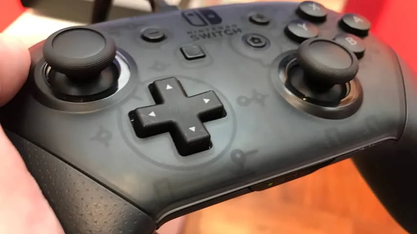
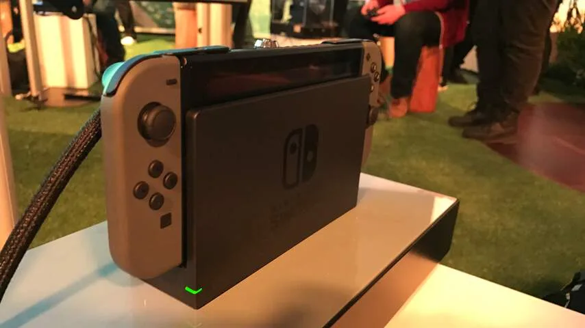
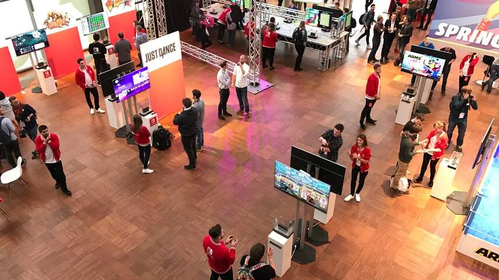
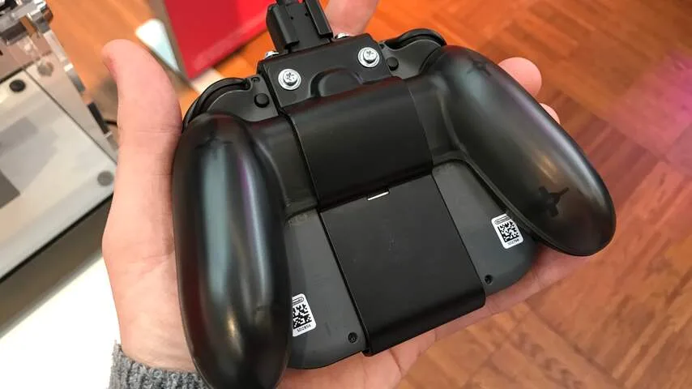
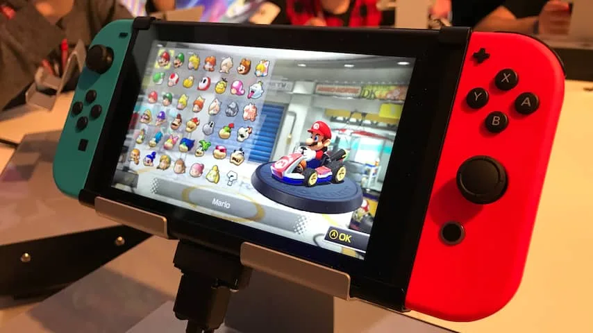
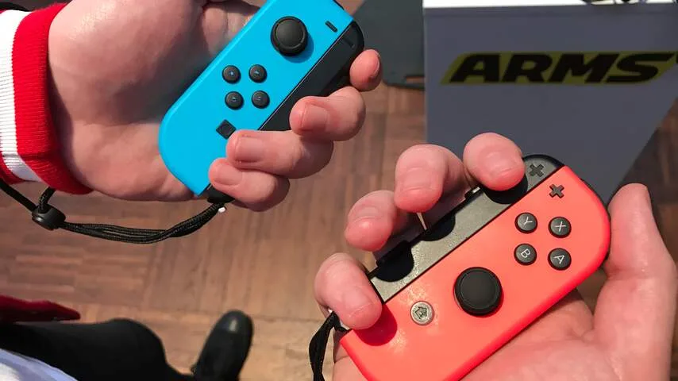
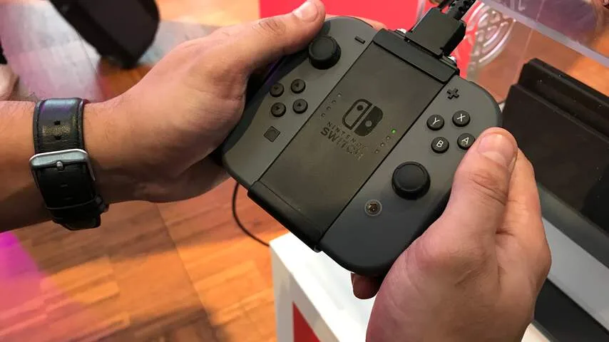

**Nadat vorig jaar alleen een demonstratievideo werd vertoond, was Nintendo’s nieuwe spelcomputer Switch deze week voor het eerst speelbaar voor de pers. Heeft Nintendo met zijn controversiële spelcomputer een stap in de juiste richting gemaakt?**

> [!NOTE]
> Deze recensie verscheen eerder op [NU.nl](https://www.nu.nl/reviews/4386648/eerste-indruk-controversiele-hybride-console-nintendo-switch.html).

Het Japanse gamebedrijf maakte er vorig jaar een punt van om de functionaliteit van de Switch uit te leggen. Logisch ook, want het apparaat is op drie verschillende manieren te gebruiken: als een handheld spelcomputer, als een gameconsole voor de televisie en als een tablet met losse controllers.

[Bekijk ingesloten media](https://content.jwplatform.com/players/5FpRevEE-whqXCOFb.html)

Alle drie deze mogelijkheden waren tijdens een evenement in Duitsland te testen. Zo was daar bijvoorbeeld een speciale versie van _Mario Kart 8_ in tabletmodus. Aan weerszijden van de Switch zaten de twee controllerhelften, met in het midden een groot scherm.

Het 6,2 inch-beeldscherm van de Switch voelt klein vergeleken met andere tablets, maar is een stuk groter dan wat we van handheld-spelcomputers gewend zijn. Het geheel voelde wel wat zwaar, al kan dat te maken hebben met de metalen beschermketting die tijdens de demonstratie aan het apparaat zat.

Na een tijd spelen valt op dat het apparaat wat lastig in de hand ligt. De gehele achterkant is in de handheldmodus plat, waardoor vingers achterop niet op een ergonomische plek kunnen rusten. De wijsvingers hebben op de trekkers bovenop een logische plek, terwijl de duimen op de knoppen rusten.

_nintendo switch — Beeld: NU.nl/Bastiaan Vroegop_

_nintendo switch — Beeld: NU.nl/Bastiaan Vroegop_

_nintendo switch — Beeld: NU.nl/Bastiaan Vroegop_

_nintendo switch — Beeld: NU.nl/Bastiaan Vroegop_

_nintendo switch — Beeld: NU.nl/Bastiaan Vroegop_

_Eerste indruk: controversiële hybride console Nintendo Switch_

_nintendo switch — Beeld: NU.nl/Bastiaan Vroegop_

Geruchten wezen er eerder op dat de Switch in zijn tabletmodus minder rekenkracht heeft, maar in de praktijk hebben we daar nog niet veel van gemerkt. _Mario Kart 8_ ziet er op het tabletscherm in elk geval indrukwekkend uit. Er waren weinig verschillen merkbaar met bijvoorbeeld dezelfde game op de Wii U.

Grafisch voelt de Switch voor Nintendo als een grote stap vooruit, aangezien de Nintendo 3DS een zeer lage videoresolutie heeft. Het scherm van de Switch toont 1280 bij 720 pixels (720p).

## Schakelen

De Switch wordt geleverd met een speciale dock die op de televisie wordt aangesloten. Steek de tablet hierin, en de game speelt automatisch verder op de tv.

Dat werkte bij een snelle test met _The Legend of Zelda: Breath of the Wild_ nagenoeg vlekkeloos. Er hoefden geen speciale menuknoppen worden ingedrukt om te schakelen. Het aansluiten van de tablet was genoeg.

Bij het verwijderen van de tablet uit de dock wordt een game automatisch gepauzeerd. De speler moet vervolgens twee knoppen tegelijkertijd indrukken om verder te gaan. Op deze manier gaat een game niet door terwijl de tablet nog niet speelklaar wordt vastgehouden.

## Controllers

De twee helften van de controller kunnen ook worden verwijderd, om ze vervolgens los te gebruiken. Dit kan door beide accessoires in één centrale controller te stoppen, of door ze individueel van elkaar te gebruiken in een multiplayerspel. Nintendo noemt de twee losse helften ook wel de JoyCon-controllers.

De samengevoegde controller heeft een handvat waardoor hij ergonomisch in de hand ligt en waarbij alle knoppen ook goed bereikbaar zijn. Dat is enigszins verrassend, omdat het ontwerp er op afbeeldingen niet erg comfortabel uitziet. In de praktijk kun je de gamepad waarschijnlijk prima voor langere tijd gebruiken.

_nintendo switch — Beeld: NU.nl/Bastiaan Vroegop_

Hoewel het mogelijk is om de JoyCons los van elkaar te gebruiken, was dit bij onze tests niet zo comfortabel. De kleine controllers liggen niet fijn in de hand en zijn door hun formaat wat onhandig in gebruik.

Nintendo heeft aan de zijkant van beide JoyCons extra knoppen geplaatst, die alleen gebruikt kunnen worden als ze niet aan een gamepad of de tablet zijn bevestigd. Als één helft als losse controller wordt gebruikt, veranderen deze knoppen in feite in trekkers.

_Eerste indruk: controversiële hybride console Nintendo Switch_

Omdat beide helften individueel van elkaar bruikbaar moeten zijn, is het ontwerp van de twee gelijk aan elkaar. De vier knoppen op de linkerhelft kunnen als richtingsknoppen worden gebruikt, maar zien er identiek uit.

Het spelen van bijvoorbeeld een vechtspel, dat specifiekere richtingsknoppen nodig heeft, is daardoor lastig. Nintendo brengt echter ook een losse Pro-controller op de markt met een traditionele knopverdeling.

## Wii-gamepads

Dankzij ingebouwde sensoren zijn de JoyCon-gamepads ook te gebruiken als bewegingscontrollers. De gamepads lijken hierdoor enigszins op de controllers van de Wii, die ook bewegingen kunnen bijhouden.

Bij het spelen van boksspel _ARMS_ merkten we weinig verschil wat betreft de trackingtechniek in de Wii-gamepads en de JoyCon-controllers. De JoyCon-controllers hielden vooral specifieke handbewegingen bij. Als je twee vuisten naar voren steekt grijpt het personage bijvoorbeeld een vijand vast, terwijl het kantelen van de apparaatjes hem of haar laat lopen.

Hoewel de tracking prima is voor simpele spellen, leek het niks vergeleken met bijvoorbeeld de bewegingscontrollers van VR-brillen HTC Vive en Oculus Rift. Deze zijn in staat om subtiele, kleinere handbewegingen in beeld te brengen.

## Prestaties

Het is bij een eerste indruk lastig om de grafische kracht van de Nintendo Switch te beoordelen. De games die wij speelden zagen er indrukwekkend uit voor een handheld-spelcomputer, maar iets minder imposant voor een 'gewone' gameconsole aan een televisie.

De Switch lijkt grafisch ongeveer hetzelfde te kunnen laten zien als de Wii U op dit moment. Dat is op zich indrukwekkend, aangezien ontwikkelaars nog maar kort games voor de Switch mogen maken.

Het lijkt aannemelijk dat spellen op termijn mooier zullen worden, naarmate programmeurs leren efficiënter de hardware te gebruiken. Het niveau van de PlayStation 4 en Xbox One gaat de spelcomputer echter niet halen.

Volgens Nintendo houdt de Switch het minstens 2,5 uur vol op een volle accu. Hoe dat in de praktijk is, moeten we nog ontdekken. Tijdens onze tests zaten de Switch-consoles vastgeschroefd aan een oplader.

## Voorlopige conclusie

We kunnen er simpel over zijn: tijdens onze eerste, korte tests doet de Switch wat Nintendo beloofde in zijn eerste promotievideo. De spelcomputer levert imposante prestaties voor een handheld en toont games die ook mooi genoeg zijn voor een televisie.

Het hybride idee achter de Switch is indrukwekkend. De spelcomputer kan op termijn zowel de Wii U als Nintendo 3DS vervangen, waardoor we nog maar één console voor al onze spellen nodig hebben. Qua hardware lijkt Nintendo gebakken te zitten. Of softwaremakers de Switch op lange termijn gaan ondersteunen, moet echter nog blijken.
