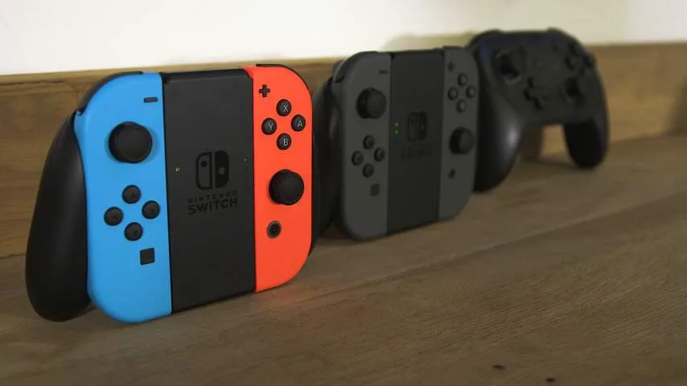
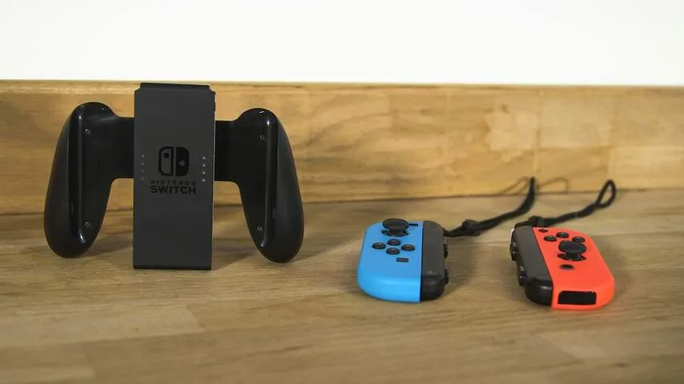

**De nieuwe Nintendo Switch is een thuisconsole en draagbaar game-apparaat in één. Dat klinkt revolutionair, maar maakt de Switch al zijn beloftes waar?**

> [!NOTE]
> Deze recensie verscheen eerder op [NU.nl](https://www.nu.nl/reviews/4503486/review-nintendo-switch-is-indrukwekkend-maar-gehaast.html).

Er zijn nogal wat manieren om op de Switch te spelen. Zet de tablet in een dock en hij speelt games af op de tv. Hang er twee controllerhelften aan en hij verandert in een handheld gameconsole voor bijvoorbeeld in de trein. Klap de standaard van de tablet uit en je kan hem op een tafel neerzetten en met de losse controllers gamen.

Nintendo belooft daarmee het apparaat in iedere denkbare situatie bruikbaar te maken. In de meeste situaties maakt de Switch die belofte waar. We hebben games gespeeld op een tv, in de trein, in het vliegtuig en op kantoor, waarbij we moeiteloos schakelden tussen de meerdere speelopties.

Het duurt bijvoorbeeld slechts een seconde om van tv-modus naar de tablet te wisselen, waarna er meteen doorgespeeld kan worden. De tablet schuift door de dock automatisch op de juiste plek en kan ook moeiteloos worden losgetrokken.

Wel voelt de Switch soms als een bouwpakket. Gebruikers hebben twee controllerhelften, een los aanschafbare Pro-controller, loskoppelbare polsbandjes, een tablet en dock om tussen te wisselen.

[Bekijk ingesloten media](https://content.jwplatform.com/players/mMovTOFI-whqXCOFb.html)

## Gamepads

De controllers bestaan uit twee helften die je makkelijk kan bevestigen aan of verwijderen van de zijkant van de tablet. Bij het losmaken moet een knop vlak achter de trekker worden ingedrukt, waarna het apparaatje met beleid kan worden losgeschoven.

_Nintendo Switch — Beeld: Bastiaan Vroegop_

De twee gamepads bieden wat inmiddels de norm is in een controller: klikbare analoge pookjes, vier trekkers, een richtingsknop en actieknoppen. Ze zijn ook te gebruiken door ze los te maken van de Switch, waarna ingebouwde sensoren handbewegingen in de gaten houden. Zo is het mogelijk om bijvoorbeeld met een boog te mikken door de controller te kantelen.

Nintendo gebruikt in de Switch-gamepads een trilmotor vergelijkbaar met die in de nieuwste iPhones, die kleine subtiele tikjes kan doorgeven. Deze tiksignalen worden gebruikt om bepaalde handelingen extra te benadrukken. Zo kan er bijvoorbeeld een tik worden gegeven om de speler te waarschuwen bij gevaar in een game.

De verwijderbare polsbandjes zijn een frustratiepunt. Deze worden met het kliksysteem van de gamepads bevestigd, maar vereisen veel fysieke kracht om weer los te maken. Hierdoor krijg je al snel het idee de gamepads stuk te trekken.

_Nintendo Switch — Beeld: Bastiaan Vroegop_

## Glitches

Bij los gebruik van de Switch-gamepads raakt de linkercontroller soms zijn verbinding kwijt. In de game _Zelda: Breath of the Wild_ is het dan nog wel mogelijk om te springen en vechten, maar kan er niet meer worden gewandeld.

Een hardnekkige bug zorgde er bovendien voor dat ons exemplaar meermaals niet wilde ontgrendelen. De stroomknop moest dan dertig seconden worden ingedrukt, zodat er een harde reset werd uitgevoerd. Hierbij was de batterij ook aanzienlijk leeggetrokken, zonder dat het apparaat een game afspeelde.

Een woordvoerder van Nintendo zegt dat beide problemen worden onderzocht, maar kon hier verder nog niks over zeggen. Op dag één verschijnt er volgens het bedrijf een update met "verbeteringen voor de algehele stabiliteit van het systeem", al is het onduidelijk of de door ons aangetroffen bugs hiermee worden opgelost.

## Technisch hoogstandje

De Switch is vanuit technisch oogpunt verder indrukwekkend. De _Zelda_\-game ziet er bijzonder mooi uit in zowel tv-modus als tabletmodus. Het spel is niet identiek in beide modi. Op de tv zijn meer objecten te zien, maar zakt de hoeveelheid frames per seconde wel. Op de handheld biedt het spel een stabielere framerate.

De PlayStation 4 en Xbox One hebben meer grafische rekenkracht en bieden op dit moment al mooiere games. Daarbij moet echter rekening worden gehouden met het hybride ontwerp van de Switch. Dit is in feite een draagbare spelcomputer, met daarin zeer compacte onderdelen om het geheel draagbaar te maken.

Hoewel smartphones en tablets inmiddels meerdere fraaie games hebben, is op iOS of Android nog nooit zo'n grote spelwereld vertoond als nu op de Switch gebeurt. Daarnaast lijkt de nieuwe gameconsole ook krachtiger dan Nintendo's eerdere Wii U.

Op een volle accu is _Zelda_ ongeveer twee uur lang te spelen. Grafisch minder hoogstaande spellen bieden vermoedelijk een langere batterijduur. De speelduur van _Zelda_ klinkt kort, maar in de praktijk valt dit ons mee. Het is genoeg om de game op de heen- en terugreis naar school of werk te spelen.

## Mager

Het besturingssysteem van de Switch reageert snel en soepel, wat een opluchting is na de trage menu’s van de Wii U en 3DS. Daar staat alleen tegenover dat de Switch-software nog beperkt is.

De Switch biedt momenteel enkel de basis voor een gamesysteem. Het apparaat speelt spellen af en heeft een digitale winkel om games in te kopen. Daar houdt het op.

Spellen op de Switch hebben bijvoorbeeld geen trofeeën, die aangeven welke prestaties een speler in zijn of haar games heeft gehaald. Zo'n systeem gebruiken concurrenten Sony, Microsoft en Valve inmiddels al ruim tien jaar.

Videodiensten zijn ook nergens op het apparaat te vinden. Zonde, want de Switch kon juist in tabletmodus een ideaal Netflix-apparaat zijn. Er is zelfs geen simpele internetbrowser, wat aanvoelt als een vreemde beperking op een tablet.

Gamediensten die Nintendo wel aanbood op eerdere apparaten, zoals het sociale netwerk Miiverse en het sociale ruilsysteem Streetpass, zijn nergens op de Switch te vinden. Nintendo belooft een abonnementsdienst met maandelijks gratis spellen uit te brengen, maar die verschijnt pas later dit jaar.

De online eShop-winkel was tijdens de recensieperiode nog niet toegankelijk, net als het geïntegreerde vriendensysteem. Nintendo maakte online bekend dat de Virtual Console, waarmee oude games worden aangeboden, ook pas op een onbekend later moment zal worden toegevoegd.

De softwarekant zorgt ervoor dat een verder zeer moderne spelcomputer soms toch wat ouderwets aanvoelt. Je kunt nagenoeg overal op de Switch gamen, maar dat is eigenlijk alles. Dat terwijl we in 2017 iets meer van een gameconsole verwachten zoals bij de PlayStation en Xbox.

## Nog weinig games

Veel games heeft de Switch op dag één ook nog niet. Nintendo brengt _The Legend of Zelda: Breath of the Wild_, _Snipperclips_ en _1-2-Switch_ uit, met daarnaast kleinere titels van andere bedrijven. Later in het jaar komen pas een nieuwe _Mario_\-game, een vervolg op _Splatoon_ en een uitgebreide port van _Mario Kart 8_ naar het systeem.

De Switch zal waarschijnlijk een aardig gamesaanbod hebben voor het jaar voorbij is, maar nu is er nog (te) weinig voor beschikbaar. De nieuwe _Zelda_ wordt veel geprezen, maar een enkele titel zal voor velen onvoldoende zijn om een nieuw apparaat voor te kopen.

## Conclusie

Het idee achter de Switch is goed en de hardware is ook goed uitgewerkt. Het apparaat weet voor een handheld adembenemende games op het scherm te toveren, die ook prima tot hun recht komen op een televisie.

In zijn huidige vorm voelt de Switch alleen wat gehaast. Er ontbreken diensten en functies die we wel hadden verwacht, het gamesaanbod is nog beperkt en glitches zorgen soms voor problemen. Wellicht had Nintendo een paar maanden moeten wachten, om zo een uitgebreider product op de markt te brengen. De Switch kan een ontzettend bijzondere gameconsole worden, maar heeft nog eventjes nodig om op dat punt te komen.

_De Nintendo Switch is vanaf vrijdag 3 maart te koop voor ongeveer 350 euro._

p.p1 {margin: 0.0px 0.0px 0.0px 0.0px; font: 14.0px 'Helvetica Neue'; color: #333333}
